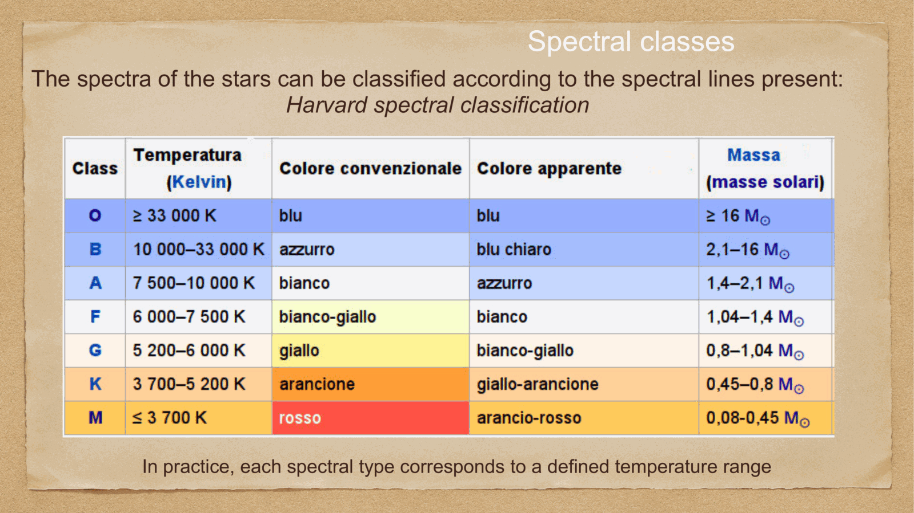
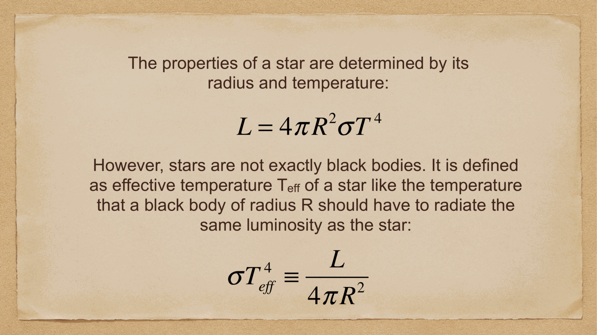
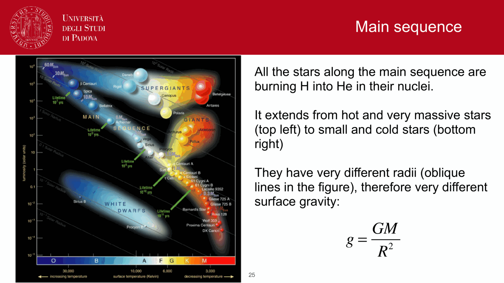
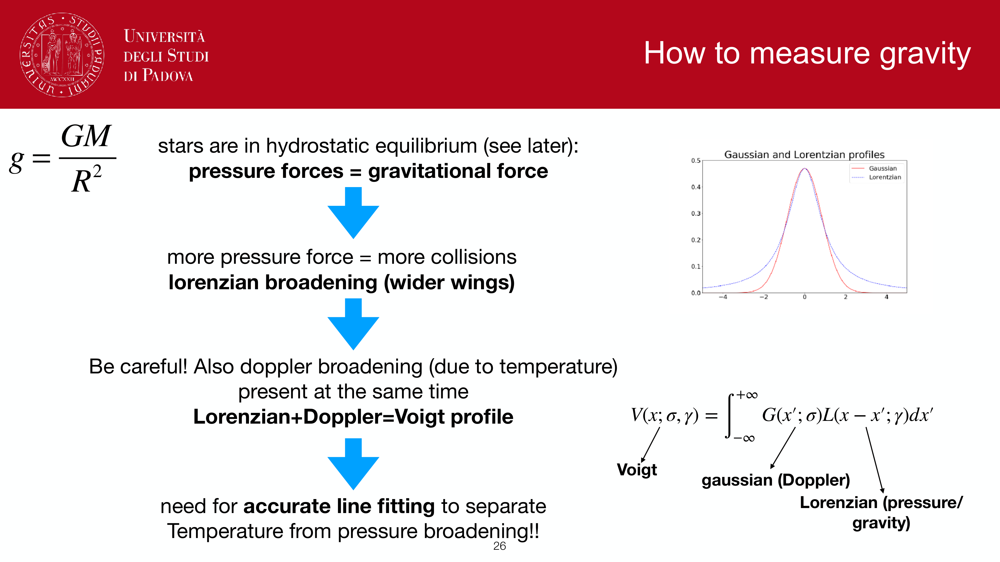
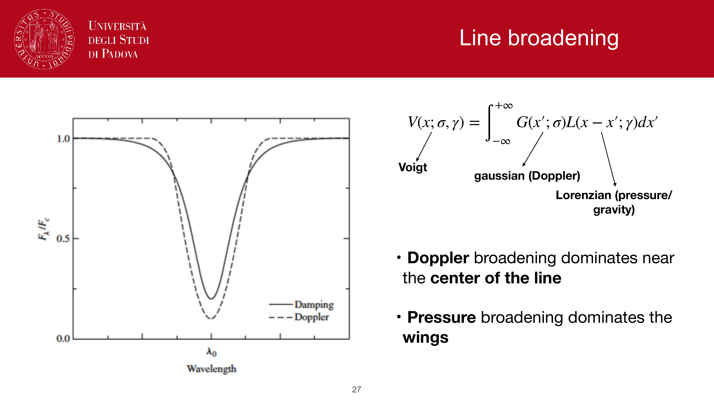
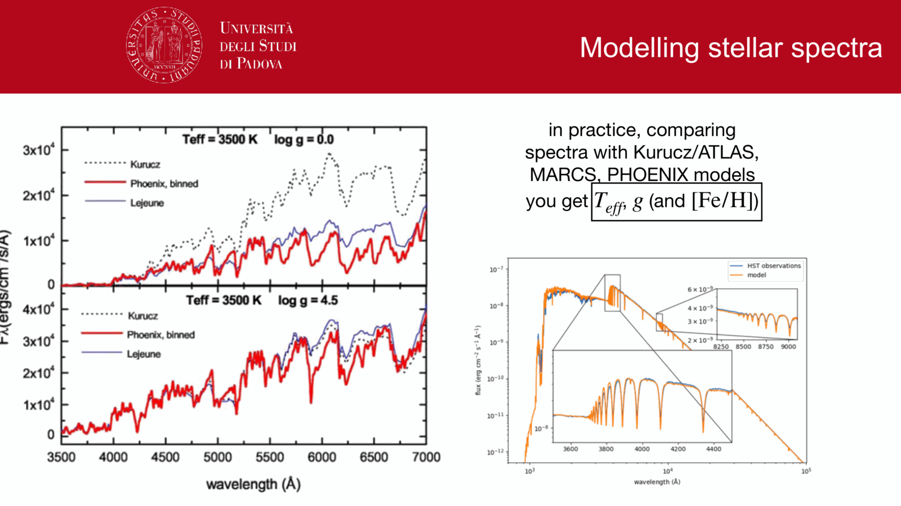
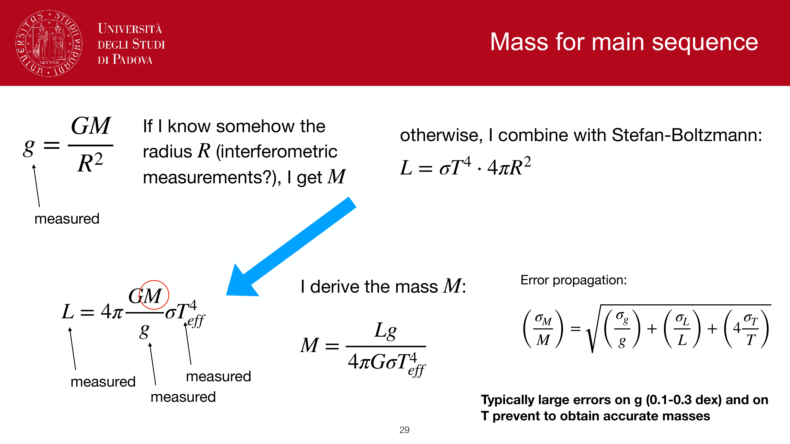
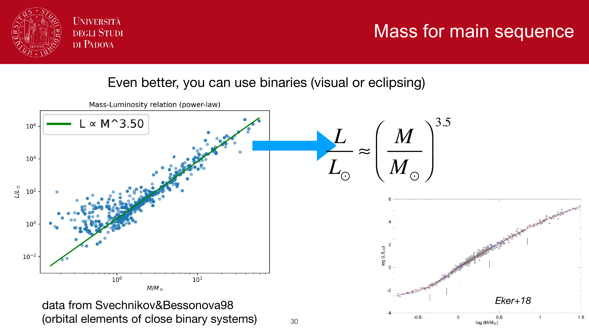


a star is a self-gravitating sphere of hot plasma held in long-term structural equilibrium by a delicate balance between inward gravitational force and outward thermal and radiation pressure gradients.

---

## fundamental stellar parameters

four fundamental macroscopic parameters completely characterize a non-rotating, single star:
1. **Mass** $M$: the master parameter governing stellar structure, luminosity, core conditions, and ultimate evolutionary fate.
2. **Radius** $R$: physical size, varying from $R \sim 0.01 R_\odot$ (white dwarfs) to $R \sim 1 R_\odot$ (Sun) to $R > 1000 R_\odot$ (red supergiants like Betelgeuse).
3. **Luminosity** $L$: total energy radiated into space per unit time ($L_\odot \approx 3.828 \times 10^{26}$ W).
4. **Effective Temperature** $T_{\text{eff}}$: surface temperature defined by the Stefan-Boltzmann law.

---

## the Stefan-Boltzmann connection: $L = 4\pi R^2 \sigma T_{\text{eff}}^4$

relating the four parameters:
$$\boxed{\, L = 4\pi R^2 \sigma T_{\text{eff}}^4 \,}$$

normalizing to solar units ($R_\odot \approx 6.96 \times 10^8$ m, $T_{\text{eff},\odot} \approx 5778$ K):
$$\frac{L}{L_\odot} = \left(\frac{R}{R_\odot}\right)^2 \left(\frac{T_{\text{eff}}}{T_{\text{eff},\odot}}\right)^4$$

consequence: if any two quantities of $(L, R, T_{\text{eff}})$ are known (e.g. $L$ from distance modulus and flux, $T_{\text{eff}}$ from spectral type or color index), the stellar radius $R$ is uniquely determined.

---

## the Mass-Luminosity relation on the Main Sequence

for stars burning hydrogen on the main sequence, observational measurements of detached, double-lined eclipsing binary stars establish a tight empirical and theoretical power-law relation:
$$\boxed{\, L \propto M^\alpha \,}$$

where the exponent $\alpha$ depends on the stellar mass range:
- for intermediate-mass stars ($2 M_\odot \lesssim M \lesssim 20 M_\odot$): $\alpha \approx 3.5 - 4.0$:
  $$\frac{L}{L_\odot} \approx \left(\frac{M}{M_\odot}\right)^{3.5}$$
- for low-mass stars ($0.43 M_\odot < M < 2 M_\odot$): $\alpha \approx 4.0$.
- for very massive stars ($M > 20 M_\odot$): radiation pressure becomes significant in the core, flattening the relation toward $L \propto M^1$ (the Eddington limit).

### profound consequences of the steep mass-luminosity relation:
1. **extreme brightness contrast**: a $10 M_\odot$ B-star has $L \approx 10^{3.5} L_\odot \approx 3160 L_\odot$. a $50 M_\odot$ O-star has $L > 10^5 L_\odot$. conversely, an $0.1 M_\odot$ M-dwarf has $L \approx 10^{-3.5} L_\odot \approx 3 \times 10^{-4} L_\odot$.
2. **stellar lifetimes**: because the nuclear fuel available is proportional to mass $M$, the main sequence lifetime scales as:
   $$t_{\text{MS}} \propto \frac{\text{Fuel}}{\text{Consumption Rate}} = \frac{M}{L} \propto \frac{M}{M^{3.5}} = M^{-2.5}$$
   massive stars burn through their hydrogen reserves at a prodigal rate and die in millions of years, while low-mass stars live for trillions of years!

---

## see also

- [Fundamentals_Astrophysics_Cosmology_MOC](../../04_Atlas/Fundamentals_Astrophysics_Cosmology_MOC.html)
- [HR diagram](./HR%20diagram.html)
- [Main sequence, giants, supergiants, white dwarfs](./Main%20sequence%2C%20giants%2C%20supergiants%2C%20white%20dwarfs.html)
- [Stellar structure equations](./Stellar%20structure%20equations.html)
- [Stellar evolution timescales](./Stellar%20evolution%20timescales.html)

---

## observational astrophysics course slides (Prof. Paolo Cassata)

*Homology scaling relations from fundamental equations of stellar structure.*

*Hydrostatic equilibrium scaling: central pressure P_c proportional to M^2 / R^4.*

*Ideal gas law scaling: central temperature T_c proportional to M / R.*

*Radiative transport scaling with Kramers opacity: L proportional to M^5.5 R^(-0.5).*

*Radiative transport scaling with electron scattering opacity: L proportional to M^3.*

*Observed Mass-Luminosity relation: L proportional to M^3.5 for intermediate-mass stars.*


  <h4 class="backlinks-title">Linked References (15)</h4>
  <ul class="backlinks-list">
    <li class="backlink-item-wrap"><a href="./Binary%20star%20evolution%20and%20mass%20transfer.html" class="backlink-item">Binary star evolution and mass transfer</a></li>
    <li class="backlink-item-wrap"><a href="./Bolometric%20correction%20and%20effective%20temperature.html" class="backlink-item">Bolometric correction and effective temperature</a></li>
    <li class="backlink-item-wrap"><a href="./Cluster%20ages%20from%20CMD%20turnoff.html" class="backlink-item">Cluster ages from CMD turnoff</a></li>
    <li class="backlink-item-wrap"><a href="../../04_Atlas/Fundamentals_Astrophysics_Cosmology_MOC.html" class="backlink-item">Fundamentals_Astrophysics_Cosmology_MOC</a></li>
    <li class="backlink-item-wrap"><a href="./HR%20diagram.html" class="backlink-item">HR diagram</a></li>
    <li class="backlink-item-wrap"><a href="./Main%20sequence%2C%20giants%2C%20supergiants%2C%20white%20dwarfs.html" class="backlink-item">Main sequence, giants, supergiants, white dwarfs</a></li>
    <li class="backlink-item-wrap"><a href="./Mass-luminosity%20relation.html" class="backlink-item">Mass-luminosity relation</a></li>
    <li class="backlink-item-wrap"><a href="../../04_Atlas/Observational_Astrophysics_MOC.html" class="backlink-item">Observational_Astrophysics_MOC</a></li>
    <li class="backlink-item-wrap"><a href="./Planck%20law%20Wien%20Stefan-Boltzmann.html" class="backlink-item">Planck law Wien Stefan-Boltzmann</a></li>
    <li class="backlink-item-wrap"><a href="./Pre-main%20sequence%20evolution%20and%20protostars.html" class="backlink-item">Pre-main sequence evolution and protostars</a></li>
    <li class="backlink-item-wrap"><a href="./Radiative%20transport.html" class="backlink-item">Radiative transport</a></li>
    <li class="backlink-item-wrap"><a href="./Stellar%20evolution%20timescales.html" class="backlink-item">Stellar evolution timescales</a></li>
    <li class="backlink-item-wrap"><a href="./Stellar%20spectra%20and%20spectral%20classification.html" class="backlink-item">Stellar spectra and spectral classification</a></li>
    <li class="backlink-item-wrap"><a href="./Stellar%20structure%20equations.html" class="backlink-item">Stellar structure equations</a></li>
    <li class="backlink-item-wrap"><a href="./Why%20hot%20massive%20stars%20dominate%20luminosity.html" class="backlink-item">Why hot massive stars dominate luminosity</a></li>
  </ul>

