stellar spectra provide the master key to stellar astrophysics. while the continuum approximately resembles a blackbody at effective temperature $T_{\text{eff}}$, the spectrum is crossed by thousands of **absorption lines**. analyzing these lines reveals the star's temperature, surface gravity, chemical abundances, rotation rate, and radial velocity.

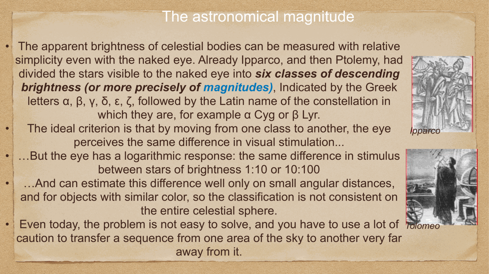

---

## Fraunhofer lines and Kirchhoff's laws

in 1814, Joseph von Fraunhofer mapped hundreds of dark absorption lines in the solar spectrum, designating the strongest with capital letters (e.g. **D** for Sodium at $589$ nm, **H & K** for ionized Calcium at $396.8$ and $393.4$ nm, **C** for $H\alpha$ at $656.3$ nm).

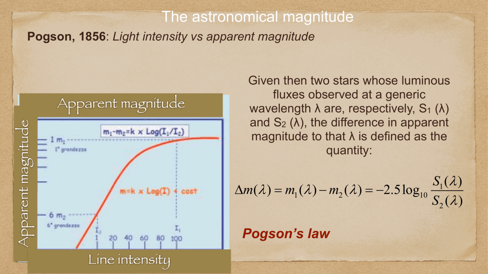

Kirchhoff formulated the three empirical laws of spectroscopy in 1859:
1. **continuous spectrum**: a hot, dense gas, liquid, or solid emits a continuous spectrum (blackbody-like).
2. **emission line spectrum**: a hot, rarefied gas emits discrete bright lines at specific wavelengths corresponding to electron de-excitations between atomic energy levels.
3. **absorption line spectrum**: when continuous radiation passes through a cooler, rarefied gas, the gas absorbs photons at the exact transition wavelengths, creating dark absorption lines against the continuum.

in a star, the hot, dense **photosphere** produces the continuous spectrum, while the cooler, lower-density outer atmospheric layers produce the absorption lines.

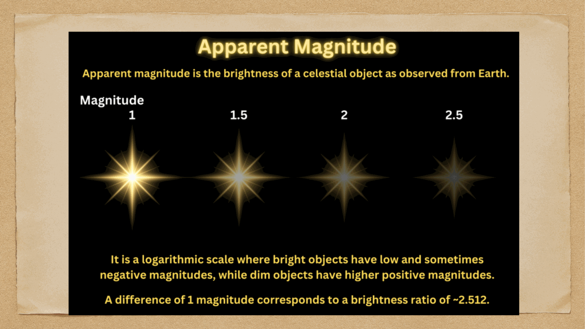

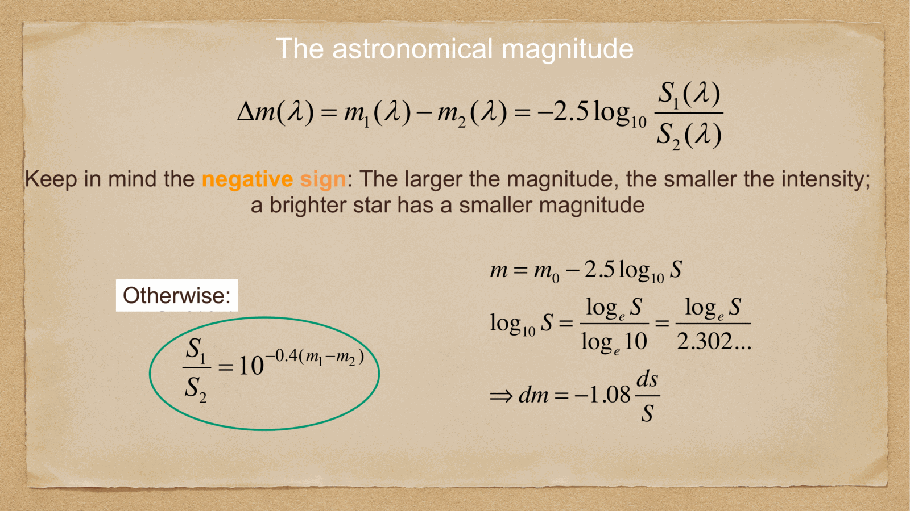

---

## the Harvard spectral sequence: OBAFGKM

historically classified by Williamina Fleming and Annie Jump Cannon at Harvard according to hydrogen Balmer line strength (A, B, C... P), the sequence was rearranged into an ordered **temperature sequence**:

$$\boxed{\, \textbf{O} \quad \textbf{B} \quad \textbf{A} \quad \textbf{F} \quad \textbf{G} \quad \textbf{K} \quad \textbf{M} \,}$$
*(mnemonic: "Oh Be A Fine Girl/Guy, Kiss Me")*

each class is subdivided into 10 decimal subclasses ($0$ to $9$, e.g. G0 to G9). the Sun is a **G2V** star.

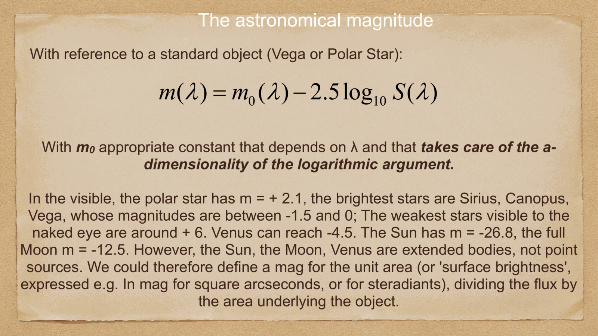

| spectral type | effective temp $T_{\text{eff}}$ [K] | conventional color | prominent spectral features | representative star |
|---|---|---|---|---|
| **O** | $> 30,000$ | blue | ionized Helium (He II), highly ionized N, C, O; weak H lines | Alnitak ($\zeta$ Ori) |
| **B** | $10,000 - 30,000$ | blue-white | neutral Helium (He I), moderate Balmer H lines, O II, Si II | Rigel, Spica |
| **A** | $7,500 - 10,000$ | white | **maximum hydrogen Balmer lines** (peaking at A0); weak ionized metals | Vega, Sirius |
| **F** | $6,000 - 7,500$ | yellow-white | weakening Balmer lines, strengthening Ca II H & K, neutral Fe | Canopus, Procyon |
| **G** | $5,200 - 6,000$ | yellow | strong **Ca II H & K**, prominent neutral and ionized metal lines (Fe, Ca) | Sun, Capella |
| **K** | $3,700 - 5,200$ | orange | dominant neutral metal lines, molecular CH band (G-band) | Arcturus, Aldebaran |
| **M** | $2,400 - 3,700$ | red | dominant molecular bands (**TiO** - Titanium Oxide), neutral atoms | Betelgeuse, Proxima Cen |

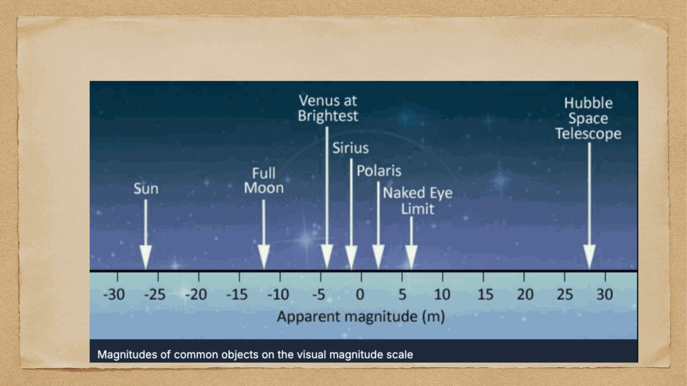

---

## the physics of line strengths: Boltzmann and Saha equations

a naive expectation might be that stars with weak hydrogen lines (like O stars or M stars) contain less hydrogen than A stars. **this is completely wrong**: Cecilia Payne-Gaposchkin proved in 1925 that all normal stars have nearly identical chemical composition ($\sim 74\%$ H, $\sim 24\%$ He, $\sim 2\%$ metals by mass). 

the observed differences in spectral lines are entirely governed by **temperature and ionization state**, described by two statistical mechanics equations:

### 1. the Boltzmann excitation equation:
for atoms in a given ionization stage, the ratio of populations between excited energy level $E_b$ and lower level $E_a$ is:
$$\frac{N_b}{N_a} = \frac{g_b}{g_a} e^{-\frac{E_b - E_a}{k_B T}}$$
where $g_a, g_b$ are statistical weights (degeneracy $g = 2j+1$). at higher temperature $T$, more electrons occupy higher energy levels.

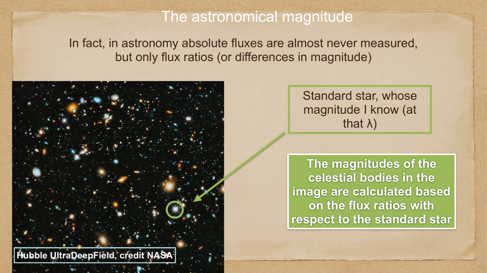

### 2. the Saha ionization equation:
the ratio between the population of ionized state $N_{j+1}$ and neutral/lower state $N_j$ is:
$$\frac{N_{j+1} N_e}{N_j} = \frac{2 g_{j+1}}{g_j} \left(\frac{2\pi m_e k_B T}{h^2}\right)^{3/2} e^{-\frac{\chi_j}{k_B T}}$$
where $N_e$ is the free electron density, and $\chi_j$ is the ionization potential. higher temperature strongly favors ionization, while higher electron density (pressure) favors recombination.

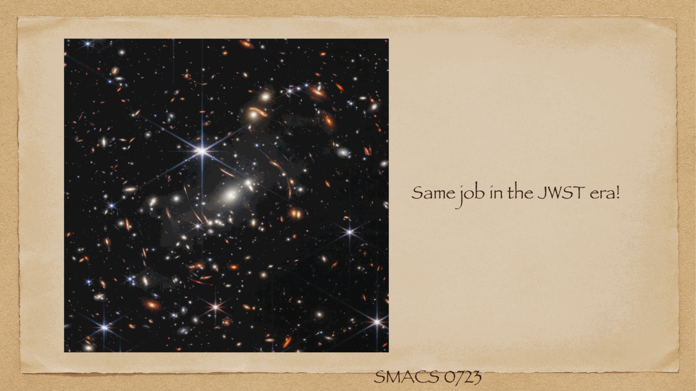

### explaining the Balmer maximum at A0 ($T \approx 10,000$ K):
Balmer absorption lines arise from transitions starting from the excited $n=2$ state of neutral hydrogen ($E_2 - E_1 = 10.2$ eV).
- at low temperatures ($T < 6000$ K): almost all electrons sit in the ground state $n=1$ ($e^{-10.2/k_B T} \ll 1$). there are virtually no electrons in $n=2$ to absorb Balmer photons $\implies$ weak Balmer lines.
- at high temperatures ($T > 20,000$ K): Boltzmann populates $n=2$, but the Saha equation dictates that almost all hydrogen is completely ionized ($H^+$, bare protons without bound electrons) $\implies$ weak Balmer lines.
- at $T \approx 10,000$ K: the product of the neutral fraction (Saha) and the $n=2$ excitation fraction (Boltzmann) reaches an absolute maximum. this produces the colossal Balmer lines characteristic of **A0 stars** (like Vega).

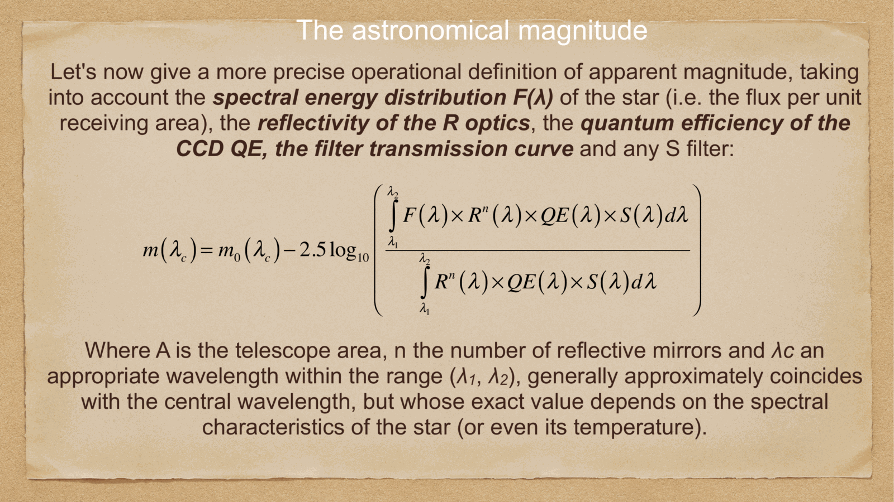

---

## spectral evolution across the sequence

- **Helium lines (O and B stars)**: Helium has a massive ionization energy ($24.6$ eV for He I, $54.4$ eV for He II). He II lines only appear in blistering O stars ($T > 30,000$ K), while neutral He I peaks around B2 ($T \sim 20,000$ K).

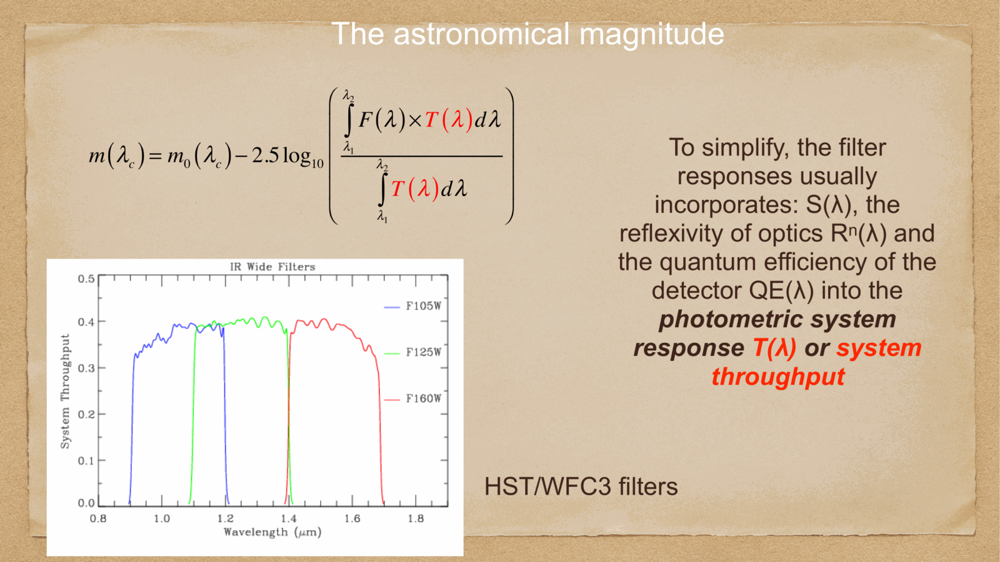

- **Metal lines (F and G stars)**: ionized calcium (Ca II, ionization potential $6.1$ eV) and neutral iron (Fe I, $7.9$ eV) have low ionization thresholds, dominating solar-type stellar atmospheres.

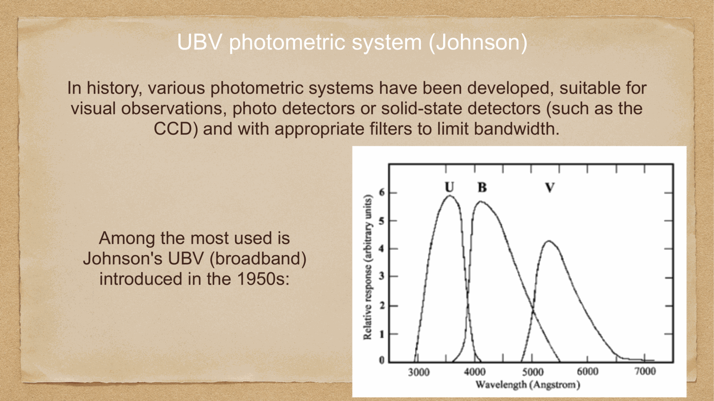

- **Molecular bands (K and M stars)**: molecules like TiO, VO, and MgH have low dissociation energies (a few eV). they only survive in cool atmospheres ($T < 4000$ K), creating dense forest-like absorption bands.

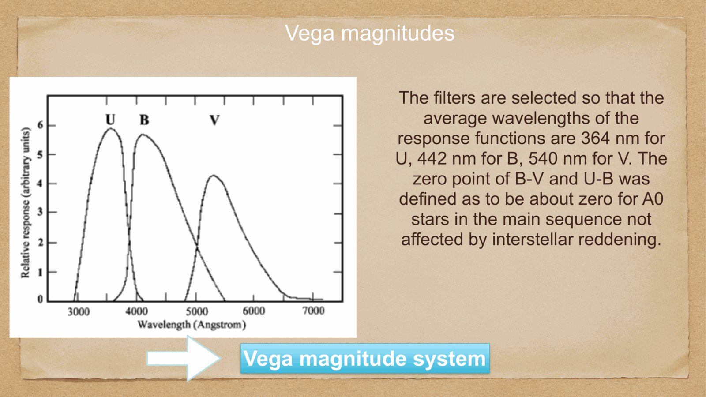

---

## MK luminosity classes and line broadening

two stars with the exact same effective temperature (same spectral type, e.g. G2) can have vastly different luminosities (e.g. G2V dwarf vs G2I supergiant). William Wilson Morgan and Philip Keenan (1943) introduced the **MK Luminosity Classes**:

- **Class I**: Supergiants (Ia-O hypergiants, Ia luminous supergiants, Ib less luminous)
- **Class II**: Bright giants
- **Class III**: Regular giants
- **Class IV**: Subgiants
- **Class V**: Main sequence stars (dwarfs, like the Sun G2V)
- **Class VI**: Subdwarfs (metal-poor halo stars)
- **Class VII**: White dwarfs

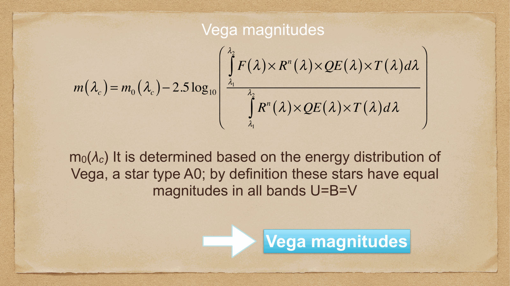

### physical mechanism: pressure broadening
supergiants have enormously extended, rarefied atmospheres with very low gas pressure $P_g$ and low surface gravity $g = GM/R^2$. dwarfs have dense, high-pressure atmospheres.
1. in high-pressure atmospheres (dwarfs, Class V), frequent collisions between atoms perturb energy levels, causing strong **collisional / Stark pressure broadening** $\implies$ lines are **wide and shallow**.
2. in low-pressure atmospheres (supergiants, Class I), collisions are rare $\implies$ lines are **exceptionally sharp, narrow, and deep**.

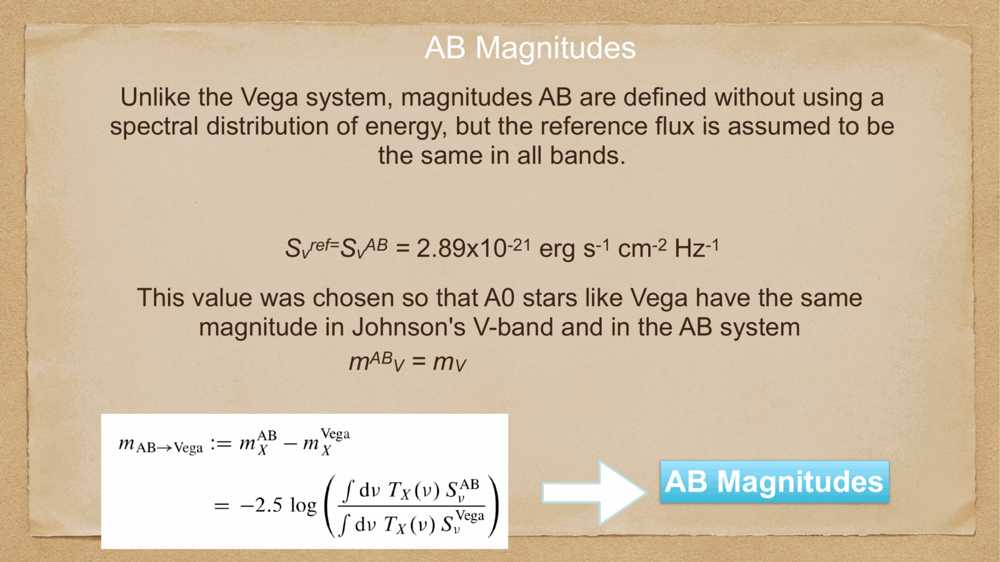

---

## see also

- [[Fundamentals_Astrophysics_Cosmology_MOC]]
- [[Blackbody radiation and Stefan-Boltzmann]]
- [[HR diagram]]
- [[Main sequence, giants, supergiants, white dwarfs]]
- [[Stellar scaling relations]]

---

## observational astrophysics course slides (Prof. Paolo Cassata)

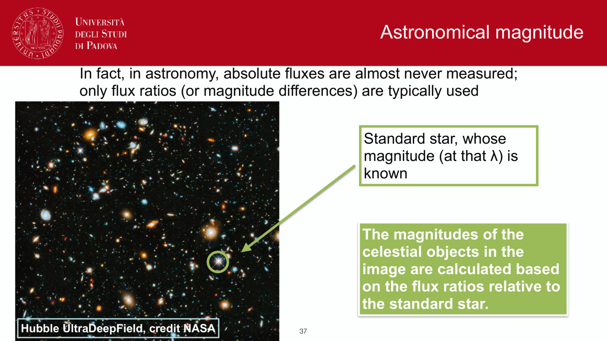
*Stellar spectroscopy: continuous spectrum with Fraunhofer absorption lines.*

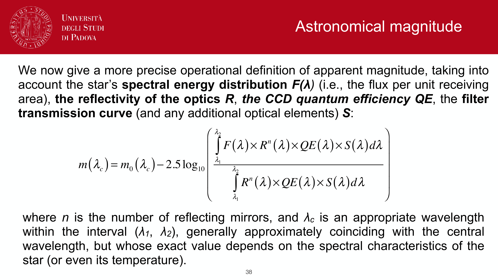
*Harvard spectral classification sequence: O B A F G K M (L T Y).*

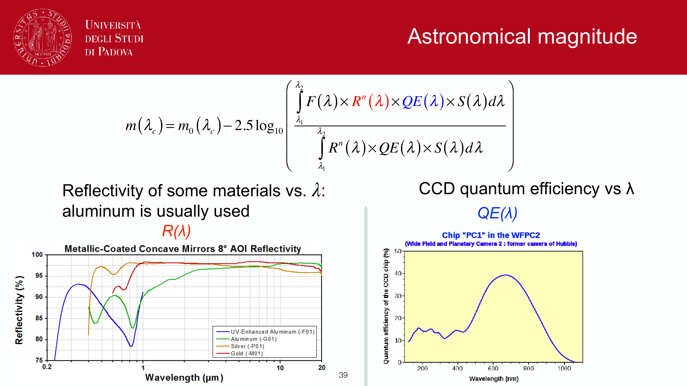
*Boltzmann excitation equation: population of atomic energy levels.*

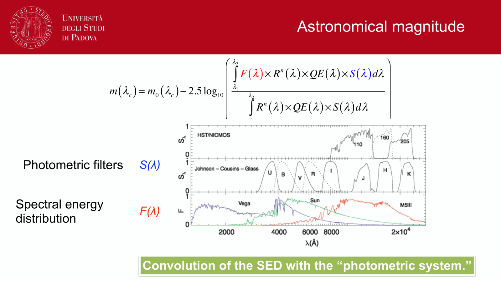
*Saha ionization equation: ionization balance as a function of T and electron pressure P_e.*

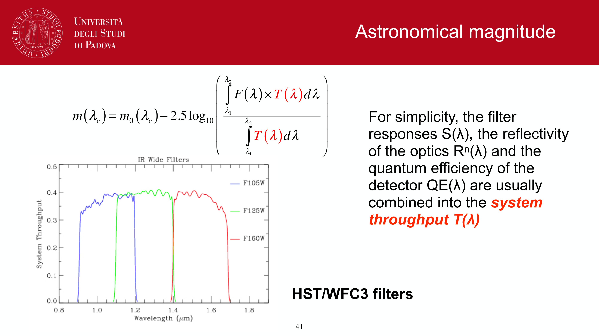
*Explanation of Balmer line peak at A0 stars (T ~ 10000 K): competition between excitation and ionization.*

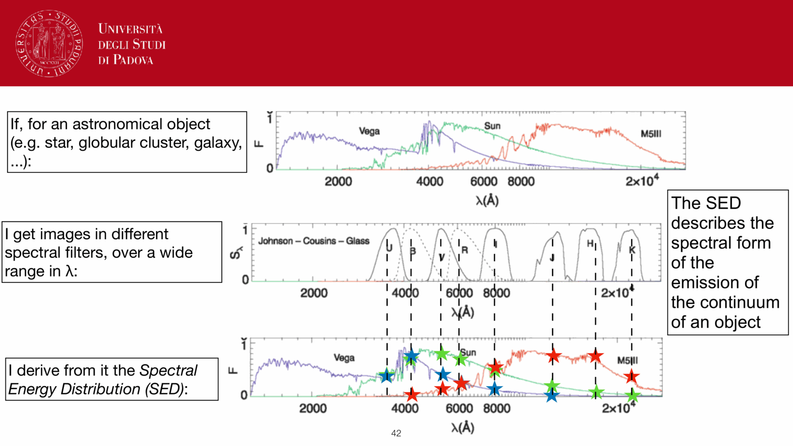
*Yerkes / Morgan-Keenan (MK) luminosity classes: I (supergiants) to V (main sequence).*

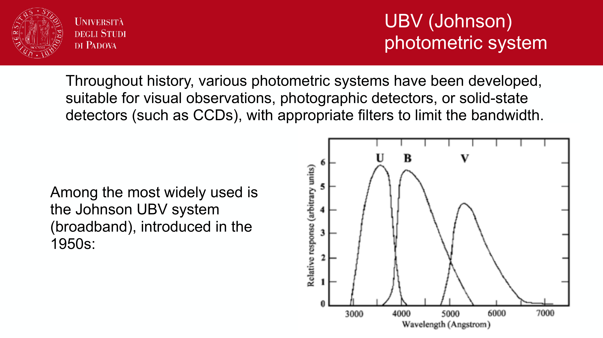
*Pressure broadening of spectral lines as indicator of stellar surface gravity g.*

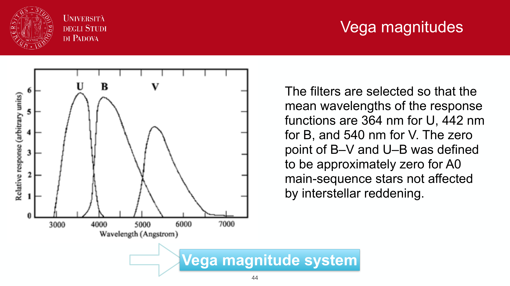
*Spectral atlas of MK standards across spectral types and luminosity classes.*

## Linked References

- [[Blackbody radiation and Stefan-Boltzmann]]
- [[Bolometric correction and effective temperature]]
- [[Calcium and CaII H+K]]
- [[Calcium population vs T]]
- [[Continuum opacity sources]]
- [[Electromagnetic radiation basics]]
- [[Emission line stars]]
- [[Helium energy levels]]
- [[Helium population vs T]]
- [[History of stellar classification]]
- [[Hydrogen population vs T]]
- [[Lick indices]]
- [[MK luminosity classes]]
- [[Magnesium and alkali earths]]
- [[Magnesium population vs T]]
- [[Population of excited levels]]
- [[Sodium and alkalis]]
- [[Sodium population vs T]]
- [[Spectroscopic parallax and main-sequence fitting]]
- [[Symbiotic star spectroscopy]]
- [[Why the Sequence OBAFGKM]]
- [[Astronomical_Spectroscopy_MOC]]
- [[Fundamentals_Astrophysics_Cosmology_MOC]]
- [[Observational_Astrophysics_MOC]]

