# stellar spectral types obafgkm

the OBAFGKM sequence is a one-parameter classification of stellar spectra that turned out to be ordered almost entirely by **effective temperature** (see [[Spectroscopic determination of Teff]]). it is the cornerstone of empirical stellar astrophysics. the order is hot to cool: O is hottest ($T_{\rm eff} > 30{,}000$ K), M is coolest ($T_{\rm eff} \lesssim 3500$ K). the standard mnemonic, "Oh Be A Fine Girl/Guy Kiss Me," helps fix the order.

each class is subdivided 0-9 (e.g. G2, the sun). additional letters L, T, Y extend the sequence to brown dwarfs.

## what changes with $T_{\rm eff}$

the spectrum is dominated by which atoms and ions are populated and how. the [[Saha ionisation equation]] and [[Saha equation and recombination]] govern the ionisation balance, and the Boltzmann distribution governs which excitation levels of a given species are populated. as $T_{\rm eff}$ drops, light elements progressively recombine and electrons settle into lower levels.

| class | $T_{\rm eff}$ (K) | dominant lines | colour | typical examples |
|-|-|-|-|-|
| O | $\geq 30{,}000$ | He II, He I, ionised metals (Si IV, C III, N III) | blue | $\zeta$ Pup, mintaka |
| B | 10{,}000-30{,}000 | He I, weak H, ionised metals (Mg II, Si II) | blue-white | Rigel, Spica |
| A | 7500-10{,}000 | strong H Balmer, Ca II, weak metals | white | Sirius, Vega |
| F | 6000-7500 | weak H, strong Ca II H&K, Fe lines | yellow-white | Procyon, Polaris |
| G | 5200-6000 | Ca II H&K dominant, many Fe and metal lines, G-band (CH) | yellow | the sun, $\alpha$ Cen A |
| K | 3700-5200 | strong neutral metals, weak Ca II, hints of TiO | orange | Arcturus, Aldebaran |
| M | $\leq 3700$ | TiO bands dominant, VO, neutral metals, Ca I | red | Betelgeuse, Proxima Cen |

the dominant-features curve as a function of class peaks for each species at a particular $T_{\rm eff}$: H Balmer peaks at A0 ($\sim 9500$ K), He II is only seen in O stars, Ca II H&K becomes dominant in F-G stars, TiO appears in late K and grows through M. the canonical "line strength vs spectral type" plot organises this beautifully.

## hydrogen Balmer paradox

H Balmer lines do not simply track temperature. they peak around A0 because:

- in cooler stars (G, K, M), most H is in the ground state (n=1) and cannot absorb Balmer photons (which arise from n=2).
- in hotter stars (B, O), most H is fully ionised, so there are no neutral atoms to absorb at all.
- the maximum H I population in n=2 occurs at intermediate temperatures, around 9500 K.

this is a textbook Saha-Boltzmann result and historically the breakthrough that allowed Cecilia Payne to interpret the OBAFGKM sequence as a temperature sequence rather than a composition sequence (see [[History of stellar classification]]).

## luminosity classes

a second dimension, **luminosity class**, was added by Morgan & Keenan in 1943 (the "MK system"):

- I supergiants (Ia, Ib)
- II bright giants
- III giants
- IV subgiants
- V main-sequence dwarfs
- VI subdwarfs
- VII white dwarfs

luminosity class is essentially set by [[Spectroscopic determination of log g]]: lower log g (giants, supergiants) gives narrower lines because pressure broadening (collisional Stark) is weaker. so the sun is "G2 V" and Betelgeuse is "M2 Iab".

## see also
- [[Spectroscopic determination of Teff]]
- [[Spectroscopic determination of log g]]
- [[Saha ionisation equation]]
- [[Saha equation and recombination]]
- [[History of stellar classification]]
- [[HR diagram]]
- [[Atmospheric parameters Teff log g feh vmicro]]
- [[Stellar_Astrophysics_MOC]]

---

### Astronomical Spectroscopy Diagnostic Panels

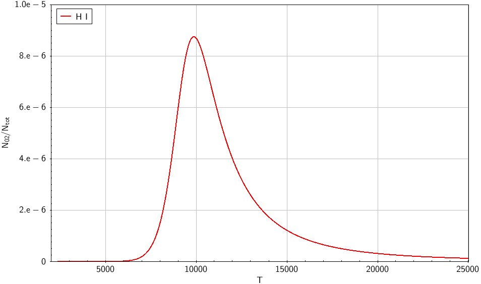
*Boltzmann-Saha calculation for neutral hydrogen: fractional population of the $n=2$ excited level peaking at $T \approx 9,520$ K, explaining why Balmer lines achieve maximum equivalent width in A0-type stars.*

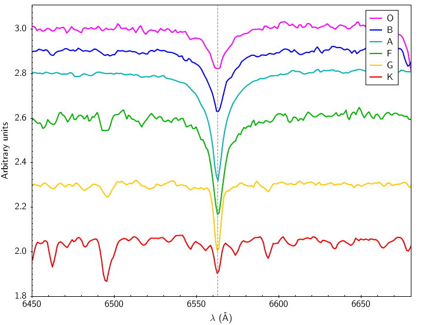
*Observed H$\alpha$ $\lambda 6563$ Å spectral absorption profiles across spectral sequence O to M, showing broad wings in A-type dwarfs and weakening in cool stars.*

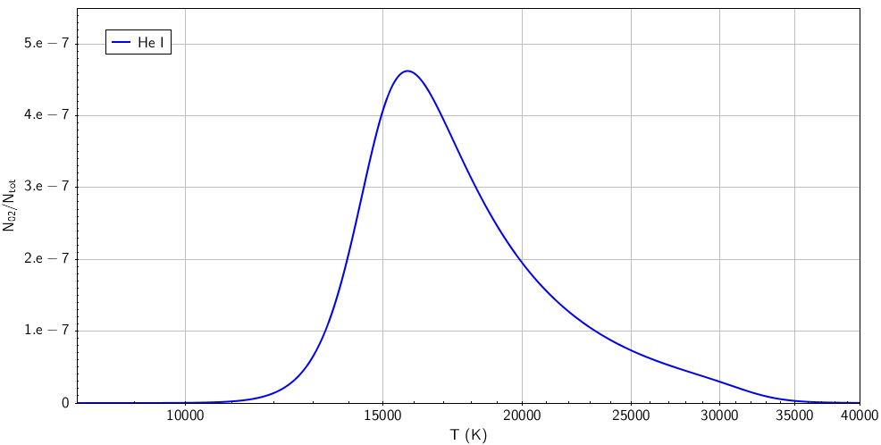
*He I level population vs effective temperature: peak absorption in early B stars ($T \approx 15,000-22,000$ K).*

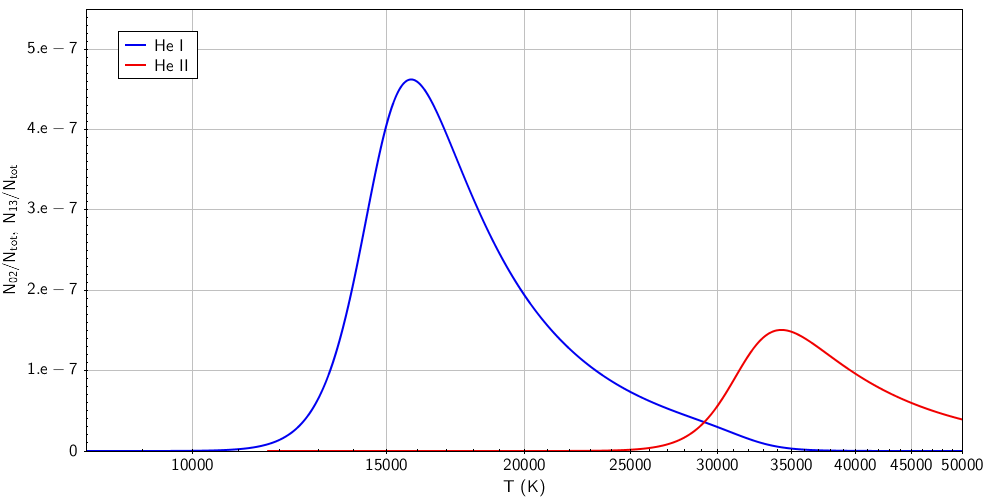
*He I and He II ionization fraction curves: He II $\lambda 4686$ Å and $\lambda 4541$ Å emerge strictly in hot O-type stars ($T > 30,000$ K).*

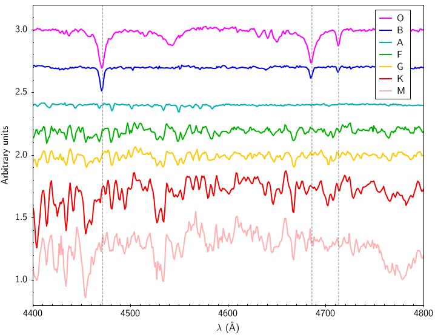
*Observed O and B star spectra around He I $\lambda 4471$ Å and He II $\lambda 4541$ Å, establishing the O-star spectral subtype classification ratio.*

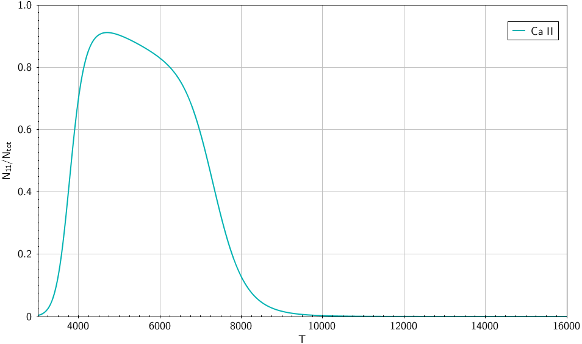
*Ca II ionization fraction and ground-state population vs temperature: rapid rise in solar-type and cool stars ($T < 6,000$ K).*

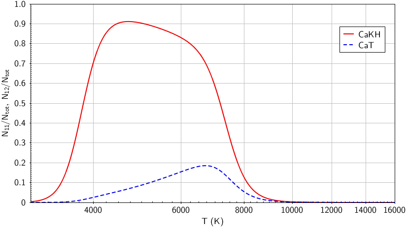
*Comparison of Ca II H&K ($\,\lambda 3934, 3968$ Å) vs Ca II Near-Infrared Triplet ($\,\lambda 8498, 8542, 8662$ Å) level populations.*

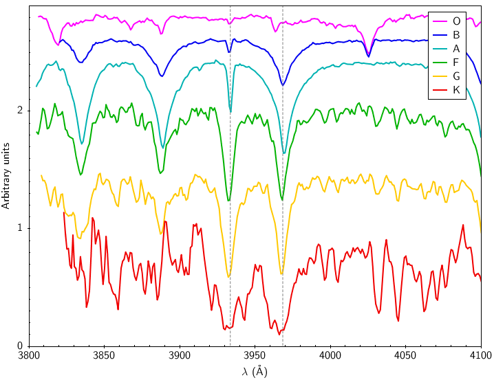
*Observed spectra of Ca II H and K lines from F to M stars: dominant resonance Fraunhofer absorption lines in late-type photospheres.*

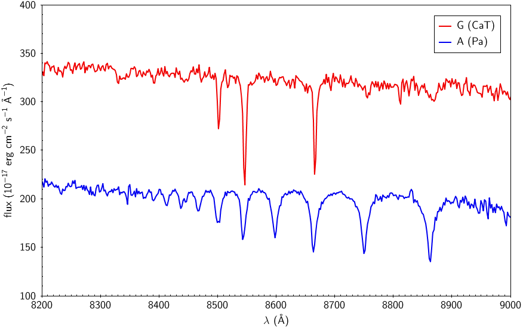
*Near-infrared spectra around the Ca II triplet and Paschen lines, separating dwarfs from giants via pressure-broadened wings.*

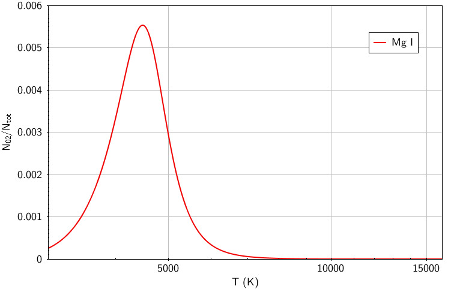
*Mg I b triplet ($\,\lambda 5167, 5173, 5184$ Å) level population curve peaking in G and K dwarf stars.*

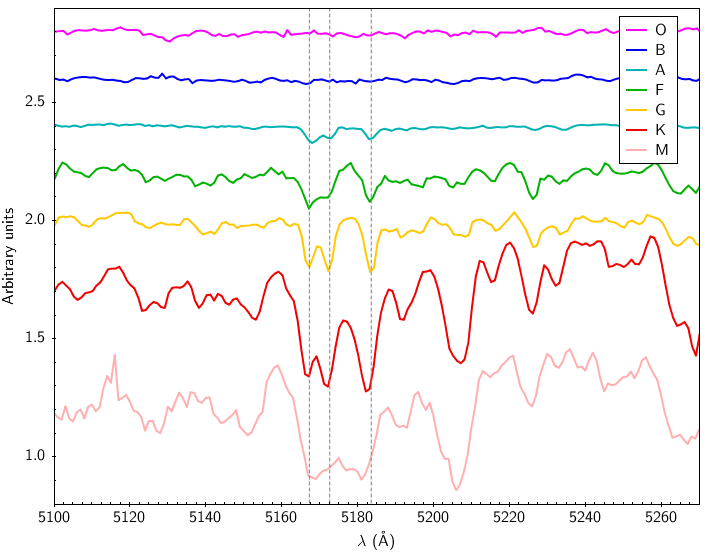
*Observed stellar spectra across the Mg I b triplet, highlighting sensitivity to photospheric surface gravity $\log g$.*

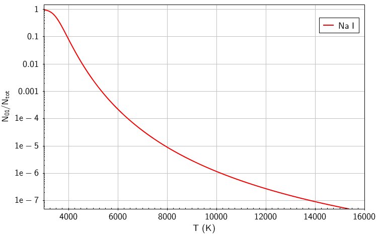
*Na I D doublet ($\,\lambda 5890, 5896$ Å) neutral resonance level population vs temperature.*

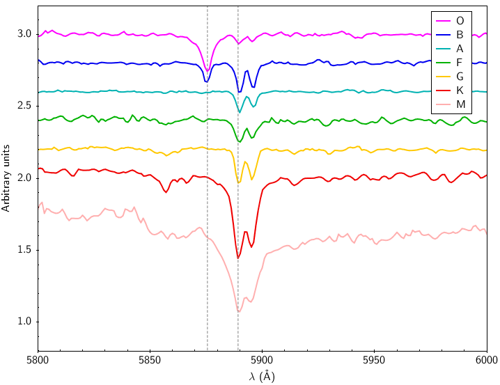
*Spectral comparison across the Na I D region in hot vs cool stars.*

## Linked References

- [[Atmospheric parameters Teff log g feh vmicro]]
- [[Astronomical_Spectroscopy_MOC]]
- [[Stellar_Astrophysics_MOC]]

