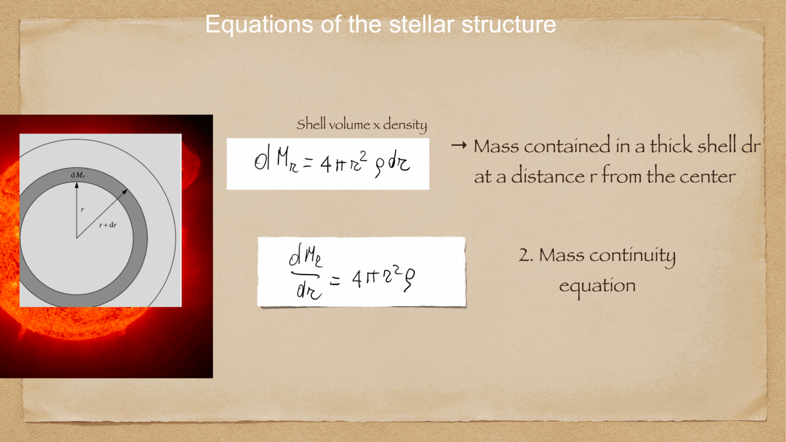
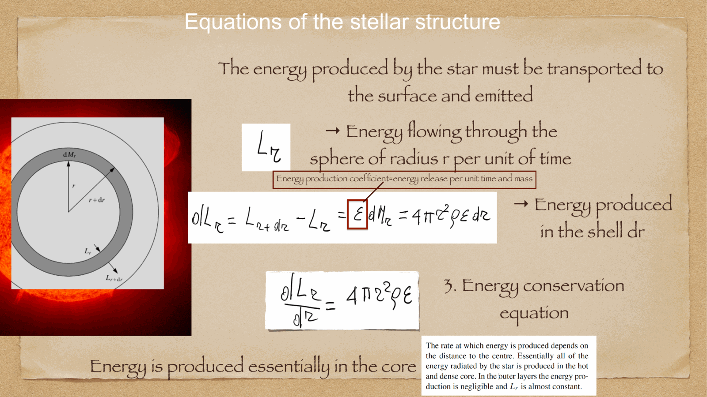
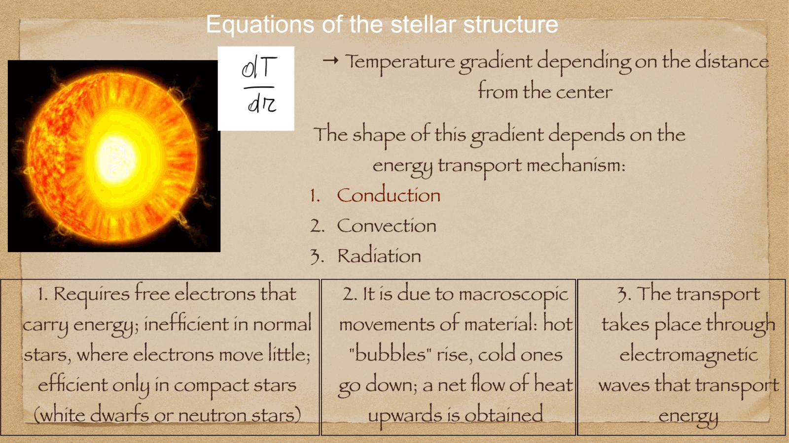
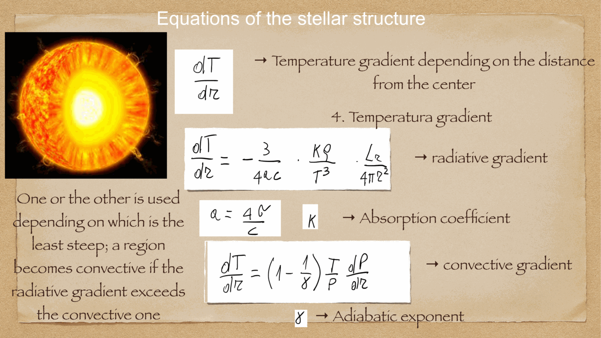
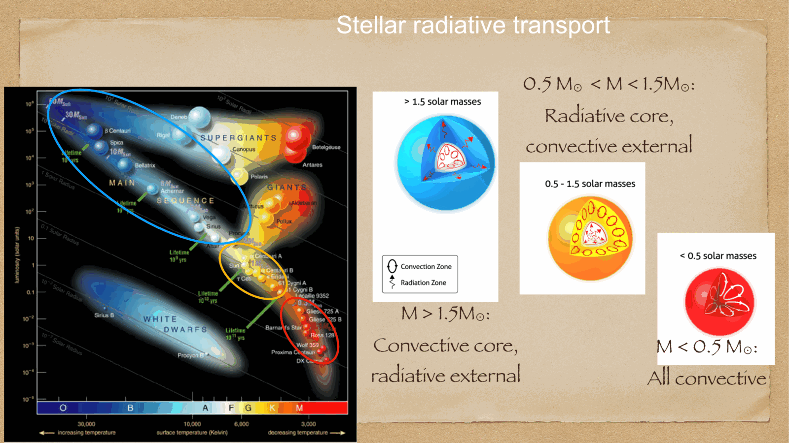

a spherically symmetric, non-rotating, non-magnetic star in quasi-static equilibrium is governed by **the four differential equations of stellar structure**. these equations connect mass, pressure, temperature, and luminosity as functions of radial distance $r$ from the center.

---

## the four fundamental equations of stellar structure

### 1. equation of mass conservation:
the mass $M(r)$ enclosed within a spherical shell of radius $r$ and thickness $dr$ with local density $\rho(r)$ is:
$$\boxed{\, \frac{dM}{dr} = 4\pi r^2 \rho(r) \,}$$
- boundary conditions: $M(0) = 0$, and $M(R) = M_{\text{total}}$.

### 2. equation of hydrostatic equilibrium:
in each spherical shell, the inward gravitational pull of the enclosed mass $M(r)$ is exactly balanced by the outward net pressure gradient force:
$$\boxed{\, \frac{dP}{dr} = -\frac{G M(r) \rho(r)}{r^2} \,}$$
where total pressure $P = P_{\text{gas}} + P_{\text{rad}} = \frac{\rho k_B T}{\mu m_H} + \frac{1}{3} a T^4$.
- boundary conditions: $P(R) \approx 0$, and $P(0) = P_c$ (central pressure).

### 3. equation of energy conservation:
the luminosity $L(r)$ flowing outward through a sphere of radius $r$ increases by the energy generated in the shell by nuclear fusion $\epsilon(r)$ (and gravitational contraction/expansion):
$$\boxed{\, \frac{dL}{dr} = 4\pi r^2 \rho(r) \left[\epsilon(r) - \epsilon_\nu + \epsilon_{\text{grav}}\right] \,}$$
where $\epsilon$ is the nuclear energy generation rate per unit mass (W/kg), and $\epsilon_\nu$ is energy lost to escaping neutrinos.
- boundary conditions: $L(0) = 0$, and $L(R) = L_{\text{surface}}$.

### 4. equation of energy transport:
governs the temperature gradient $dT/dr$ required to transport luminosity $L(r)$ outward. energy flows via the mechanism that requires the smallest temperature gradient (conduction, radiation, or convection).

#### A. Radiative transport:
when energy is carried by photons diffusing through matter with Rosseland mean opacity $\kappa$ (diffusion approximation):
$$\boxed{\, \left(\frac{dT}{dr}\right)_{\text{rad}} = -\frac{3 \kappa \rho L(r)}{16\pi a c r^2 T^3} = -\frac{3 \kappa \rho}{4 a c T^3} \frac{F(r)}{\pi} \,}$$
where $a = 4\sigma/c$ is the radiation constant.

#### B. Convective transport and the Schwarzschild criterion:
Karl Schwarzschild proved that a fluid element displaced upward adiabatically will become buoyant and unstable to **convection** if the actual temperature gradient is steeper than the adiabatic gradient:
$$\boxed{\, \left\lvert\frac{dT}{dr}\right\rvert_{\text{actual}} > \left\lvert\frac{dT}{dr}\right\rvert_{\text{ad}} = \left(1 - \frac{1}{\gamma}\right) \frac{T}{P} \left\lvert\frac{dP}{dr}\right\rvert \,}$$

convection is triggered when:
1. the opacity $\kappa$ is very large (e.g. hydrogen/helium partial ionization zones where $T \sim 10^4-10^5$ K in outer stellar envelopes).
2. the energy generation rate $\epsilon$ is extremely temperature-sensitive (e.g. CNO cycle where $\epsilon \propto T^{18}$), producing an immense central luminosity flux.

when convection occurs, it is so efficient that the temperature gradient is clamped very close to the adiabatic gradient: $\frac{dT}{dr} \approx \left(\frac{dT}{dr}\right)_{\text{ad}}$.

---

## Convective Instability: Schwarzschild and Ledoux Criteria

The Schwarzschild criterion above is derived from the buoyancy of an adiabatically displaced fluid element and is exact only for a chemically homogeneous medium. Writing the local temperature gradient in the dimensionless logarithmic form
$$\nabla \equiv \frac{d\ln T}{d\ln P}, \qquad \nabla_{\mathrm{ad}} \equiv \left(\frac{\partial \ln T}{\partial \ln P}\right)_S = \frac{\Gamma_1-1}{\Gamma_1}$$
where $\Gamma_1 \equiv (\partial\ln P/\partial\ln\rho)_S$ is the first adiabatic exponent, the **Schwarzschild criterion for instability** is
$$\boxed{\, \nabla_{\mathrm{rad}} > \nabla_{\mathrm{ad}} \,}, \qquad \nabla_{\mathrm{rad}} \equiv \frac{3\kappa P L}{16\pi a c G M T^4}$$
with $\nabla_{\mathrm{rad}}$ obtained by rewriting the radiative-transport equation in logarithmic form under hydrostatic equilibrium.

In a region with a composition (mean molecular weight $\mu$) gradient, a displaced element carries its original composition with it, so buoyancy depends on both the thermal and compositional density contrast. The generalized **Ledoux criterion for instability** is
$$\boxed{\, \nabla_{\mathrm{rad}} > \nabla_{\mathrm{ad}} + \frac{\varphi}{\delta}\nabla_\mu \,}, \qquad \nabla_\mu \equiv \frac{d\ln\mu}{d\ln P}, \quad \varphi \equiv \left(\frac{\partial\ln\rho}{\partial\ln\mu}\right)_{P,T}, \quad \delta \equiv -\left(\frac{\partial\ln\rho}{\partial\ln T}\right)_{P,\mu}$$
A positive $\nabla_\mu$ (mean molecular weight increasing inward, as in a helium-enriched core beneath a hydrogen envelope) stabilizes the layer against convection that the Schwarzschild criterion alone would predict as unstable — the extra term is a compositional restoring force analogous to the stabilizing effect of a salinity gradient in oceanic double-diffusive convection. **Asymptotic check**: for $\nabla_\mu \to 0$ (chemically homogeneous layer), the Ledoux criterion reduces identically to the Schwarzschild criterion.

## Mixing-Length Theory: The Convective Flux

When a layer is convectively unstable, the local temperature gradient must be determined from an explicit theory of convective heat transport rather than simply set equal to $\nabla_{\mathrm{ad}}$, since a finite superadiabatic excess $\nabla-\nabla_{\mathrm{ad}}$ is required to drive a finite convective flux. **Mixing-length theory (MLT)** models convection as parcels rising a characteristic distance $\ell_{\mathrm{MLT}} = \alpha_{\mathrm{MLT}} H_P$ (a fixed multiple of the local pressure scale height $H_P = -dr/d\ln P$) before dissolving and depositing their thermal energy excess. Balancing the buoyant work done on a parcel against its radiative energy leakage yields the convective flux
$$\boxed{\, F_{\mathrm{conv}} = \rho c_P T \sqrt{\frac{g\delta}{T}}\left(\frac{\ell_{\mathrm{MLT}}}{2}\right)^2 (\nabla-\nabla')^{3/2} \,}$$
where:
- $c_P$ is the specific heat at constant pressure
- $g$ is the local gravitational acceleration
- $\nabla$ is the actual (background) logarithmic temperature gradient
- $\nabla'$ is the logarithmic temperature gradient inside the rising parcel (equal to $\nabla_{\mathrm{ad}}$ only in the limit of zero radiative leakage from the parcel)
- $\delta$ is defined as above

Total luminosity is transported jointly by radiation and convection, $L = L_{\mathrm{rad}} + L_{\mathrm{conv}} = 4\pi r^2(F_{\mathrm{rad}}+F_{\mathrm{conv}})$; closing the system requires solving simultaneously for $\nabla$ and $\nabla'$ given $\nabla_{\mathrm{rad}}$ and $\nabla_{\mathrm{ad}}$. **Asymptotic checks**: in the highly efficient convection limit (stellar interiors, high $\rho$, low $\kappa$), radiative parcel leakage is negligible, $\nabla'\to\nabla_{\mathrm{ad}}$, and $\nabla\to\nabla_{\mathrm{ad}}$ to high precision — recovering the adiabatic clamping stated above; in the inefficient convection limit (stellar surface layers, low $\rho$), radiative leakage is severe, $\nabla \gg \nabla_{\mathrm{ad}}$ is required to drive any convective flux at all, and $\alpha_{\mathrm{MLT}}$ becomes an empirically calibrated free parameter (fixed via the solar radius at the solar age) rather than a value derivable from first principles — the dominant systematic uncertainty in 1D stellar evolution codes, only fully resolved by 3D radiative-hydrodynamic simulation (cf. [[Asplund_2009_Chemical_Composition_of_the_Sun]]).

## Polytropic Spheres and the Lane-Emden Equation

A **polytrope** is a self-gravitating configuration whose pressure and density are related by a single power law, $P = K\rho^{1+1/n}$, with $K$ constant and $n$ the polytropic index — an idealization exact for a fully convective star ($n=3/2$; MLT drives $\nabla\to\nabla_{\mathrm{ad}}$ everywhere, and for an ideal monatomic gas $\Gamma_1=5/3$ gives $P\propto\rho^{5/3}$) and for a degenerate electron gas ([[Chandrasekhar mass limit]]).

Substituting the dimensionless variables
$$\rho = \rho_c\,\theta^n, \qquad r = \alpha\,\xi, \qquad \alpha^2 \equiv \frac{(n+1)K\rho_c^{1/n-1}}{4\pi G}$$
into the combined hydrostatic-equilibrium and mass-conservation equations (equations 1 and 2 above) eliminates $P$ and $M(r)$ in favor of the single dimensionless function $\theta(\xi)$, giving the **Lane-Emden equation**:
$$\boxed{\, \frac{1}{\xi^2}\frac{d}{d\xi}\left(\xi^2\frac{d\theta}{d\xi}\right) = -\theta^n \,}, \qquad \theta(0)=1, \quad \theta'(0)=0$$
where:
- $\theta(\xi)$ is the dimensionless density/pressure variable, normalized to $\theta=1$ at the center
- $\xi$ is the dimensionless radial coordinate
- $\rho_c$ is the central density
- the surface is located at the first zero $\xi_1$ where $\theta(\xi_1)=0$

**Analytic solutions** exist for three special indices:
$$n=0:\ \ \theta = 1-\frac{\xi^2}{6}, \qquad n=1:\ \ \theta = \frac{\sin\xi}{\xi}, \qquad n=5:\ \ \theta = \left(1+\frac{\xi^2}{3}\right)^{-1/2}$$
The $n=0$ (incompressible) and $n=1$ solutions have finite radius $\xi_1$; the $n=5$ solution has $\theta\to0$ only as $\xi\to\infty$, describing a centrally concentrated sphere of formally infinite radius but finite mass — the analytic boundary case beyond which no finite-radius polytrope exists ($n<5$ required for a physical stellar model with a well-defined surface).

For general $n$, the enclosed mass in terms of the dimensionless mass function $\omega_n \equiv -\xi_1^2\theta'(\xi_1)$ is
$$M = 4\pi\alpha^3\rho_c\,\omega_n = 4\pi\left(\frac{(n+1)K}{4\pi G}\right)^{3/2}\rho_c^{(3-n)/2n}\,\omega_n$$
**Asymptotic check — the $n=3$ case**: for $n=3$ the exponent $(3-n)/2n = 0$, so $M$ becomes *independent of central density* and is fixed entirely by $K$ and the constant $\omega_3\approx2.018$ — this is the mass-radius degeneracy underlying both the ultra-relativistic-degenerate white dwarf limit ([[Chandrasekhar mass limit]]) and, in a different physical context, the $n=3$ radiative envelope structure of an Eddington standard model.

---

## internal structure configurations across the Main Sequence

the dominance of radiative vs convective zones depends fundamentally on stellar mass:
1. **Low-mass stars ($M < 0.35 M_\odot$)**: completely convective from core to surface. high opacity and low temperatures keep the entire star mixed, allowing them to burn nearly $100\%$ of their hydrogen before leaving the MS.
2. **Solar-type stars ($0.35 M_\odot < M < 1.5 M_\odot$)**: **radiative core** and **convective outer envelope**. pp-chain energy generation is weakly temperature-dependent ($\epsilon \propto T^4$), keeping the core stable against convection. the cooler outer layers have high opacity, driving envelope convection.
3. **Massive stars ($M > 1.5 M_\odot$)**: **convective core** and **radiative outer envelope**. the CNO cycle dominates, concentrating energy production in a tiny central region and driving intense core convection. the hot outer layers have low opacity (electron scattering $\kappa_{es} = 0.4$ cm$^2$/g), transporting energy stably by radiation.

---

## Primary Literature

- **Kippenhahn, Weigert & Weiss**, *Stellar Structure and Evolution* (2nd ed., Springer) — the standard graduate reference for the four-equation formalism, MLT, and polytropic structure derived above.
- **Bressan et al. (2012)**, *MNRAS* 427, 127, [arXiv:1208.4498](https://arxiv.org/abs/1208.4498) — the PARSEC stellar evolution code: modern numerical solution of the four structure equations with updated opacities, equations of state, and mixing-length calibration, used throughout the Padova isochrone grids referenced in [[Photometric chromosome maps]] and [[Extended main sequence turn-off eMSTO]].

## see also

- [Fundamentals_Astrophysics_Cosmology_MOC](../../04_Atlas/Fundamentals_Astrophysics_Cosmology_MOC.html)
- [Radiative transport](Radiative%20transport.html)
- [Stellar scaling relations](Stellar%20scaling%20relations.html)
- [Stellar nucleosynthesis](Stellar%20nucleosynthesis.html)
- [Stellar evolution timescales](Stellar%20evolution%20timescales.html)
- [Chandrasekhar mass limit](Chandrasekhar%20mass%20limit.html)

  <h4 class="backlinks-title">Linked References (7)</h4>
  <ul class="backlinks-list">
    <li class="backlink-item-wrap"><a href="Jeans%20theory%20and%20protostellar%20formation.html" class="backlink-item">Jeans theory and protostellar formation</a></li>
    <li class="backlink-item-wrap"><a href="M-dwarf%20discontinuity%20and%20convective%20merging%20instability.html" class="backlink-item">M-dwarf discontinuity and convective merging instability</a></li>
    <li class="backlink-item-wrap"><a href="Stellar%20atmosphere%20structure.html" class="backlink-item">Stellar atmosphere structure</a></li>
    <li class="backlink-item-wrap"><a href="Stellar%20evolution%20timescales.html" class="backlink-item">Stellar evolution timescales</a></li>
    <li class="backlink-item-wrap"><a href="Stellar%20nucleosynthesis.html" class="backlink-item">Stellar nucleosynthesis</a></li>
    <li class="backlink-item-wrap"><a href="Stellar%20scaling%20relations.html" class="backlink-item">Stellar scaling relations</a></li>
    <li class="backlink-item-wrap"><a href="../../04_Atlas/Fundamentals_Astrophysics_Cosmology_MOC.html" class="backlink-item">Fundamentals_Astrophysics_Cosmology_MOC</a></li>
  </ul>

