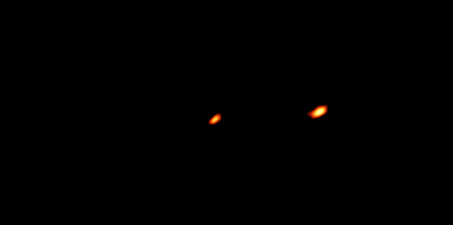


> A radio observation flows through a strict pipeline of planning, alternating calibrator scans, data flagging, and iterative imaging.

---

## core physical intuition

Taking an image with a radio interferometer is not a simple point-and-shoot process. Because the array is spread across miles of terrain, the signals are heavily distorted by the atmosphere and by variations in the electronics of each individual antenna. To recover the true sky image, the observer must constantly switch away from their science target to look at known, bright reference sources.

By tracking how these reference sources are distorted, you can calculate mathematical corrections and apply them to your science target. This calibration process requires carefully mapping out the sequence of observations. Even after calibration, the data must be rigorously filtered to remove human-made radio interference before the mathematical deconvolution algorithms can finally reconstruct the image.

---

## key derivation & equations

The typical sequence of operations is
1. define science goal and required resolution and sensitivity
2. choose array configuration and frequency band
3. select calibrators for flux, bandpass, and phase
4. observe in alternating target and calibrator scans
5. flag bad data such as RFI or dead antennas
6. apply bandpass, flux, and phase calibration solutions
7. image with algorithms like CLEAN or MEM
8. self-calibrate and re-image to improve dynamic range
9. validate against known sources or expectations

---

## astrophysical context

Major facilities like ALMA and the VLA process observations through this standard pipeline. The calibration overhead is significant. Spending 20 to 40 percent of the total telescope time just looking at calibrators is typical. This intensive process ensures that the amplitude scales are absolute and that the phase errors from the troposphere or ionosphere are removed, allowing for the incredibly high dynamic range images seen in modern radio astronomy.

---

## connections & zettel links

* parent moc: [Astronomical_Interferometry_MOC](../../04_Atlas/Astronomical_Interferometry_MOC.html)
* related zettels: [Calibration overview](interf/Calibration%20overview.html), [Bandpass calibration](interf/Bandpass%20calibration.html), [Flux calibration](interf/Flux%20calibration.html), [Phase referencing](interf/Phase%20referencing.html), [Self-calibration](interf/Self-calibration.html), [CLEAN algorithm](interf/CLEAN%20algorithm.html)
