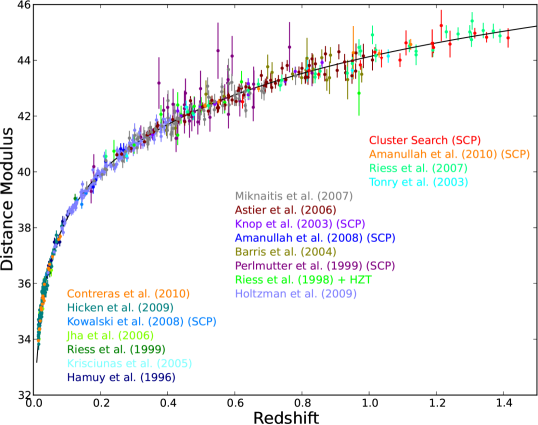
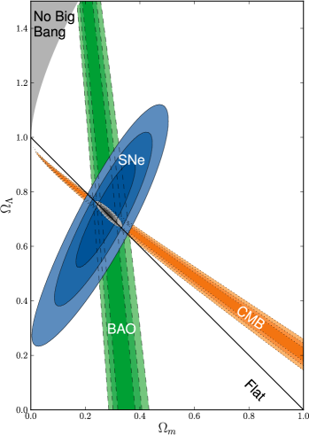
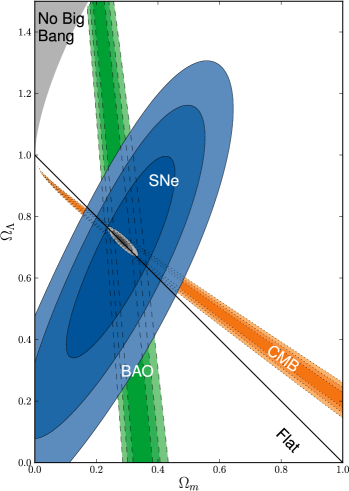


the **SN Ia Hubble diagram** plots the apparent brightness (distance modulus) of Type Ia supernovae against their redshift. its **deviation from linear at high $z$** is the smoking-gun evidence for accelerated expansion of the universe (Perlmutter, Riess, Schmidt 1998).

## the plot

axes:
- **x**: $\log z$ or $z$.
- **y**: distance modulus $\mu = m - M = 5\log_{10}(d_L/10\,\text{pc})$.

each SN Ia provides one data point: its observed peak magnitude (with stretch + colour corrections) gives $m$, the standard-candle absolute magnitude $M \approx -19.3$ gives $\mu$.

in flat $\Lambda$CDM:
$$d_L(z) = (1+z)\frac{c}{H_0}\int_0^z \frac{dz'}{\sqrt{\Omega_m(1+z')^3 + \Omega_\Lambda}}$$

## the discovery

1998 Riess + Perlmutter independent samples of $\sim 50$ SN Ia at $z \sim 0.5$:
- predicted $d_L$ for matter-only ($\Omega_m = 1$, $\Omega_\Lambda = 0$): one curve.
- predicted $d_L$ for accelerated expansion ($\Omega_\Lambda > 0$): a higher curve.
- observed SN Ia at $z \sim 0.5$ are **fainter** than the matter-only prediction, consistent with $\Omega_\Lambda \approx 0.7$.

so the universe is **accelerating**. interpretation: dark energy with $w \approx -1$.

Nobel 2011: Saul Perlmutter, Brian Schmidt, Adam Riess.

## the modern Hubble diagram

over $\sim 2000$ SN Ia in modern compilations (Pantheon, Pantheon+, Union3). spans $z = 0$ to $\sim 2$. precision constraints:
- $\Omega_m \approx 0.30 \pm 0.02$ (matter density).
- $\Omega_\Lambda = 1 - \Omega_m \approx 0.70$ (assuming flat).
- $w \approx -1.03 \pm 0.04$ (dark energy equation of state).
- $H_0 = 73.04 \pm 1.04$ km/s/Mpc (local ladder, in tension with CMB).

## the calibration ladder

SN Ia absolute magnitudes calibrated by:
1. **parallax** to nearby Cepheids.
2. **Cepheids** in $\sim 40$ galaxies that hosted both Cepheids and SN Ia.
3. **SN Ia distances** in those host galaxies.

each step has its own systematic. the SH0ES program (Riess et al.) drives the precision down to $\sim 1\%$ at each step.

alternative: TRGB calibration (Carnegie-Chicago), gives slightly different $H_0 \approx 69.8$. partial resolution between SN Ia ladder + CMB.

## what the curve teaches

at low $z$: linear, slope = $H_0$. matter and curvature don't matter yet.

at moderate $z$ ($0.1 \lesssim z \lesssim 1$): deviation from linearity reveals the cosmological model. data prefer accelerated expansion.

at high $z$ ($z \gtrsim 1$): SN Ia were **brighter** than expected for a constant-$\Lambda$ model, consistent with $\Lambda$CDM. some surveys hint at $w \ne -1$ (DESI 2024-2025), still under investigation.

## see also

- [Type Ia supernovae as standard candles](./Type%20Ia%20supernovae%20as%20standard%20candles.html)
- [Luminosity distance](./Luminosity%20distance.html)
- [Distance modulus](./Distance%20modulus.html)
- [Hubble flow distances](./Hubble%20flow%20distances.html)
- [Distance ladder derivations](./Distance%20ladder%20derivations.html)
- [Cepheid period-luminosity relation](./Cepheid%20period-luminosity%20relation.html)
- [TRGB tip of the red giant branch](./TRGB%20tip%20of%20the%20red%20giant%20branch.html)
- [Cosmic_inventory_dark_energy](./Cosmic_inventory_dark_energy.html)
- [Observational_Cosmology_MOC](../../04_Atlas/Observational_Cosmology_MOC.html)

---

### Observational Cosmology Data Panels & Visual Evidence

*Suzuki et al. (2012) Supernova Cosmology Project Union2.1 compilation: Hubble diagram of 580 Type Ia supernovae out to $z=1.4$.*

*Residual magnitude $\Delta(m - M)$ relative to an empty universe ($\,\Omega_m = 0, \Omega_\Lambda = 0$), conclusively ruling out decelerating matter-only models at $> 99.9\%$ confidence.*

*Confidence contours in the $(\Omega_m, \Omega_\Lambda)$ plane combining SNe Ia, CMB, and BAO, establishing the concordance $\Lambda$CDM universe ($\,\Omega_m \approx 0.3, \Omega_\Lambda \approx 0.7$).*


  <h4 class="backlinks-title">Linked References (8)</h4>
  <ul class="backlinks-list">
    <li class="backlink-item-wrap"><a href="./Deceleration%20parameter.html" class="backlink-item">Deceleration parameter</a></li>
    <li class="backlink-item-wrap"><a href="./Distance%20ladder%20derivations.html" class="backlink-item">Distance ladder derivations</a></li>
    <li class="backlink-item-wrap"><a href="./LambdaCDM%20current%20parameters.html" class="backlink-item">LambdaCDM current parameters</a></li>
    <li class="backlink-item-wrap"><a href="./Luminosity%20distance.html" class="backlink-item">Luminosity distance</a></li>
    <li class="backlink-item-wrap"><a href="../../04_Atlas/Observational_Cosmology_MOC.html" class="backlink-item">Observational_Cosmology_MOC</a></li>
    <li class="backlink-item-wrap"><a href="./Surveys%20to%20remember.html" class="backlink-item">Surveys to remember</a></li>
    <li class="backlink-item-wrap"><a href="./Various%20models%20of%20the%20universe.html" class="backlink-item">Various models of the universe</a></li>
    <li class="backlink-item-wrap"><a href="./%CE%9BCDM%20current%20parameters.html" class="backlink-item">ΛCDM current parameters</a></li>
  </ul>

