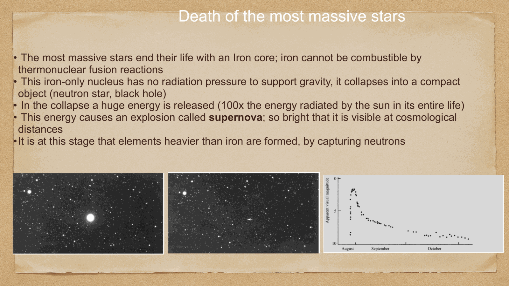
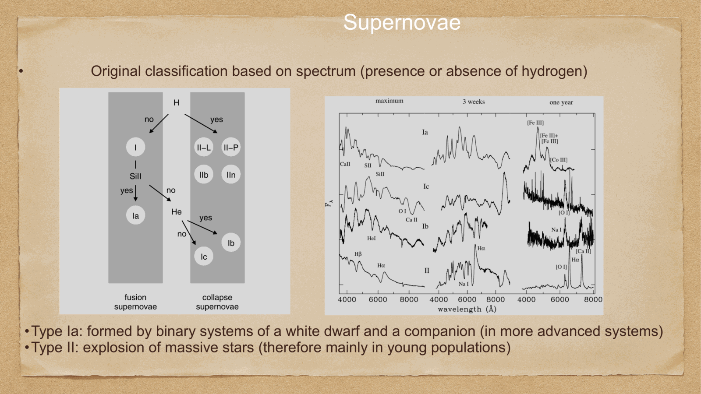
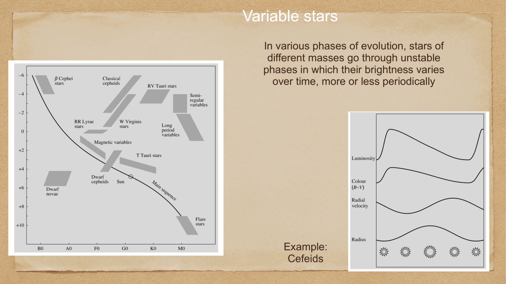
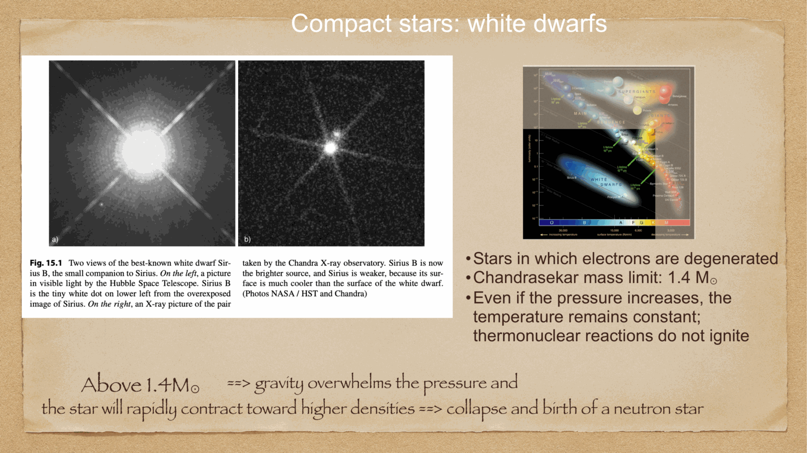
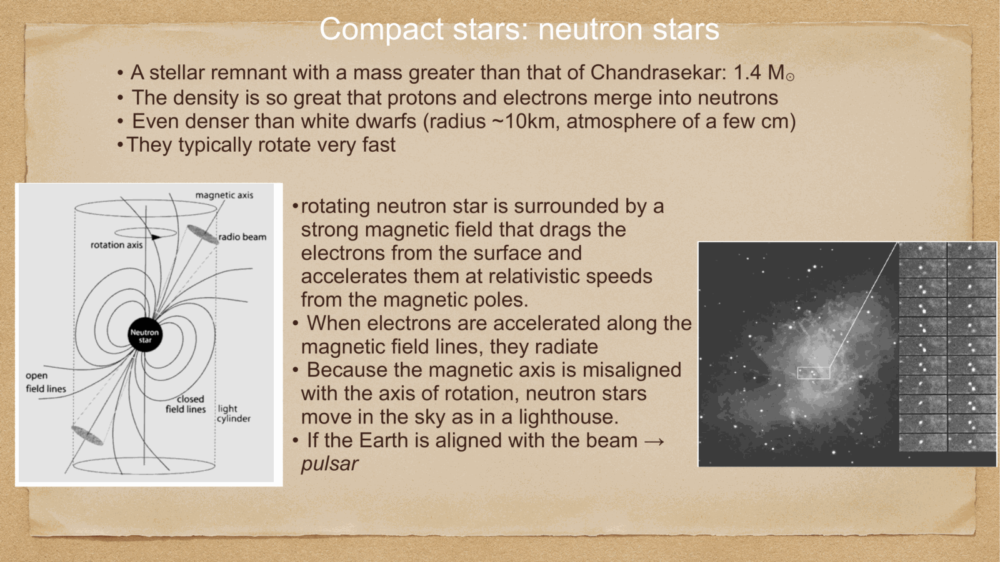
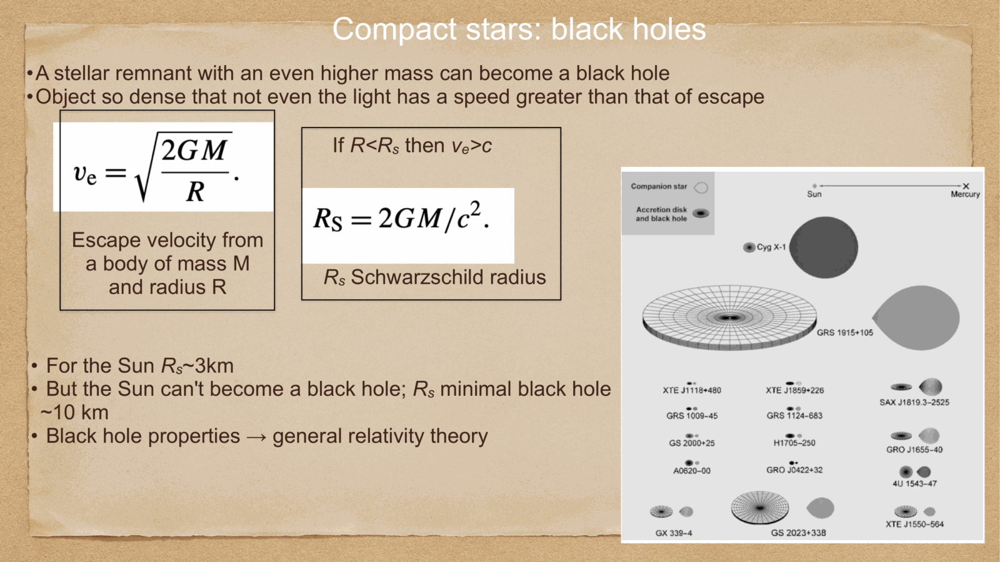
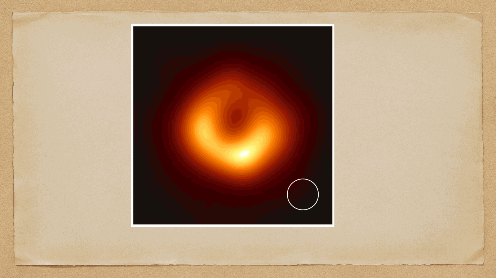


when a star exhausts all viable thermonuclear fuel, gravity prevails uncontested. depending on the progenitor's zero-age main-sequence mass and core composition, the star undergoes catastrophic explosive death, leaving behind one of three types of **compact remnants**: a **white dwarf**, a **neutron star**, or a **black hole**.

---

## 1. core-collapse supernovae (massive stars: $M \ge 8 M_\odot$)

massive stars synthesize elements up to iron in an onion-skin core structure. once the iron core reaches the Chandrasekhar limit ($M_{\text{core}} \approx 1.4 M_\odot$), two endothermic catastrophes trigger instantaneous core collapse:
1. **photodisintegration**: high-energy gamma photons shatter iron nuclei into alpha particles and neutrons, draining thermal pressure:
   $${}^{56}\text{Fe} + \gamma \to 13\,{}^4\text{He} + 4n - 124.4 \text{ MeV}$$
2. **electron capture (neutronization)**: ultra-relativistic electrons are squeezed into protons:
   $$p + e^- \to n + \nu_e$$
   eliminating the electron degeneracy pressure supporting the core!

the core collapses in free fall at $\sim 25\%$ the speed of light ($v \sim 70,000$ km/s) in less than a second, until nuclear saturation density is reached ($\rho_{\text{nuc}} \approx 2.7 \times 10^{14}$ g/cm$^3$). at this point, the strong nuclear force becomes repulsive: the core stiffens, rebounds (**core bounce**), driving a shock wave outward that blows the stellar envelope into space as a **Type II, Ib, or Ic supernova**, releasing $\sim 10^{51}$ erg of kinetic energy and $10^{53}$ erg in a blinding burst of neutrinos!

---

## supernova classification scheme

astronomers classify supernovae observationally based on spectral features near maximum light:
- **Type I (no hydrogen lines in spectrum)**:
  - **Type Ia**: strong ionized silicon line (**Si II at $6150$ Å**). thermonuclear detonation of a carbon-oxygen white dwarf in a binary system. uniform peak luminosity ($M_B \approx -19.3$), fundamental cosmological standard candles.
  - **Type Ib**: no Si II, but strong neutral Helium (**He I at $5876$ Å**). core collapse of a massive star that shed its hydrogen envelope (Wolf-Rayet star).
  - **Type Ic**: no Si II and no He I lines. core collapse of a massive star that shed both hydrogen and helium envelopes.
- **Type II (prominent hydrogen Balmer lines)**:
  - core collapse of massive stars retaining their hydrogen envelopes.

---

## the three compact remnants of stellar evolution

### 1. White Dwarfs (Nane Bianche)
- **progenitor mass**: $M_{\text{ZAMS}} < 8 M_\odot$ (including Sun).
- **support mechanism**: **non-relativistic electron degeneracy pressure**:
  $$P_e = \frac{(3\pi^2)^{2/3} \hbar^2}{5 m_e} n_e^{5/3} \propto \rho^{5/3}$$
- **mass-radius relation**: $R \propto M^{-1/3}$ (more massive white dwarfs are smaller!).
- **Chandrasekhar Mass Limit (1931)**: as mass increases, electron Fermi velocity approaches $c$. relativistic degeneracy yields $P_e \propto \rho^{4/3}$. the star becomes unstable, yielding the absolute maximum mass for a white dwarf:
  $$\boxed{\, M_{\text{Ch}} = \frac{\omega_3^0}{4\pi} \left(\frac{h c}{G}\right)^{3/2} \left(\frac{1}{\mu_e m_H}\right)^2 \approx 1.44 M_\odot \,}$$

### 2. Neutron Stars (Stelle di Neutroni)
- **progenitor mass**: $8 M_\odot \lesssim M_{\text{ZAMS}} \lesssim 25-30 M_\odot$.
- **support mechanism**: **neutron degeneracy pressure** and repulsive strong nuclear forces.
- **dimensions**: mass $M \sim 1.4 - 2.1 M_\odot$, radius $R \approx 10 - 12$ km (city-sized!), average density $\rho \sim 10^{14}-10^{15}$ g/cm$^3$ (a teaspoon weighs a billion tons).
- **observational manifestations**: radio **pulsars** (highly magnetized rotating neutron stars sweeping beams across Earth), magnetars ($B \sim 10^{14}-10^{15}$ G).
- **Tolman-Oppenheimer-Volkoff (TOV) Limit**: the maximum mass of a stable neutron star:
  $$\boxed{\, M_{\text{TOV}} \approx 2.0 - 2.3 M_\odot \,}$$

### 3. Black Holes (Buchi Neri)
- **progenitor mass**: $M_{\text{ZAMS}} \gtrsim 25-30 M_\odot$.
- when the remnant core mass exceeds the TOV limit ($M_{\text{core}} > M_{\text{TOV}}$), no known physical force or degeneracy pressure can halt collapse. gravity crushes the matter into a gravitational singularity enclosed by an **event horizon**.
- **Schwarzschild radius** (event horizon of a non-rotating black hole):
  $$\boxed{\, R_s = \frac{2 G M}{c^2} \approx 3 \left(\frac{M}{M_\odot}\right) \text{ km} \,}$$
- detected via X-ray binaries (e.g. Cygnus X-1), gravitational waves from binary mergers (LIGO/Virgo), and supermassive black holes in galactic nuclei (e.g. Sgr A*, M87* imaged by EHT).

---

## see also

- [Fundamentals_Astrophysics_Cosmology_MOC](../../04_Atlas/Fundamentals_Astrophysics_Cosmology_MOC.html)
- [Solar evolution and final stages](./Solar%20evolution%20and%20final%20stages.html)
- [Stellar nucleosynthesis](./Stellar%20nucleosynthesis.html)
- [Type Ia supernovae as standard candles](./Type%20Ia%20supernovae%20as%20standard%20candles.html)
- [Galactic Center](./Galactic%20Center.html)


  <h4 class="backlinks-title">Linked References (6)</h4>
  <ul class="backlinks-list">
    <li class="backlink-item-wrap"><a href="./Binary%20star%20evolution%20and%20mass%20transfer.html" class="backlink-item">Binary star evolution and mass transfer</a></li>
    <li class="backlink-item-wrap"><a href="../../04_Atlas/Fundamentals_Astrophysics_Cosmology_MOC.html" class="backlink-item">Fundamentals_Astrophysics_Cosmology_MOC</a></li>
    <li class="backlink-item-wrap"><a href="./Galactic%20Center.html" class="backlink-item">Galactic Center</a></li>
    <li class="backlink-item-wrap"><a href="./Solar%20evolution%20and%20final%20stages.html" class="backlink-item">Solar evolution and final stages</a></li>
    <li class="backlink-item-wrap"><a href="./Stellar%20nucleosynthesis.html" class="backlink-item">Stellar nucleosynthesis</a></li>
    <li class="backlink-item-wrap"><a href="./Type%20Ia%20supernovae%20as%20standard%20candles.html" class="backlink-item">Type Ia supernovae as standard candles</a></li>
  </ul>

