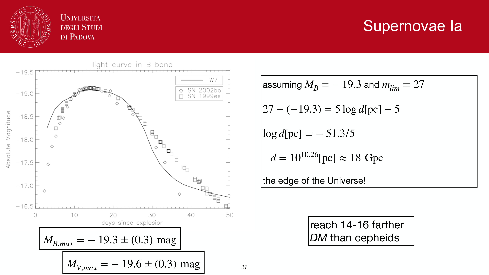
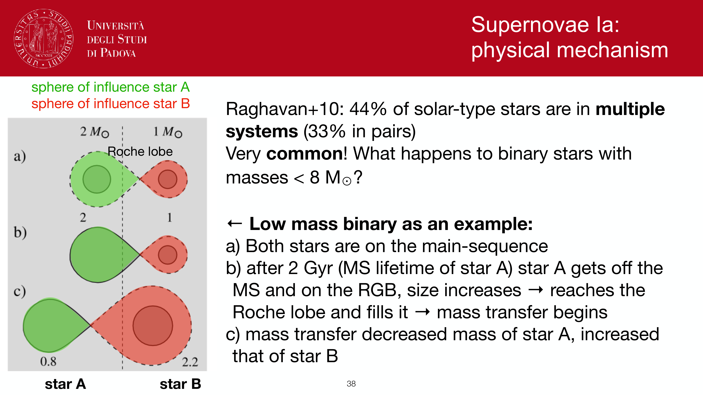
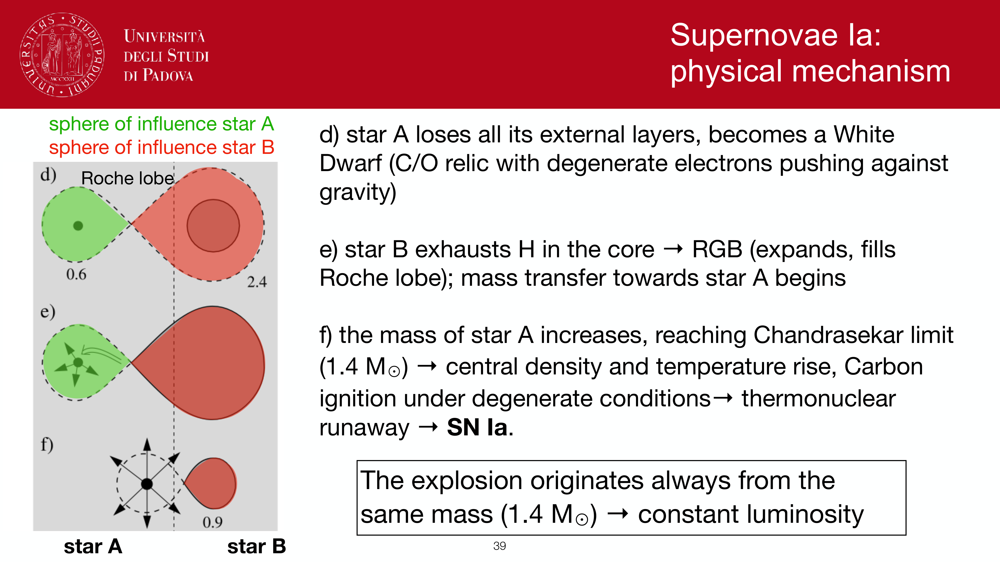
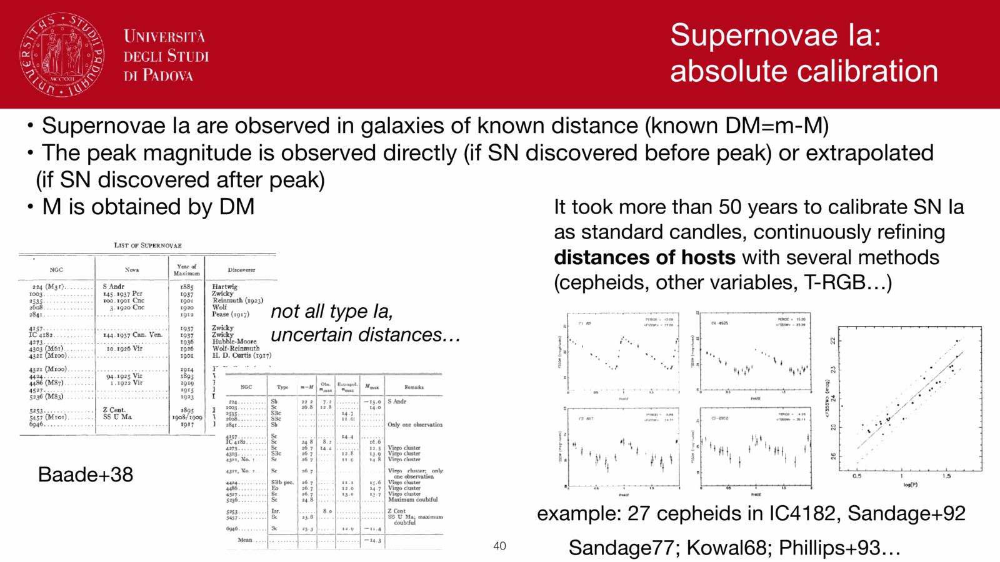

**surface brightness fluctuations (SBF)** is a Poisson-statistics distance method for unresolved elliptical galaxies. their finite stellar populations create flux variations from pixel to pixel, and the variance is distance-dependent.

## the physics

an elliptical galaxy has $N$ stars per pixel, with a typical stellar luminosity dominated by red giants ($\bar L \sim 10^4\,L_\odot$ in I-band). the mean flux per pixel is $\bar F = N \bar L / (4\pi d^2)$. but the variance is
$$\sigma_F^2 = N \langle L^2\rangle / (4\pi d^2)^2$$

so the **fractional fluctuation** has a fixed relation to distance:
$$\frac{\sigma_F^2}{\bar F} = \frac{\langle L^2\rangle}{\bar L} \cdot \frac{1}{4\pi d^2}$$

## the standard candle

define the **fluctuation luminosity**:
$$\bar L \equiv \frac{\langle L^2\rangle}{\langle L\rangle}$$
weighted by the second moment of the luminosity function (so dominated by the brightest stars: red giants). for old populations, $\bar M_I^{\rm SBF} \approx -1.7$ to $-1.5$, with a color-dependent calibration:
$$\bar M_I = a + b\,(V - I)$$
typical $b \approx 4$ to $6$ depending on calibration.

so by measuring $\sigma_F^2/\bar F$ and using the calibrated $\bar M$:
$$d^2 \propto \bar L/(\sigma_F^2/\bar F)$$
giving the distance.

## the observational procedure

1. take a deep, well-sampled image of an elliptical (preferably I-band, where giants dominate).
2. subtract a smooth galaxy model (Sérsic + de Vaucouleurs).
3. analyse the residual pixel-to-pixel fluctuations using power-spectrum methods (Tonry & Schneider 1988).
4. correct for Poisson noise from the sky and CCD.
5. apply the calibrated $\bar M$ to get the distance modulus.

## range and use

best for **smooth ellipticals** at $\sim 10$ to $100$ Mpc. limit at low end: galaxy must be far enough that individual giants are not resolvable (otherwise they show up as point sources rather than fluctuations). limit at high end: PSF-scale fluctuations need to be detectable above other noise.

precision: $\sim 5$ to $10\%$ in distance, comparable to Cepheids and TRGB.

an independent rung in the distance ladder: SBF can target the same galaxies as Cepheids (in spiral hosts) or different galaxies (giant ellipticals, where Cepheids are absent). cross-check distances.

## limitations

- requires **smooth surface brightness** profile. dust patches, dwarf galaxies, recent star formation contaminate.
- color dependence ($\sim 0.1$ mag/(V-I) mag) means accurate $V - I$ photometry is essential.
- Poisson noise floor from atmosphere and detector limits the smallest detectable fluctuations.

## see also

- [Distance ladder derivations](Distance%20ladder%20derivations.html)
- [Cepheid period-luminosity relation](Cepheid%20period-luminosity%20relation.html)
- [TRGB tip of the red giant branch](TRGB%20tip%20of%20the%20red%20giant%20branch.html)
- [Type Ia supernovae as standard candles](Type%20Ia%20supernovae%20as%20standard%20candles.html)
- [Galaxy size-luminosity relation](Galaxy%20size-luminosity%20relation.html)
- [Initial mass function](Initial%20mass%20function.html)
- [Stellar populations I II III](Stellar%20populations%20I%20II%20III.html)

---

## observational astrophysics course slides (Prof. Paolo Cassata)

*Surface Brightness Fluctuations (SBF) method (Tonry & Schneider 1988).*

*Poisson counting statistics of red giant branch stars in early-type galaxy pixels.*

*Variance of pixel flux: sigma_F^2 proportional to average stellar flux F_bar proportional to 1/d^2.*

*SBF distance range out to ~100 Mpc with HST and JWST.*

  <h4 class="backlinks-title">Linked References (1)</h4>
  <ul class="backlinks-list">
    <li class="backlink-item-wrap"><a href="../../04_Atlas/Observational_Astrophysics_MOC.html" class="backlink-item">Observational_Astrophysics_MOC</a></li>
  </ul>

