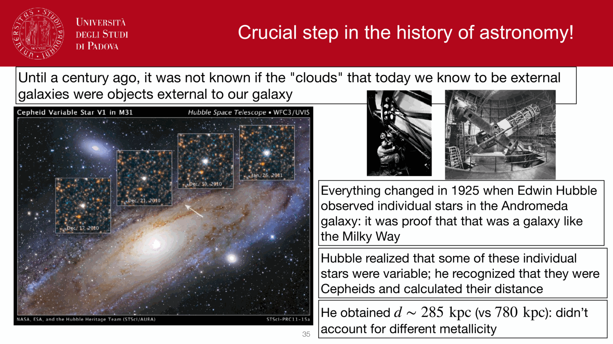
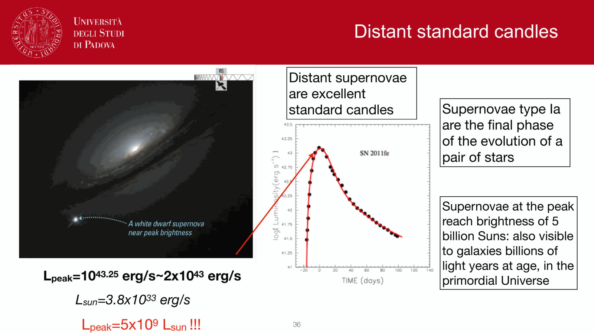

at the **tip of the red giant branch** (TRGB), low-mass stars ignite helium in a thermal flash. the luminosity at this point is nearly independent of mass and metallicity, making it a sharp standard-candle feature in the I-band luminosity function.

## the physics

stars with $M \lesssim 2.3\,M_\odot$ ascend the RGB while burning hydrogen in a shell around an inert helium core. as they evolve up the RGB, the He core grows by shell burning until it reaches a critical mass $\sim 0.46\,M_\odot$, at which point degenerate helium ignites in a runaway thermonuclear flash (the **helium flash**).

since the core mass at flash is universal (set by neutrino cooling and degeneracy pressure), the luminosity at the tip is also universal:
$$M_I^{\rm TRGB} \approx -4.0$$

with a weak metallicity dependence:
$$M_I^{\rm TRGB} = -4.05 + 0.22[Fe/H]$$
(approximate; calibrations vary).

## the observational signature

a CMD of an old population (resolved galaxy halo) shows:
- the RGB rising in $V$ as stars get redder.
- a sharp **edge** at the top: stars stop accumulating at the tip because they evolve quickly through the helium flash.

statistically, the I-band luminosity function shows a sharp discontinuity (the "tip"), and edge-detection algorithms (Sobel filter, Bayesian) locate it to $\sim 0.05$ mag precision.

## advantages over Cepheids

- works in **old populations**: globular clusters, halos, ellipticals, spheroidal dwarfs. anywhere there are old red giants.
- **less metallicity-sensitive**: $\sim 0.05$ mag/dex vs $\sim 0.2$ for Cepheids.
- **insensitive to crowding** at moderate distances (large stars, sparse field).
- **does not require multi-epoch photometry**: a single-epoch deep image gives the answer.
- competes with Cepheids in the same galaxies, providing a critical cross-check.

## disadvantages

- requires **resolving** individual giants. limit: $\sim 30$ Mpc with HST, $\sim 100$ Mpc with JWST in deep fields.
- needs a **clean halo field** away from disk dust.
- the tip detection itself has subtle systematics (smoothing kernel, slope of the LF beneath the tip, metal-rich populations adding scatter).

## the modern $H_0$ player

the Carnegie-Chicago Hubble Program (Freedman et al.) advocates TRGB as the primary local distance scale, calibrated against parallax-known Galactic globular clusters. their $H_0$ measurement:
$$H_0 \approx 69.8 \pm 1.7\,\text{km/s/Mpc}$$
intermediate between the Cepheid-anchored ($73.0$) and Planck-anchored ($67.4$) values. the disagreement among the three is at the heart of the modern $H_0$ tension.

JWST is now resolving TRGB stars in galaxies hosting SN Ia, providing the cleanest Cepheid-independent local ladder.

## see also

- [Cepheid period-luminosity relation](Cepheid%20period-luminosity%20relation.html)
- [Variable stars as standard candles](Variable%20stars%20as%20standard%20candles.html)
- [Type Ia supernovae as standard candles](Type%20Ia%20supernovae%20as%20standard%20candles.html)
- [Distance ladder derivations](Distance%20ladder%20derivations.html)
- [Color-magnitude diagrams of clusters](Color-magnitude%20diagrams%20of%20clusters.html)
- [HR diagram](HR%20diagram.html)
- [Hubble flow distances](Hubble%20flow%20distances.html)

---

## observational astrophysics course slides (Prof. Paolo Cassata)

*Tip of the Red Giant Branch (TRGB) distance indicator.*

*Core helium flash in low-mass degenerate cores fixing tip luminosity M_I ~ -4.0 mag.*

  <h4 class="backlinks-title">Linked References (8)</h4>
  <ul class="backlinks-list">
    <li class="backlink-item-wrap"><a href="Cepheid%20period-luminosity%20relation.html" class="backlink-item">Cepheid period-luminosity relation</a></li>
    <li class="backlink-item-wrap"><a href="Distance%20ladder%20derivations.html" class="backlink-item">Distance ladder derivations</a></li>
    <li class="backlink-item-wrap"><a href="Red%20giant%20branch%20RGB.html" class="backlink-item">Red giant branch RGB</a></li>
    <li class="backlink-item-wrap"><a href="Resolved%20vs%20unresolved%20stellar%20populations.html" class="backlink-item">Resolved vs unresolved stellar populations</a></li>
    <li class="backlink-item-wrap"><a href="Supernova%20Hubble%20diagram.html" class="backlink-item">Supernova Hubble diagram</a></li>
    <li class="backlink-item-wrap"><a href="Surface%20brightness%20fluctuations.html" class="backlink-item">Surface brightness fluctuations</a></li>
    <li class="backlink-item-wrap"><a href="Variable%20stars%20as%20standard%20candles.html" class="backlink-item">Variable stars as standard candles</a></li>
    <li class="backlink-item-wrap"><a href="../../04_Atlas/Observational_Astrophysics_MOC.html" class="backlink-item">Observational_Astrophysics_MOC</a></li>
  </ul>

