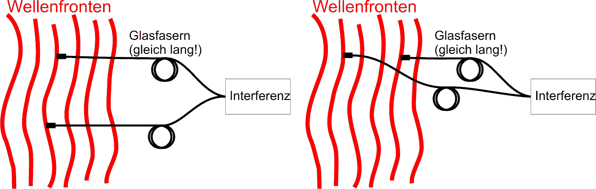

> *the measure of a wave's predictability over time, dictated strictly by its bandwidth, determining how carefully we must match optical paths*

---

## core physical intuition

No real light source emits a perfectly pure, single-frequency sine wave. Real light has a spread of frequencies (a bandwidth). Because different frequencies oscillate at slightly different rates, a wave only remains perfectly in step (coherent) with a delayed copy of itself for a short duration. 

If you take a light beam, split it, delay one half, and recombine them, they will only form an interference pattern if the delay is smaller than the wave's "memory" of its own phase. A very narrow bandwidth (like a laser) means the wave looks like a perfect sine wave for a long time—high temporal coherence. A broad bandwidth (like white light) means the wave packet is very short, and you must perfectly equalize the travel times to see any interference fringes at all.

---

## key derivation & equations

Temporal coherence is fundamentally tied to the bandwidth of the light, $\Delta\nu$, through the uncertainty principle of Fourier transforms. The coherence time $\tau_c$ is approximately the inverse of the bandwidth:

$$ \tau_c \sim \frac{1}{\Delta\nu} $$

The coherence length $l_c$ is simply the distance light travels in that time:

$$ l_c = c\tau_c = \frac{c}{\Delta\nu} $$

In terms of wavelength $\lambda$ and spectral bandwidth $\Delta\lambda$, the coherence length can be approximated as:

$$ l_c \approx \frac{\lambda^2}{\Delta\lambda} $$

---

## astrophysical context

Temporal coherence drives major engineering decisions in interferometry. In optical interferometry (like the VLTI), the coherence length is incredibly short (often microns). Therefore, massive motorized delay lines must actively compensate for the Earth's rotation to keep the optical path difference (OPD) matched to within a fraction of a wavelength in real-time, otherwise the fringes completely wash out. In radio interferometry, the bandwidth of the individual frequency channels determines the coherence time, which in turn sets the maximum usable field of view (bandwidth smearing) for the synthesized image.

---

## connections & zettel links

* parent moc: [Astronomical_Interferometry_MOC](../../04_Atlas/Astronomical_Interferometry_MOC.html)
* related zettels: [Spatial coherence](interf/Spatial%20coherence.html), [Coherence function and visibility](interf/Coherence%20function%20and%20visibility.html), [Wiener-Khinchin theorem](interf/Wiener-Khinchin%20theorem.html), [Delay lines and path-length equalization](interf/Delay%20lines%20and%20path-length%20equalization.html)
