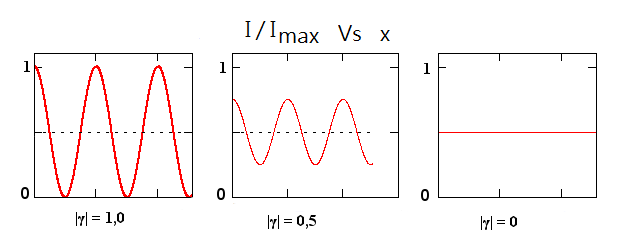


> *the mathematical landscape where baselines live, representing the discrete spatial frequencies of the sky that our array manages to sample*

---

## core physical intuition

To build a high-resolution image of a source without a giant mirror, we construct the image by adding together its spatial Fourier components (like drawing a complex shape by adding different sine waves). The (u,v) plane is simply the 2D coordinate system for these spatial frequencies.

Every pair of antennas in an interferometer forms a baseline. As seen from the sky, this baseline has a specific projected length and orientation. This projected baseline samples exactly one point in the (u,v) plane—one specific spatial frequency of the source's brightness distribution. Short baselines sit near the center of the (u,v) plane and capture broad, extended structures. Long baselines sit at the edges and capture fine, high-resolution details. The goal of observational interferometry is to paint as much of this (u,v) plane as possible.

---

## key derivation & equations

The spatial frequency coordinates $u$ and $v$ are defined by the projected baseline vector $\mathbf{B}_\perp$ divided by the observing wavelength $\lambda$:

$$ u = \frac{B_x}{\lambda}, \quad v = \frac{B_y}{\lambda} $$

According to the Van Cittert-Zernike theorem, the complex visibility $V(u,v)$ measured by a baseline is the 2D Fourier transform of the sky brightness distribution $I(l,m)$, where $l$ and $m$ are direction cosines on the sky:

$$ V(u,v) = \iint I(l,m) e^{-2\pi i(ul + vm)} \, dl\,dm $$

Because $I(l,m)$ is a real-valued intensity, the visibility function has Hermitian symmetry: $V(-u, -v) = V^*(u,v)$. This means every baseline automatically gives you two mirrored points in the (u,v) plane.

---

## astrophysical context

The quality of a synthesized radio or optical image is entirely dependent on (u,v) coverage. The VLA's famous Y-shaped configuration is designed to provide excellent, pseudo-randomized instantaneous (u,v) coverage, which slowly traces out dense elliptical tracks as the Earth rotates over 12 hours. ALMA's compact configurations fill the central (u,v) plane to capture extended molecular clouds without resolving them out. Conversely, the Event Horizon Telescope (EHT) operates with extremely sparse (u,v) coverage, requiring highly advanced imaging algorithms to fill in the massive gaps in spatial frequency data.

---

## connections & zettel links

* parent moc: [Astronomical_Interferometry_MOC](../../04_Atlas/Astronomical_Interferometry_MOC.html)
* related zettels: [Aperture synthesis principle](interf/Aperture%20synthesis%20principle.html), [Earth-rotation aperture synthesis](interf/Earth-rotation%20aperture%20synthesis.html), [Dirty beam and dirty image](interf/Dirty%20beam%20and%20dirty%20image.html), [Van Cittert-Zernike theorem](interf/Van%20Cittert-Zernike%20theorem.html)
