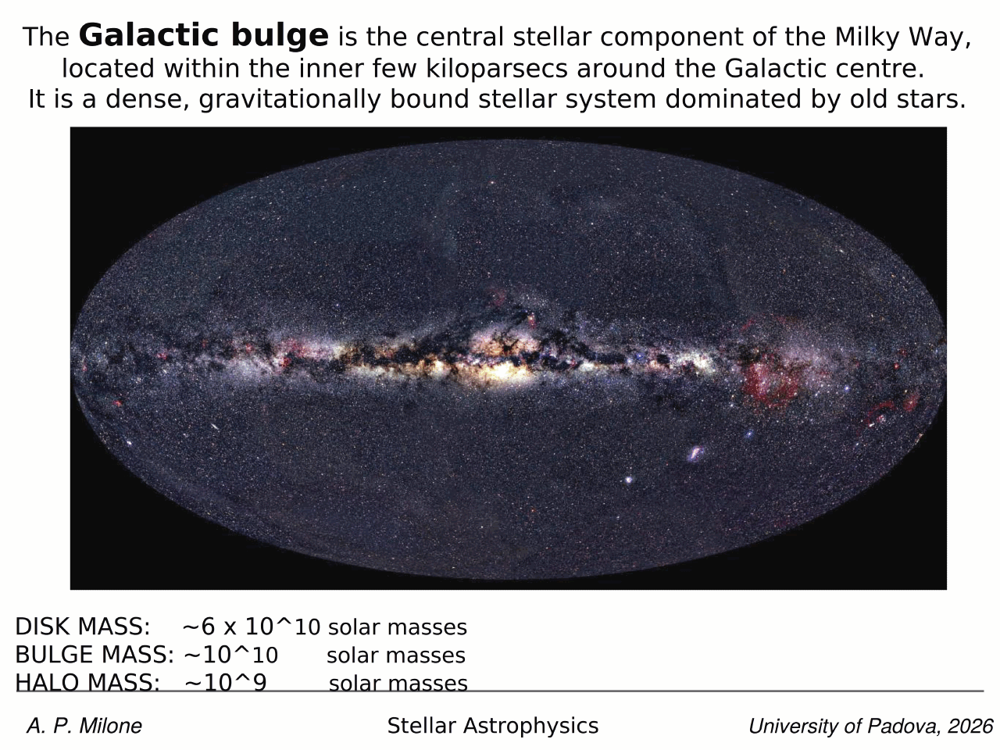
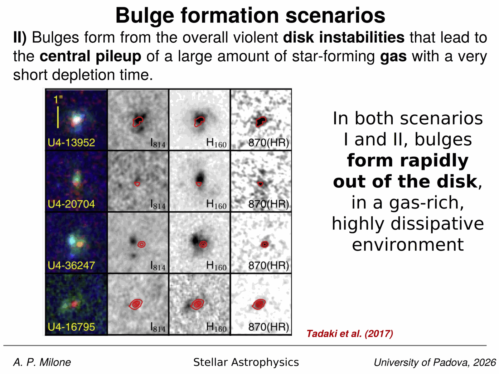
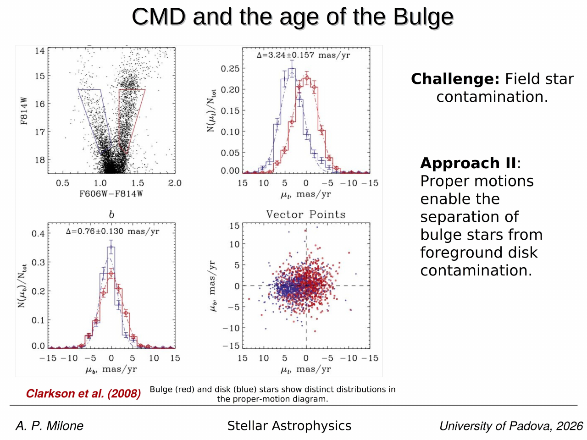
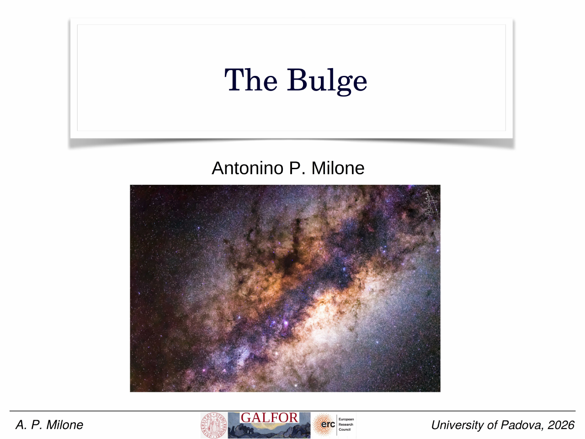
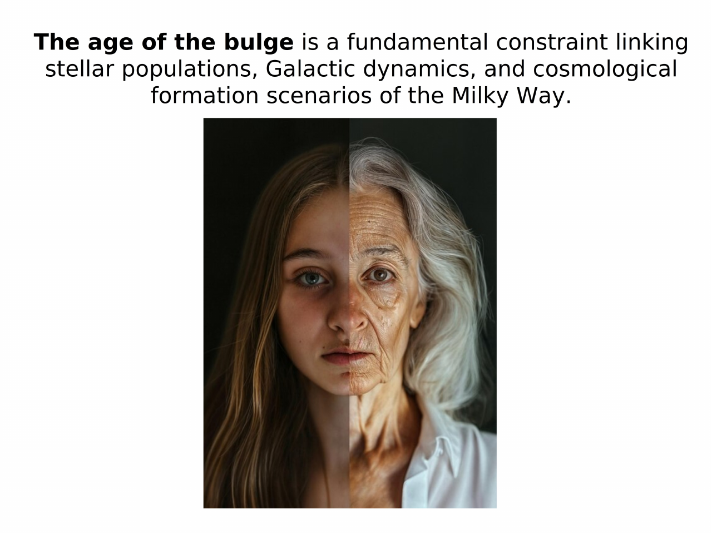
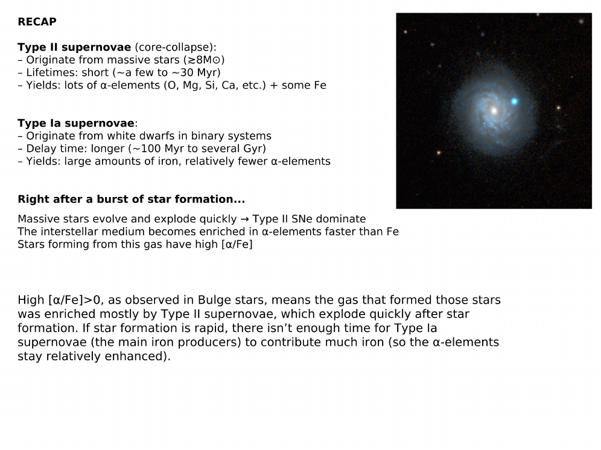
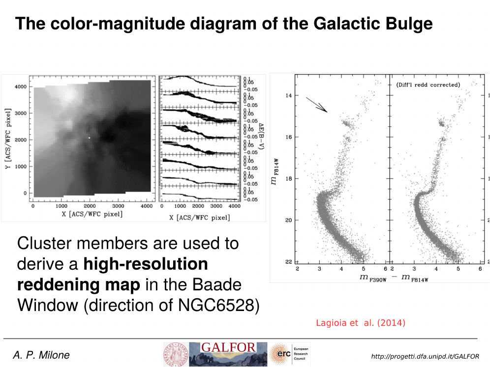
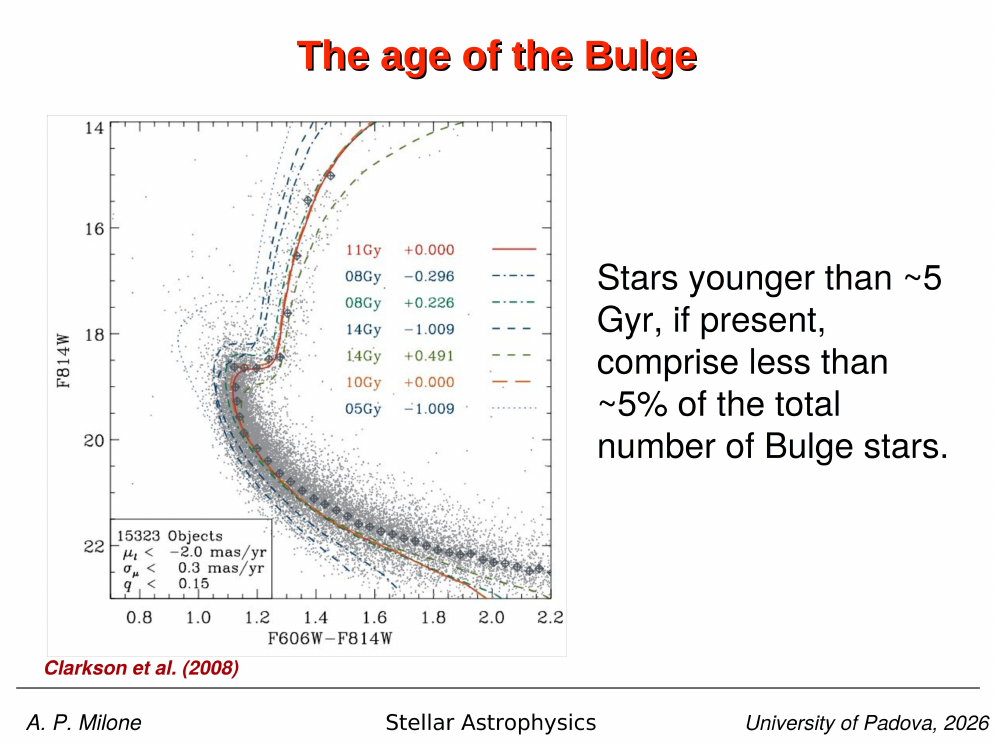
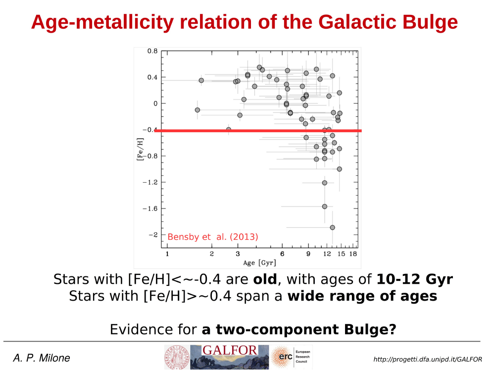


the **Galactic bulge** is the central stellar component of the Milky Way, located within the inner few kiloparsecs around the Galactic centre. it is a dense, gravitationally bound stellar system dominated by old stars. the bulge is one of the three main baryonic components of the Galaxy together with the disk and the halo, and its age + metallicity tell us about the **inner Galactic formation history**.

## mass budget of the Milky Way

| component | mass |
|---|---|
| disk | $\sim 6 \times 10^{10}\,M_\odot$ |
| **bulge** | $\sim 10^{10}\,M_\odot$ |
| halo (stellar) | $\sim 10^{9}\,M_\odot$ |

the bulge is small compared to the disk in mass but contains a high stellar density, making it one of the most crowded fields in any extragalactic photometric study.

note: there is no sharp distinction between bulge and disk. by convention, the term refers to the inner $\sim 3$ kpc of our Galaxy.

## why the age of the bulge matters

the age of the Galactic bulge directly constrains how the Milky Way formed and evolved. it is a fundamental constraint linking stellar populations, Galactic dynamics, and cosmological formation scenarios of the Milky Way:

- **galaxy formation history**: tells us whether the inner Galaxy formed rapidly at early times (collapse, mergers) or more gradually through secular evolution of the disk (bar formation + buckling).
- **link to cosmology**: if the bulge is predominantly old ($\geq 10$ Gyr), it traces star formation at high redshift and provides a local benchmark for galaxy formation in the early Universe.
- **chemical evolution**: combined with $[\alpha/{\rm Fe}]$, age constrains the timescale of chemical enrichment and the relative roles of [Type II vs Type Ia supernovae](./Cepheids%20and%20supernovae.html).
- **structure-evolution connection**: helps disentangle classical bulge vs bar-driven (pseudo-bulge) components.
- **calibration of stellar populations**: a key laboratory for testing stellar evolution models at high metallicity and for interpreting [unresolved stellar populations](./Resolved%20vs%20unresolved%20stellar%20populations.html) in external galaxies.

## the CMD of the bulge: observational challenges

reading the CMD of the bulge is hard. two challenges dominate:

### 1. field star contamination

the bulge sits behind the Galactic disk along our line of sight. the bulge CMD is significantly contaminated by foreground disk stars, contaminating the bulge MS turn-off region. critically, this affects accurate age estimates of the bulge population (Zoccali, with bulge-TO + disk-MS + disk-RC + bulge-RC + RGB all visible).

### 2. differential reddening

photometry of bulge stars typically suffers from low-scale **differential reddening**. patchy dust in front of the bulge field artificially broadens the CMD sequences and can be confused with multiple populations or metallicity spreads. see [Effects of differential reddening on CMD analysis](./Effects%20of%20differential%20reddening%20on%20CMD%20analysis.html).

### approaches to decontamination

two complementary approaches handle the field contamination problem:

**(I) statistical decontamination** (Valenti et al. 2013): subtract a control field CMD from the bulge field CMD, leaving only the bulge population. this approach gives a clean bulge CMD on average but loses individual-star information.

**(II) proper motions** (Clarkson et al. 2008): bulge stars and disk stars have distinct kinematics. relative proper motions from multi-epoch HST imaging show two distinct distributions in the proper-motion diagram, which can be used to select bulge members with high purity. this is now the gold-standard method.

## the Clarkson et al. 2008 result: an old bulge

using HST proper-motion-cleaned CMDs of $\sim 15{,}000$ bulge stars in the SWEEPS field (with $\mu_l < -2.0$ mas/yr selection), Clarkson et al. 2008 fit isochrones of varying age + metallicity to the bulge MS turn-off. the conclusion: the bulge is largely composed of **old stellar populations** ($\geq 10$ Gyr), and stars younger than $\sim 5$ Gyr, if present, constitute $< 5\%$ of the total bulge stellar content.

this is the single strongest piece of CMD evidence that the bulge formed rapidly + early.

*Clarkson et al. 2008: bulge MS turn-off compared with isochrones at varying age + [Fe/H]; bulk old, $< 5\%$ younger than 5 Gyr.*

## the Lagioia et al. 2014 NGC 6528 + Baade Window study

Lagioia et al. 2014 used the globular cluster NGC 6528 (which sits in the Baade Window, near the bulge centre) as a tool to characterise the bulge CMD. they:

1. used proper motions to select cluster members and separate them from bulge + disk contamination,
2. derived a high-resolution differential-reddening map from the cluster member ridge,
3. corrected the bulge CMD for differential reddening using this map.

the result: after PM selection + DR correction, isochrone fits to NGC 6528 + bulge stars in the same field both give ages $\sim 10$-$12$ Gyr at $[{\rm Fe/H}] = +0.20$, $[\alpha/{\rm Fe}] = 0$, supporting rapid star formation in the bulge.

## chemical evidence: the alpha-enhanced bulge

bulge stars are **$\alpha$-enhanced** ($[\alpha/{\rm Fe}] > 0$), consistent with rapid star formation and enrichment primarily from Type II supernovae. studies: Alves-Brito et al. 2010, Gonzalez et al. 2011, Ness et al. 2013, Johnson et al. 2013.

within the common $[{\rm Fe/H}]$ interval, bulge and thick-disk populations display similar $[\alpha/{\rm Fe}]$ sequences, pointing to **analogous chemical evolution pathways** (and possibly common origin).

### why $[\alpha/{\rm Fe}] > 0$ implies fast star formation

- **Type II SNe** (core-collapse): originate from massive stars ($\geq 8 M_\odot$); short lifetimes ($\sim$ few to $30$ Myr); yields lots of $\alpha$-elements (O, Mg, Si, Ca) plus some Fe.
- **Type Ia SNe**: from white dwarfs in binaries; long delay time ($\sim 100$ Myr to several Gyr); large iron yields, fewer $\alpha$-elements.

right after a star-formation burst, only Type II SNe have fired. the gas pool gets $\alpha$-enriched faster than Fe. stars forming from this gas have high $[\alpha/{\rm Fe}]$. only later does Type Ia Fe enrichment lower $[\alpha/{\rm Fe}]$. high $[\alpha/{\rm Fe}] > 0$ thus signals **rapid + early** star formation.

## the conflict: HST photometry vs microlensing spectroscopy

the bulge age picture has been debated for over a decade. two opposite results.

### CMD evidence (old bulge): Zoccali et al. 2003, Clarkson et al. 2008, Renzini et al. 2018

the bulge is as old as Galactic globular clusters ($\geq 10$ Gyr), with no trace of any young stellar population.

Renzini et al. 2018 used five-band HST photometry in five bulge fields (SWEEPS, Baade, Stanek, OGLE-29) plus reddening-free pseudo-colour diagrams ([m] vs [t]) to compare bulge stars to GC fiducials (NGC 6791, 6528, 0104, 5927, 6752, 6341 at varying $[{\rm Fe/H}]$). conclusion: the bulk of bulge stars are $\sim 10$ Gyr old; only $\sim 3\%$ are younger than $\sim 5$ Gyr.

### microlensing evidence (extended SF history): Bensby et al. 2013, 2017

during a microlensing event, a faint bulge MS star can brighten by several magnitudes for hours to days. Bensby et al. exploited this to obtain high-resolution spectra of $\sim 90$ bulge dwarfs at the MS turn-off. from each spectrum: $\log g$, $T_{\rm eff}$, and $[{\rm Fe/H}]$. ages from isochrone fitting in the $\log g$-$\log T_{\rm eff}$ plane.

result: the age-metallicity plane shows that **stars with $[{\rm Fe/H}] < -0.4$ are old ($10$-$12$ Gyr)**, while **stars with $[{\rm Fe/H}] > -0.4$ span a wide range of ages**, with $\sim 30\%$ of microlensed dwarfs younger than $\sim 7$ Gyr. some stars as young as $\sim 1.5$ Gyr.

this suggests a **two-component bulge**: an old metal-poor component plus an intermediate-age + young metal-rich component, possibly built by secular evolution of the disk.

### why the discrepancy

- spectroscopy of individual MS turn-off stars probes the age of each star directly; CMD fits are integrated over the population.
- the photometry is more sensitive to the dominant old population; spectroscopy uniquely identifies the small young metal-rich tail.
- a real two-component bulge (classical old + bar-driven young) would naturally produce both signals.

so the unresolved question: is the bulge a single old population with a tiny young contaminant, or is it genuinely composite?

## the Galactic bulge in context

connections to the rest of the course:
- the bulge GCs (NGC 6528, NGC 6553, Liller 1, Terzan 5) are the metal-rich tail of the [Age-metallicity relation of Galactic GCs](./Age-metallicity%20relation%20of%20Galactic%20GCs.html).
- Terzan 5 is famous for hosting **two metal populations** (Ferraro et al. 2009, Massari et al. 2014: $[{\rm Fe/H}] \sim -0.2$ + $\sim +0.3$, with an outlier $\sim -0.8$). it may be a **fossil bulge fragment**, not a true GC. see [Multiple populations in GCs discovery](./Multiple%20populations%20in%20GCs%20discovery.html).
- the bulge bar links to dynamical bulge formation (boxy/peanut shape from bar buckling); see [Astrophysics_of_Galaxies_MOC](../../04_Atlas/Astrophysics_of_Galaxies_MOC.html).
- chemical evolution models (Matteucci & Romano 1999) predict the bulge formed at the same time or even faster than the Galactic halo, consistent with its $\alpha$-enhancement.

## see also

- [Bulge microlensing surveys](./Bulge%20microlensing%20surveys.html)
- [Bulge CMD complications](./Bulge%20CMD%20complications.html)
- [Age-metallicity relation of Galactic GCs](./Age-metallicity%20relation%20of%20Galactic%20GCs.html)
- [Galactic GC two-population age structure](./Galactic%20GC%20two-population%20age%20structure.html)
- [Halo accretion from dwarf galaxies](./Halo%20accretion%20from%20dwarf%20galaxies.html)
- [Effects of differential reddening on CMD analysis](./Effects%20of%20differential%20reddening%20on%20CMD%20analysis.html)
- [Multiple populations in GCs discovery](./Multiple%20populations%20in%20GCs%20discovery.html)
- [Stellar_Astrophysics_MOC](../../04_Atlas/Stellar_Astrophysics_MOC.html)
- [Astrophysics_of_Galaxies_MOC](../../04_Atlas/Astrophysics_of_Galaxies_MOC.html)

---

## Complete Lecture Slide Panels & Observational Evidence (Lecture 19 — The Galactic Bulge & Milky Way Structure)

> **Context**: *Boxy/peanut bulge, X-shaped bar, ancient ~10 Gyr stellar populations, proper motion cleaning of foreground disk stars, and metallicity distribution functions.*

The following slides from Prof. Antonino Milone's lecture series provide the direct observational, photometric, and theoretical foundations for this topic:

*Figure P19-01: L19_p01_title-01.png — Observational data, CMD morphology, and diagnostics from Lecture 19 — The Galactic Bulge & Milky Way Structure.*

*Figure P19-02: L19_p05-05.png — Observational data, CMD morphology, and diagnostics from Lecture 19 — The Galactic Bulge & Milky Way Structure.*

*Figure P19-03: L19_p17_alpha_Fe-17.png — Observational data, CMD morphology, and diagnostics from Lecture 19 — The Galactic Bulge & Milky Way Structure.*

*Figure P19-04: L19_p19_old_bulge_Zoccali-19.png — Observational data, CMD morphology, and diagnostics from Lecture 19 — The Galactic Bulge & Milky Way Structure.*

*Figure P19-05: L19_p22_Terzan5_Ferraro-22.png — Observational data, CMD morphology, and diagnostics from Lecture 19 — The Galactic Bulge & Milky Way Structure.*

*Figure P19-06: LAntonino_p19_01.png — Observational data, CMD morphology, and diagnostics from Lecture 19 — The Galactic Bulge & Milky Way Structure.*

*Figure P19-07: LAntonino_p19_02.png — Observational data, CMD morphology, and diagnostics from Lecture 19 — The Galactic Bulge & Milky Way Structure.*

*Figure P19-08: LAntonino_p19_03.png — Observational data, CMD morphology, and diagnostics from Lecture 19 — The Galactic Bulge & Milky Way Structure.*

*Figure P19-09: LAntonino_p19_04.png — Observational data, CMD morphology, and diagnostics from Lecture 19 — The Galactic Bulge & Milky Way Structure.*

*Figure P19-10: LAntonino_p19_05.png — Observational data, CMD morphology, and diagnostics from Lecture 19 — The Galactic Bulge & Milky Way Structure.*

*Figure P19-11: LAntonino_p19_06.png — Observational data, CMD morphology, and diagnostics from Lecture 19 — The Galactic Bulge & Milky Way Structure.*

*Figure P19-12: LAntonino_p19_07.png — Observational data, CMD morphology, and diagnostics from Lecture 19 — The Galactic Bulge & Milky Way Structure.*

*Figure P19-13: LAntonino_p19_08.png — Observational data, CMD morphology, and diagnostics from Lecture 19 — The Galactic Bulge & Milky Way Structure.*

*Figure P19-14: LAntonino_p19_09.png — Observational data, CMD morphology, and diagnostics from Lecture 19 — The Galactic Bulge & Milky Way Structure.*

*Figure P19-15: LAntonino_p19_10.png — Observational data, CMD morphology, and diagnostics from Lecture 19 — The Galactic Bulge & Milky Way Structure.*

*Figure P19-16: LAntonino_p19_11.png — Observational data, CMD morphology, and diagnostics from Lecture 19 — The Galactic Bulge & Milky Way Structure.*

*Figure P19-17: LAntonino_p19_12.png — Observational data, CMD morphology, and diagnostics from Lecture 19 — The Galactic Bulge & Milky Way Structure.*

*Figure P19-18: LAntonino_p19_13.png — Observational data, CMD morphology, and diagnostics from Lecture 19 — The Galactic Bulge & Milky Way Structure.*

*Figure P19-19: LAntonino_p19_14.png — Observational data, CMD morphology, and diagnostics from Lecture 19 — The Galactic Bulge & Milky Way Structure.*

*Figure P19-20: LAntonino_p19_15.png — Observational data, CMD morphology, and diagnostics from Lecture 19 — The Galactic Bulge & Milky Way Structure.*

*Figure P19-21: LAntonino_p19_16.png — Observational data, CMD morphology, and diagnostics from Lecture 19 — The Galactic Bulge & Milky Way Structure.*

*Figure P19-22: LAntonino_p19_17.png — Observational data, CMD morphology, and diagnostics from Lecture 19 — The Galactic Bulge & Milky Way Structure.*

*Figure P19-23: LAntonino_p19_18.png — Observational data, CMD morphology, and diagnostics from Lecture 19 — The Galactic Bulge & Milky Way Structure.*

*Figure P19-24: LAntonino_p19_19.png — Observational data, CMD morphology, and diagnostics from Lecture 19 — The Galactic Bulge & Milky Way Structure.*

*Figure P19-25: LAntonino_p19_20.png — Observational data, CMD morphology, and diagnostics from Lecture 19 — The Galactic Bulge & Milky Way Structure.*

*Figure P19-26: LAntonino_p19_21.png — Observational data, CMD morphology, and diagnostics from Lecture 19 — The Galactic Bulge & Milky Way Structure.*

*Figure P19-27: LAntonino_p19_22.png — Observational data, CMD morphology, and diagnostics from Lecture 19 — The Galactic Bulge & Milky Way Structure.*

*Figure P19-28: LAntonino_p19_23.png — Observational data, CMD morphology, and diagnostics from Lecture 19 — The Galactic Bulge & Milky Way Structure.*

*Figure P19-29: LAntonino_p19_24.png — Observational data, CMD morphology, and diagnostics from Lecture 19 — The Galactic Bulge & Milky Way Structure.*

*Figure P19-30: LAntonino_p19_25.png — Observational data, CMD morphology, and diagnostics from Lecture 19 — The Galactic Bulge & Milky Way Structure.*

*Figure P19-31: Lecture19_p15-15.png — Observational data, CMD morphology, and diagnostics from Lecture 19 — The Galactic Bulge & Milky Way Structure.*

*Figure P19-32: Lecture19_p25-25.png — Observational data, CMD morphology, and diagnostics from Lecture 19 — The Galactic Bulge & Milky Way Structure.*

*Figure P19-33: Lecture19_p35-35.png — Observational data, CMD morphology, and diagnostics from Lecture 19 — The Galactic Bulge & Milky Way Structure.*

*Figure P19-34: Lecture19_p5-05.png — Observational data, CMD morphology, and diagnostics from Lecture 19 — The Galactic Bulge & Milky Way Structure.*


  <h4 class="backlinks-title">Linked References (4)</h4>
  <ul class="backlinks-list">
    <li class="backlink-item-wrap"><a href="./Bulge%20CMD%20complications.html" class="backlink-item">Bulge CMD complications</a></li>
    <li class="backlink-item-wrap"><a href="./Bulge%20microlensing%20surveys.html" class="backlink-item">Bulge microlensing surveys</a></li>
    <li class="backlink-item-wrap"><a href="./Stellar%20Astrophysics%20research%20citations%20index.html" class="backlink-item">Stellar Astrophysics research citations index</a></li>
    <li class="backlink-item-wrap"><a href="../../04_Atlas/Stellar_Astrophysics_MOC.html" class="backlink-item">Stellar_Astrophysics_MOC</a></li>
  </ul>

