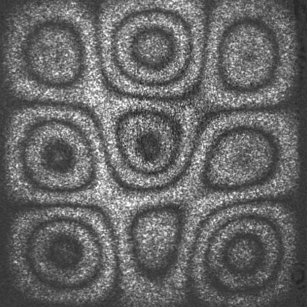


> Short snapshot images freeze atmospheric turbulence into speckled patterns that still encode the full diffraction-limited spatial resolution of the telescope.

---

## core physical intuition

Normally a long exposure image through the atmosphere smears out into a blurry seeing disk. Labeyrie realized in 1970 that if you take an exposure fast enough to freeze the atmospheric motion, the resulting image is broken up into a random pattern of tiny speckles. Each individual speckle is actually a distorted copy of the diffraction-limited image.

Although taking a simple average of many speckle images just gives back the blurry seeing disk, taking the average of their power spectra does not. The spatial frequencies in the power spectrum add up constructively. This allows the high-resolution information to survive the averaging process, completely bypassing the atmospheric blurring envelope and recovering detail down to the theoretical diffraction limit of the telescope aperture.

---

## key derivation & equations

In Fourier space, the instantaneous image $\tilde{I}(\mathbf{u})$ is the product of the object $\tilde{O}(\mathbf{u})$ and the instantaneous atmospheric optical transfer function $\tilde{S}(\mathbf{u})$
$$\tilde{I}(\mathbf{u}) = \tilde{O}(\mathbf{u}) \tilde{S}(\mathbf{u})$$

If we take the squared modulus to form the power spectrum and average over many short exposures, we get
$$\langle \vert\tilde{I}(\mathbf{u})\vert ^2 \rangle = \vert\tilde{O}(\mathbf{u})\vert ^2 \langle   \vert\tilde{S}(\mathbf{u})\vert ^2 \rangle$$

Here $\langle   \vert\tilde{S}(\mathbf{u})\vert ^2 \rangle$ is the speckle transfer function. Unlike the long-exposure transfer function which drops to zero at the seeing limit $r_0/\lambda$, the speckle transfer function has a high-frequency tail that extends all the way out to the telescope's diffraction cutoff $D/\lambda$.

---

## astrophysical context

Speckle interferometry was the very first technique to break the seeing limit and achieve diffraction-limited resolution from ground-based optical telescopes. Before adaptive optics became common, speckle imaging was widely used to measure the separations of tight binary stars, determine stellar diameters, and map the shapes of large asteroids. It is still used today as a robust, computationally cheap way to resolve bright targets.

---

## connections & zettel links

* parent moc: [Astronomical_Interferometry_MOC](../../04_Atlas/Astronomical_Interferometry_MOC.html)
* related zettels: [Speckle interferometry](interf/Speckle%20interferometry.html), [Speckle imaging algorithms](interf/Speckle%20imaging%20algorithms.html), [Bispectrum and triple correlation](interf/Bispectrum%20and%20triple%20correlation.html), [Aperture masking](interf/Aperture%20masking.html)
