
"what time is it" is a surprisingly subtle question in astronomy. there are at least five definitions in regular use, each appropriate for a different physical question. mixing them up is a classic source of errors in ephemerides and observation planning.

## the time families

### universal time UT, UT1, UTC

- **UT0**: raw mean solar time at Greenwich, before correcting for Earth's pole wobble.
- **UT1**: UT0 corrected for polar motion. tracks Earth's actual rotation, varies smoothly. used for celestial pointing.
- **UTC**: coordinated universal time. atomic-clock-based but kept within $0.9$ s of UT1 by inserting **leap seconds**. this is what civil clocks (and computer clocks via NTP) display.

UTC = UT1 + DUT1, with $|$DUT1$| < 0.9$ s by definition.

### atomic time TAI

**TAI** (Temps Atomique International): the SI second running on a global ensemble of atomic clocks. monotonic, no leap seconds. starting epoch in 1958. as of 2026, TAI is ahead of UTC by $\sim 37$ s.

### dynamical times TT, TDB

- **TT** (Terrestrial Time): the proper time of a clock at the geoid. relates to TAI by TT = TAI + $32.184$ s. used for solar-system ephemerides at the Earth's location.
- **TDB** (Barycentric Dynamical Time): equivalent of TT but at the solar-system barycentre. differs from TT by relativistic corrections of $\le 1.6$ ms with annual periodicity.

### sidereal time

- **GMST** (Greenwich Mean Sidereal Time): Earth's rotation angle measured against the equinox $\gamma$. one sidereal day = $23^{\rm h}56^{\rm m}4.0905^{\rm s}$, shorter than the solar day by $\sim 4$ minutes. used to compute hour angle (see [Equatorial system](./Equatorial%20system.html)).
- **LMST** (Local Mean Sidereal Time): GMST + observer's east longitude. directly gives the hour angle of $\gamma$ at the observer.

sidereal time is what you actually use to point a telescope, not UTC. observatories all run on local sidereal time alongside UTC.

## the leap-second problem

UTC has been adjusted with **leap seconds** since 1972 to keep it close to UT1. the rotation of the Earth slows irregularly (mainly tidal), so UT1 drifts. as of 2024, the IERS has issued $27$ positive leap seconds.

**consequence**: time differences in UTC are not reliable across leap-second boundaries. high-precision timing (pulsar TOAs, GPS) uses TAI or TT. Resolution at the 2022 General Conference on Weights and Measures: leap seconds will be discontinued by 2035.

## why this matters in practice

- **observation planning**: rise/set times require UT1 or UTC + DUT1.
- **archival data**: exposure times in FITS headers are usually UTC. for sub-second precision, check for `TIMESYS` keyword.
- **solar-system ephemerides**: positions are tabulated in TT or TDB; convert to UTC for observing.
- **pulsar timing**: TOAs to nanoseconds, must use TT or TAI, not UTC.

a single Julian Date can be ambiguous about which time scale it is in. always specify: JD$_{\rm TT}$, MJD$_{\rm UTC}$, etc.

## see also

- [Equatorial system](./Equatorial%20system.html) — sidereal time enters the hour angle
- [Sidereal vs solar time](./Sidereal%20vs%20solar%20time.html)
- [Precession nutation aberration parallax](./Precession%20nutation%20aberration%20parallax.html)
- [Earth coordinates](./Earth%20coordinates.html)
- [Observational_Astrophysics_MOC](../../04_Atlas/Observational_Astrophysics_MOC.html)

---

## observational astrophysics course slides (Prof. Paolo Cassata)

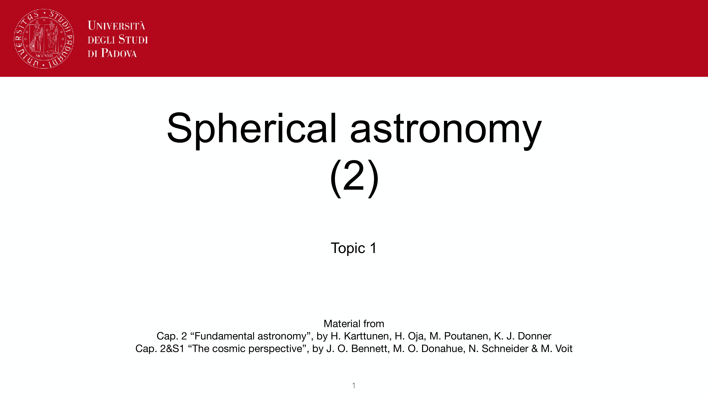
*Lecture 1.2: Spherical astronomy part 2 - timekeeping and corrections.*

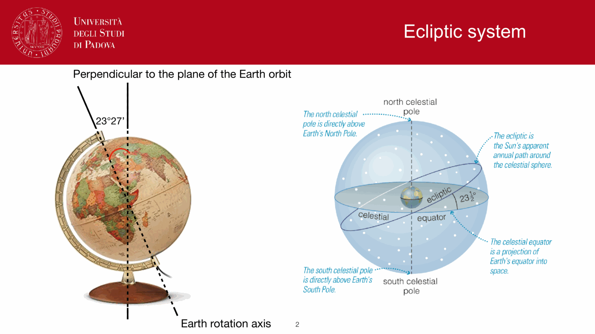
*Atomic time standards: TAI (International Atomic Time).*

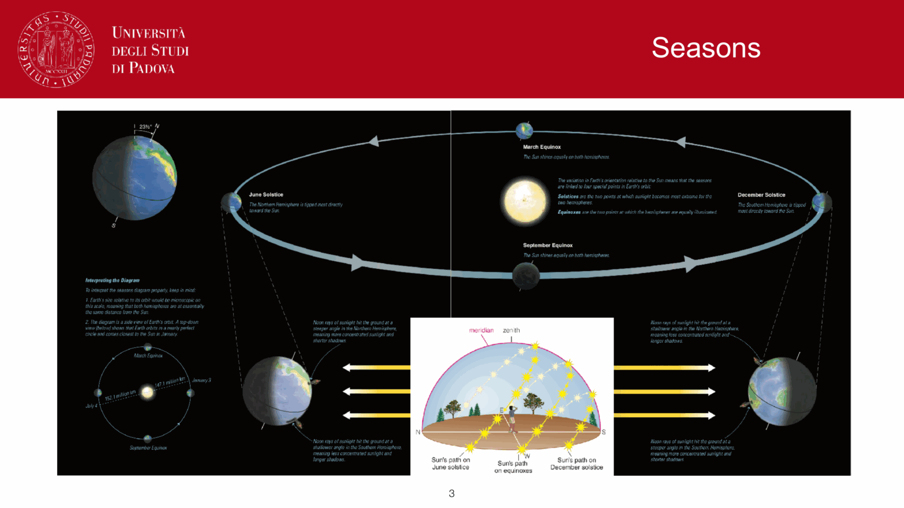
*UTC and leap seconds: keeping civil time aligned with Earth rotation.*

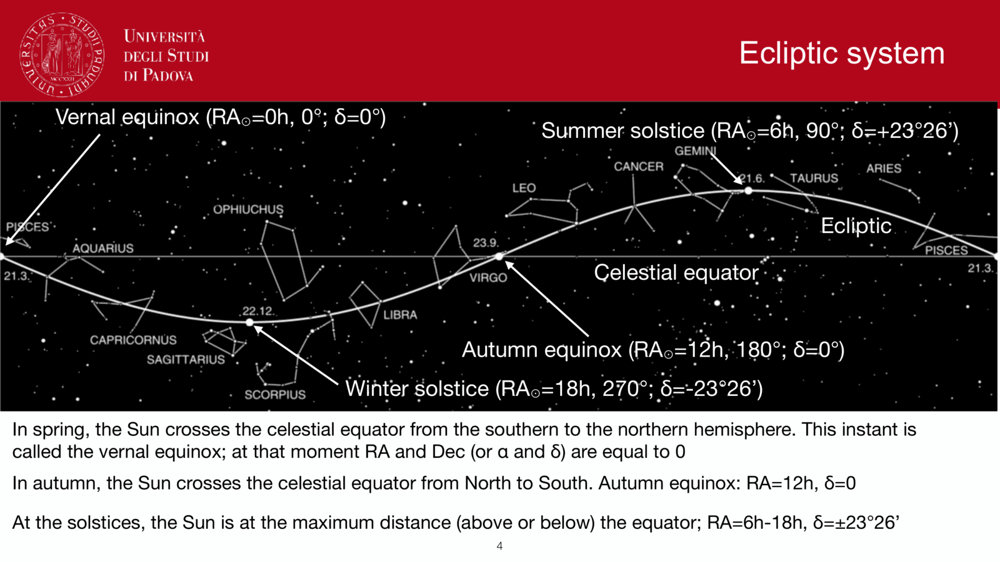
*Dynamical times: Terrestrial Time (TT) and Barycentric Dynamical Time (TDB).*

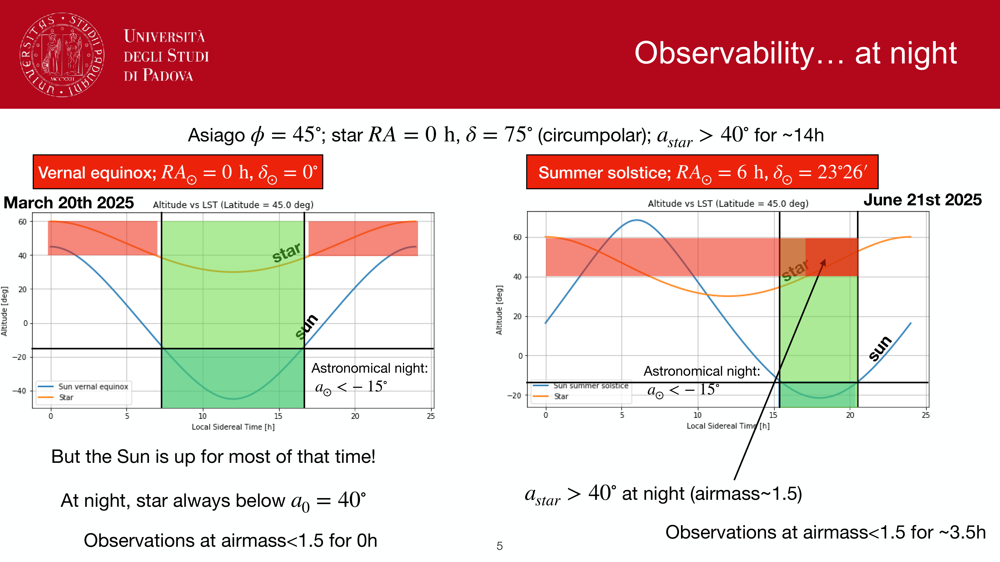
*Julian Date (JD) definition: continuous day count since Jan 1, 4713 BC.*

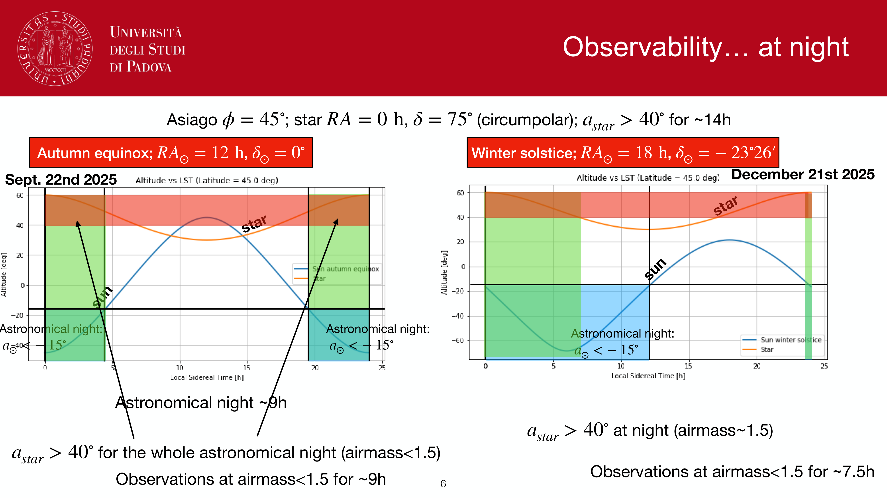
*Modified Julian Date (MJD = JD - 2400000.5) and Heliocentric Julian Date (HJD).*

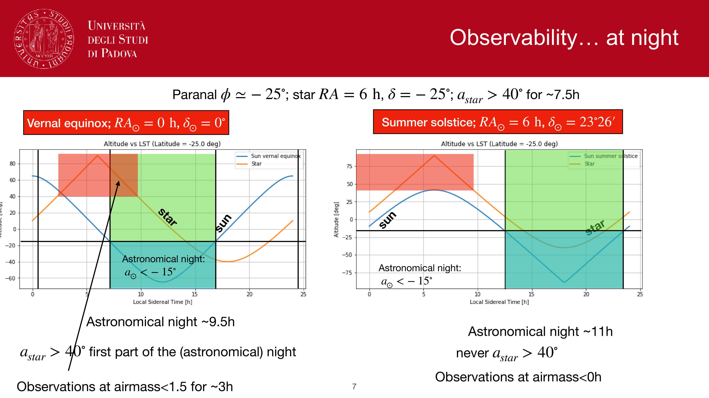
*Barycentric Julian Date (BJD): correcting light-travel time to solar system barycenter.*

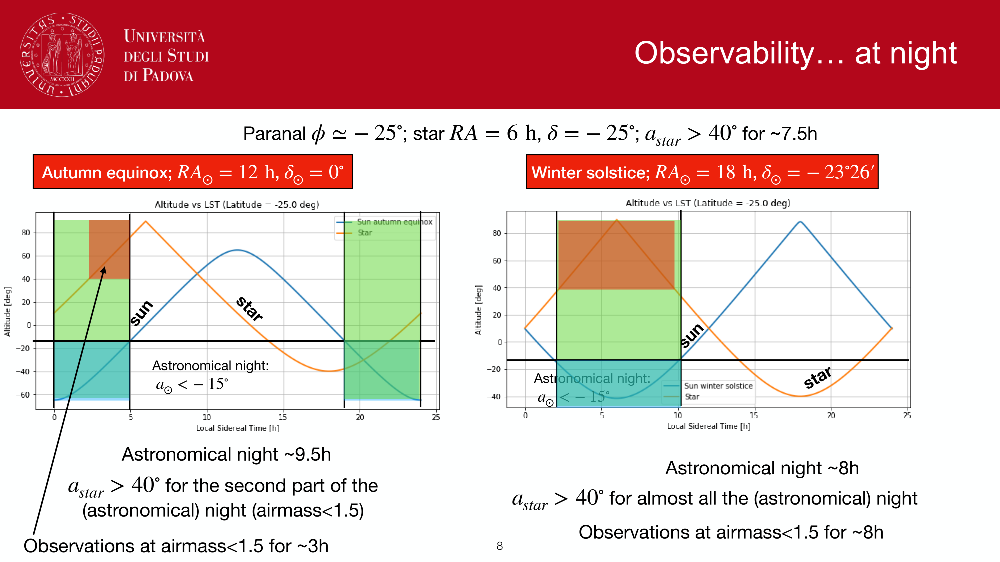
*Equation of time curve (analemma) throughout the calendar year.*

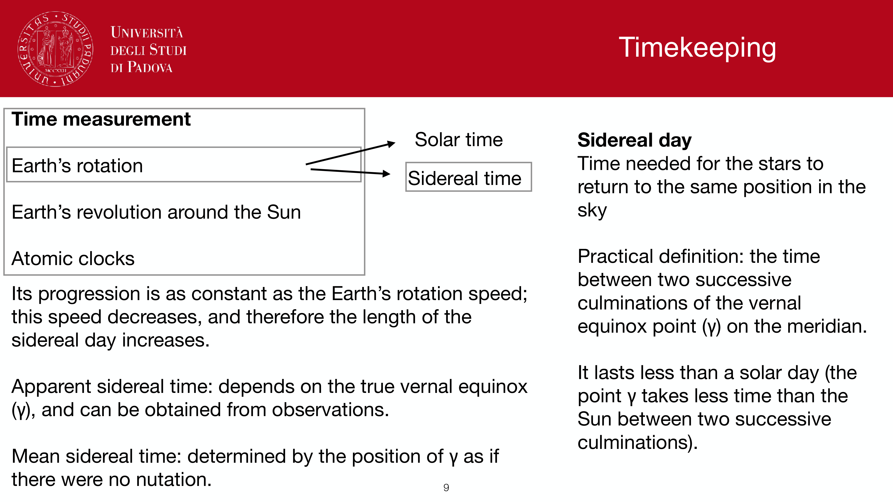
*Timekeeping summary table: TAI, UTC, UT1, TT, TDB.*

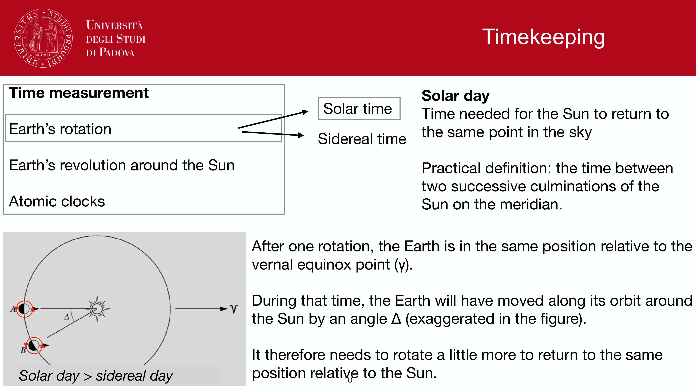
*Sidereal time at Greenwich (GMST and GAST).*

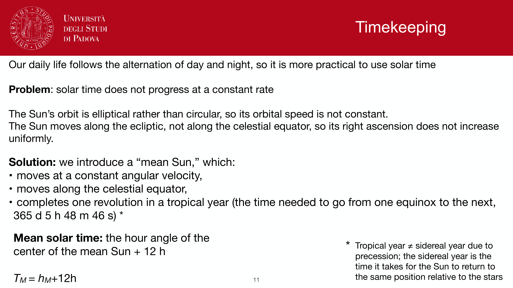
*Earth rotation angle (ERA) in modern IAU 2000/2006 resolutions.*

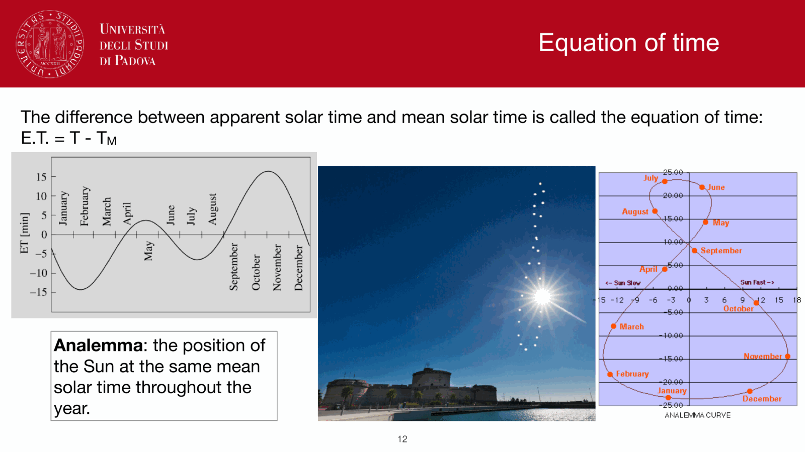
*Celestial Intermediate Pole (CIP) and Origin (CIO).*

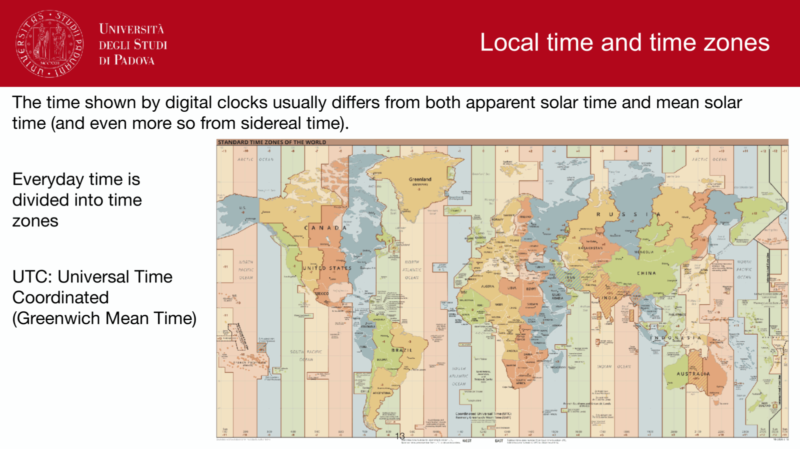
*Local time calculation for telescope control systems.*

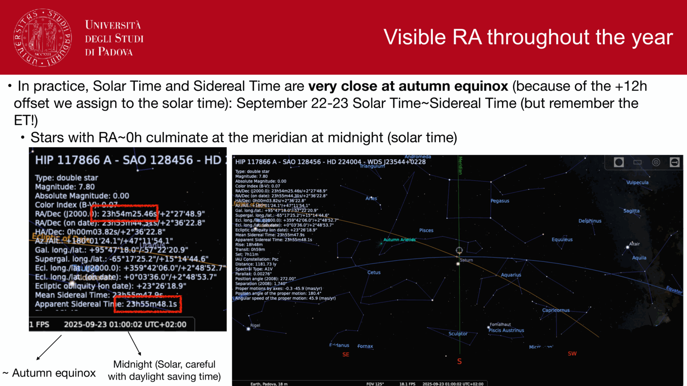
*Time conversion algorithms for astronomical pipelines.*

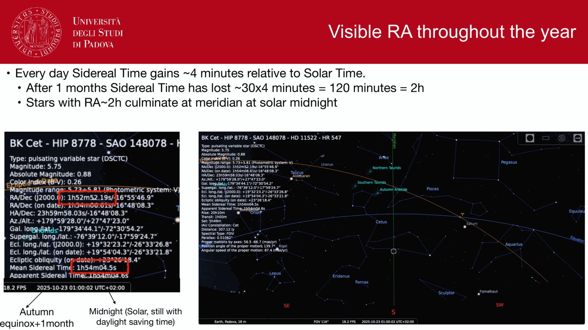
*Precision timing for pulsar astrometry and exoplanet transits.*

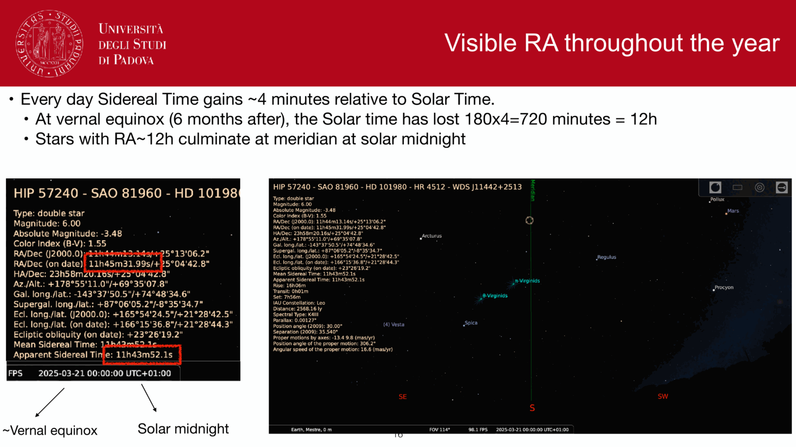
*Summary of time standards.*


  <h4 class="backlinks-title">Linked References (3)</h4>
  <ul class="backlinks-list">
    <li class="backlink-item-wrap"><a href="../../04_Atlas/Observational_Astrophysics_MOC.html" class="backlink-item">Observational_Astrophysics_MOC</a></li>
    <li class="backlink-item-wrap"><a href="./Precession%20and%20nutation.html" class="backlink-item">Precession and nutation</a></li>
    <li class="backlink-item-wrap"><a href="./Precession%20nutation%20aberration%20parallax.html" class="backlink-item">Precession nutation aberration parallax</a></li>
  </ul>

