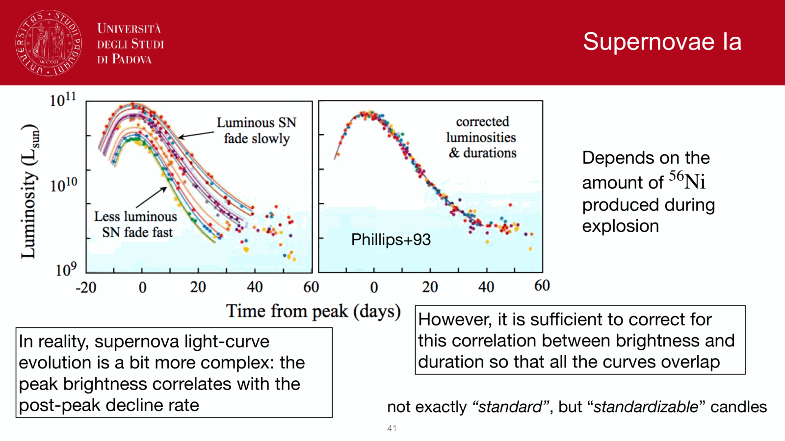
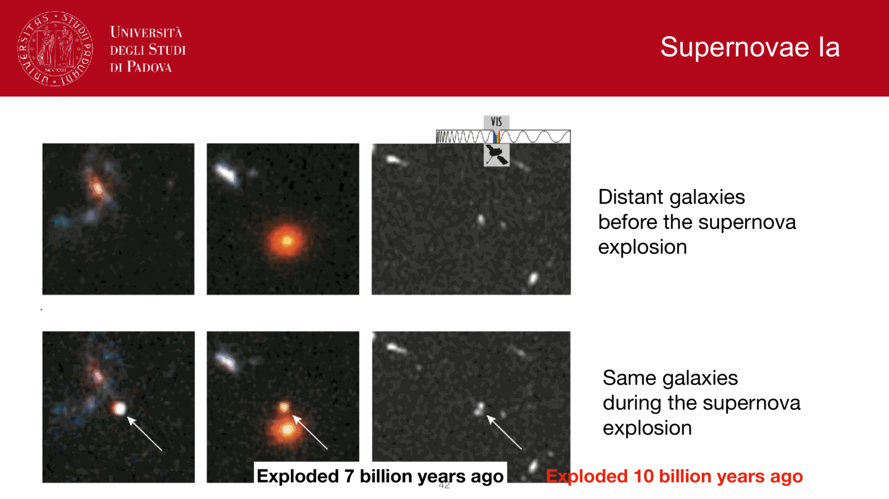

# tully-fisher relation

Parent [[Pablo_02_Statistical_properties_of_galaxies]]

## The Empirical Relation

For rotationally supported disk galaxies (spirals), R. Brent Tully and J. Richard Fisher (1977, A&A 54, 661) discovered an exceptionally tight correlation between total optical/infrared luminosity $L$ and asymptotic flat rotation velocity $V_{\rm flat}$ (or maximum rotation speed $V_{\rm max}$).

$$\boxed{L \propto V_{\rm flat}^\alpha \iff M = -2.5 \alpha \log_{10} V_{\rm flat} + \text{const}}$$

The observed slope $\alpha$ depends on the photometric band.
- $B$-band - $\alpha \approx 3.0$ (strongly affected by dust extinction and recent starbursts).
- $R$-band - $\alpha \approx 3.5$.
- Near-IR ($K$-band, Spitzer $3.6\,\mu\mathrm{m}$) - $\alpha \approx 4.0$ (traces total stellar mass, minimal dust extinction, nearly constant stellar mass-to-light ratio).

The intrinsic scatter in the near-IR is less than $0.1$ dex ($\sim 0.25$ mag), making it one of the premier primary distance indicators for the extragalactic distance scale.

---

## Unbroken Mathematical Derivation - Centrifugal Equilibrium to Tully-Fisher

### Step 1 - Centrifugal Balance in a Thin Disk
Consider test mass tracers (cold neutral hydrogen gas clouds) executing circular orbits in the equatorial plane of a spiral galaxy. Centrifugal acceleration balances gravitational attraction.

$$\frac{V_{\rm circ}^2(R)}{R} = \frac{G M(R)}{R^2} \implies M(R) = \frac{V_{\rm circ}^2(R)\, R}{G}$$

where $M(R)$ is the total enclosed dynamical mass (stars + gas + dark matter halo) within radius $R$.

### Step 2 - Photometric Integration of an Exponential Disk
The radial surface brightness profile of a spiral disk follows Freeman's (1970) exponential law.

$$I(R) = I_0 \exp\left(-\frac{R}{h_R}\right)$$

where $I_0$ is the central surface brightness and $h_R$ is the radial scale length.

Integrating over all radii to compute the total disk luminosity $L$.

$$L = \int_0^\infty 2\pi R\, I(R)\, dR = 2\pi I_0 \int_0^\infty R e^{-R/h_R}\, dR$$

Substitute $u = R/h_R \implies R = h_R u, dR = h_R du$.

$$L = 2\pi I_0 h_R^2 \int_0^\infty u e^{-u}\, du = 2\pi I_0 h_R^2 \cdot 1! = 2\pi I_0 h_R^2$$

Solve explicitly for the disk scale length $h_R$.

$$h_R = \left(\frac{L}{2\pi I_0}\right)^{1/2}$$

### Step 3 - Enclosed Mass at a Characteristic Radial Multiple
Evaluate the centrifugal equilibrium relation at a characteristic radius proportional to the scale length, $R_c = C_R h_R$ (for instance, the Holmberg optical radius $R_{25} \approx 3.2 h_R$, where the rotation curve reaches its flat plateau $V_{\rm circ}(R_c) \approx V_{\rm max}$).

$$M = \frac{V_{\rm max}^2 R_c}{G} = \frac{V_{\rm max}^2 (C_R h_R)}{G}$$

Substitute the scale length $h_R = \left(\frac{L}{2\pi I_0}\right)^{1/2}$.

$$M = \frac{C_R}{G} V_{\rm max}^2 \left(\frac{L}{2\pi I_0}\right)^{1/2} = \left(\frac{C_R}{G \sqrt{2\pi}}\right) \frac{V_{\rm max}^2 L^{1/2}}{I_0^{1/2}}$$

### Step 4 - Connecting Dynamical Mass to Luminosity
Introduce the total mass-to-light ratio $\Upsilon \equiv \frac{M}{L} \implies M = \Upsilon L$.

$$\Upsilon L = \left(\frac{C_R}{G \sqrt{2\pi}}\right) \frac{V_{\rm max}^2 L^{1/2}}{I_0^{1/2}}$$

Divide both sides by $L^{1/2}$.

$$\Upsilon L^{1/2} = \left(\frac{C_R}{G \sqrt{2\pi I_0}}\right) V_{\rm max}^2$$

Square both sides.

$$\Upsilon^2 L = \left(\frac{C_R^2}{2\pi G^2 I_0}\right) V_{\rm max}^4$$

Divide by $\Upsilon^2$ to obtain the final Tully-Fisher relation.

$$\boxed{L = \left(\frac{C_R^2}{2\pi G^2 \Upsilon^2 I_0}\right) V_{\rm max}^4 \propto V_{\rm max}^4}$$

### Necessary Physical Conditions for $L \propto V^4$
This rigorous derivation reveals that $L \propto V_{\rm max}^4$ holds if and only if two conditions are satisfied.
1. **Constant Central Surface Brightness ($I_0 = \text{const}$) -**
   Empirically confirmed by **Freeman's Law (1970)**, which found that normal high-surface-brightness spirals have nearly invariant central surface brightness.
   $$\mu_0(B) \approx 21.65 \pm 0.30\,\text{mag\,arcsec}^{-2}$$
2. **Constant Mass-to-Light Ratio ($\Upsilon = \text{const}$) -**
   Satisfied in the near-infrared ($K$-band, $3.6\,\mu\mathrm{m}$), where starlight is dominated by old, low-mass stars whose light directly traces stellar mass, unperturbed by young starbursts or dust extinction.

---

## The Baryonic Tully-Fisher Relation (BTFR)

In low-mass dwarf galaxies ($V_{\rm flat} < 50\,\mathrm{km\,s^{-1}}$), the cold interstellar gas mass ($M_{\rm gas} = 1.4 M_{\rm HI}$) exceeds the stellar mass ($M_{\rm gas} \gg M_*$). Plotting optical luminosity $L$ causes dwarf galaxies to peel off below the classical Tully-Fisher line.

McGaugh (2000, 2005) showed that replacing optical luminosity with total **baryonic mass**.
$$M_{\rm bar} \equiv M_* + M_{\rm gas} = \Upsilon_* L + 1.4 M_{\rm HI}$$
restores a single, unbroken power law spanning over five decades in mass down to the smallest dwarf irregulars.

$$\boxed{M_{\rm bar} = A\, V_{\rm flat}^4}$$

with zero-point $A \approx 50 M_\odot\,\mathrm{km}^{-4}\,\mathrm{s}^4$.

### MOND Interpretation
In Modified Newtonian Dynamics (Milgrom 1983), the deep-MOND acceleration regime ($a \ll a_0 \approx 1.2 \times 10^{-10}\mathrm{m\,s^{-2}}$) gives.
$$a = \sqrt{a_N a_0} = \sqrt{\frac{G M}{R^2} a_0} = \frac{V_{\rm flat}^2}{R} \implies \frac{G M a_0}{R^2} = \frac{V_{\rm flat}^4}{R^2} \implies M_{\rm bar} = \frac{V_{\rm flat}^4}{G a_0}$$
BTFR is thus an exact, parameter-free prediction of MOND.

---

## Observational Measurement from 21 cm HI Profiles

The rotation velocity $V_{\rm max}$ is measured directly from the Doppler broadening of the spatially integrated 21 cm neutral hydrogen line profile.
$$W_{20} = 2 V_{\rm max} \sin i + W_{\rm turb}$$
where $W_{20}$ is the full line width measured at $20\%$ of peak intensity, $i$ is the disk inclination angle ($i = 0^\circ$ face-on, $i = 90^\circ$ edge-on, determined from isophotal axis ratio $\cos^2 i = \frac{(b/a)^2 - q_0^2}{1 - q_0^2}$), and $W_{\rm turb} \approx 5-10\,\mathrm{km\,s^{-1}}$ accounts for thermal/turbulent velocity dispersion.

---

## Textbook & Course References

- **Mo, van den Bosch & White (2010), *Galaxy Formation and Evolution***.
  - File `Houjun Mo, Frank van den Bosch, Simon White - Galaxy Formation and Evolution (2010, Cambridge University Press) - libgen.li.pdf`
  - Chapter 11, Section 11.3 "The Origin of Disk Galaxy Scaling Relations", pp. 534-537 (virial derivation, BTFR).
- **Binney & Merrifield (1998), *Galactic Astronomy***.
  - File `Galactic Astronomy (James Binney Michael Merrifield) (z-library.sk, 1lib.sk, z-lib.sk).pdf`
  - Chapter 7, Section 7.3.1 "The Tully-Fisher Relation", pp. 422-425 (HI line width measurement, distance scale application).
- **Peter Schneider (2015), *Extragalactic Astronomy and Cosmology***.
  - File `Extrag_Astro_122-138.pdf`
  - Chapter 3, Section 3.3.4 "The Tully-Fisher relation", pp. 136-138.
- **Repository Special Papers**.
  - `TF-z1.pdf` (Evolution of TF at $z \sim 1$)
  - `TF_Galaxies_on_scale.pdf`
  - `TF_estinzione_Shao.pdf` (Extinction corrections in TF)
- **Master Derivations Guide**.
  - Master Derivations and Mathematical Rigor

---

---

## observational astrophysics course slides (Prof. Paolo Cassata)

*Tully-Fisher relation (1977) - empirical luminosity vs maximum rotation velocity for spirals.*

*Formula - L proportional to V_max^alpha (alpha ~ 3 to 4 depending on passband, steepest in NIR/FIR).*

## Linked References

- [[Dark matter in dwarf galaxies]]
- [[Dark matter rotation curves]]
- [[De Vaucouleurs and exponential profiles]]
- [[Faber-Jackson relation]]
- [[Galaxy main sequence of star formation]]
- [[Galaxy size-luminosity relation]]
- [[H I regions]]
- [[Ionized gas kinematics]]
- [[MOND]]
- [[Mass-radius and mass-velocity relations]]
- [[Modified gravity alternatives]]
- [[Peculiar velocities of galaxies and structures]]
- [[Rotation curves]]
- [[Schmidt-Kennicutt law]]
- [[Velocity dispersion from line width]]
- [[Astrophysics_of_Galaxies_MOC]]
- [[Observational_Astrophysics_MOC]]
- [[Observational_Cosmology_MOC]]

