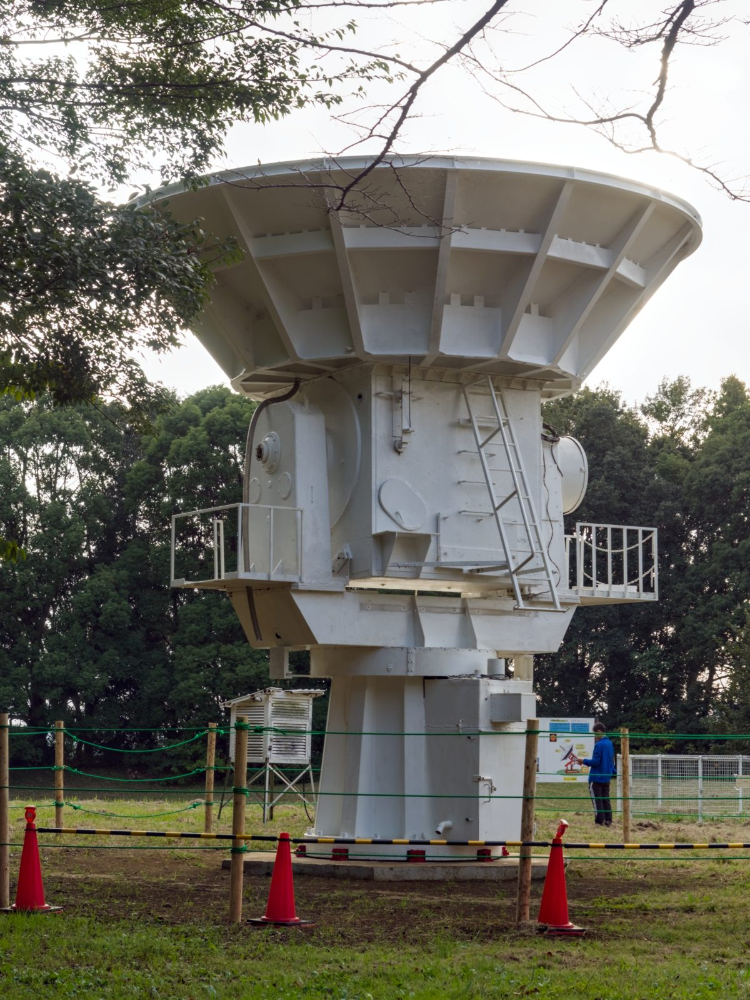


> The correlator combines voltage signals from two antennas and averages them to measure the complex visibility of the source.

---

## core physical intuition

A radio interferometer does not focus light with a physical lens. Instead it uses a correlator to digitally or electronically combine the signals collected by pairs of antennas. The correlator multiplies the time-varying voltage from one antenna with the voltage from another and averages the result over time.

Because the antennas are physically separated, the wavefront from a source reaches one antenna slightly before the other. This creates a geometric delay. For a source exactly at the targeted phase center, the correlator continuously outputs a constant value representing the correlated flux. For a source offset from the center, the changing geometric delay caused by the Earth rotating creates a beating pattern in the output called the fringe rate. The correlator essentially filters out all uncorrelated noise and distills the signals into a single complex visibility measurement for that baseline.

---

## key derivation & equations

The basic cross-correlation function $R_{ij}(\tau)$ between the voltage $V_i$ of antenna $i$ and $V_j$ of antenna $j$ as a function of delay $\tau$ is
$$R_{ij}(\tau) = \langle V_i(t) V_j^*(t+\tau) \rangle$$

For a monochromatic source at frequency $\nu$ with a geometric delay $\tau_g$ between the antennas, the correlated signal oscillates as
$$R_{ij} \propto e^{-2\pi i \nu \tau_g}$$

This averaged output represents the complex visibility $\mathcal{V}$ of the source on that specific baseline, which has an amplitude and a phase
$$\mathcal{V} = \lvert \mathcal{V}\rvert e^{i\phi}$$

---

## astrophysical context

The correlator is the computational heart of any radio array. Modern instruments like ALMA and the VLA rely on massive digital supercomputers to handle this task. They do not just compute one correlation, they process thousands of spectral channels across every single antenna pair simultaneously. For an array with $N$ antennas, the correlator must compute $N(N-1)/2$ baselines in real time.

---

## connections & zettel links

* parent moc: [Astronomical_Interferometry_MOC](../../04_Atlas/Astronomical_Interferometry_MOC.html)
* related zettels: [Radio interferometer architecture](interf/Radio%20interferometer%20architecture.html), [Connected element interferometer](interf/Connected%20element%20interferometer.html), [Very Long Baseline Interferometry VLBI](interf/Very%20Long%20Baseline%20Interferometry%20VLBI.html), [Downconversion of signals in radio interferometers](interf/Downconversion%20of%20signals%20in%20radio%20interferometers.html)
