while Cepheid variable stars provide extraordinary accuracy, they cannot be resolved beyond $\sim 30-40$ Mpc. to map cosmological distances across billions of light-years and measure the expansion rate of the universe, astronomy relies on the premier secondary standard candle: **Type Ia Supernovae (SNe Ia)**.

---

## the physical progenitor mechanism

a **Type Ia Supernova** is the catastrophic thermonuclear detonation of a **carbon-oxygen white dwarf** in a binary system:
1. the white dwarf accretes hydrogen-rich gas from an evolving companion star (single-degenerate channel) or merges with another white dwarf (double-degenerate channel).
2. as mass accumulates, the white dwarf approaches the **Chandrasekhar mass limit**:
   $$M_{\text{Ch}} \approx 1.44 M_\odot$$
3. electron degeneracy pressure cannot prevent central compression. central density climbs to $\rho_c \sim 2 \times 10^9$ g/cm$^3$ and temperature reaches $T_c \sim 7 \times 10^8$ K, igniting carbon fusion.
4. because the matter is completely electron-degenerate, temperature increases do not increase pressure: there is no thermal expansion to stabilize fusion. a runaway **thermonuclear flame front** sweeps through the entire star in seconds, incinerating the carbon and oxygen into radioactive nickel (${}^{56}\text{Ni}$).
5. the star is completely obliterated; no central remnant is left behind.

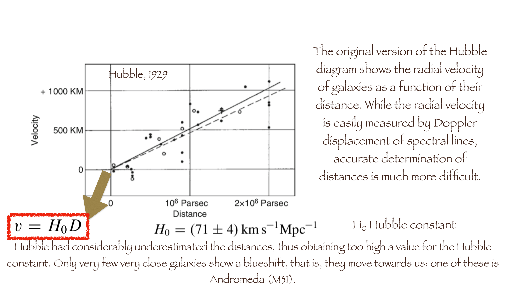

---

## why Type Ia Supernovae are ideal standard candles

1. **uniform trigger mass**: because all progenitors detonate at essentially the identical critical mass ($M \approx 1.4 M_\odot$) and identical carbon-oxygen composition, the total energy release and radioactive ${}^{56}\text{Ni}$ mass synthesized are remarkably uniform:
   $$M({}^{56}\text{Ni}) \approx 0.6 M_\odot$$
2. **colossal luminosity**: at peak brightness, a Type Ia supernova reaches an absolute magnitude of:
   $$\boxed{\, M_B \approx M_V \approx -19.3 \pm 0.3 \text{ mag} \,}$$
   radiating a peak luminosity of $L \approx 4 \times 10^9 L_\odot$—**as bright as an entire galaxy of 10 billion stars!**
3. **vast cosmological reach**: can be detected and monitored across deep space out to redshifts $z > 1.5 - 2.0$.

---

## the Phillips relation (luminosity-width relation)

uncalibrated Type Ia supernovae exhibit an intrinsic scatter of $\sim 0.3 - 0.5$ mag (too large for precision cosmology). in 1993, Mark Phillips discovered an empirical calibration: **the Phillips Relation**:
- the peak absolute magnitude correlates tightly with the **rate of decline** of its B-band light curve in the 15 days following maximum: $\Delta m_{15}(B)$.
- intrinsically brighter supernovae have broader, slower-declining light curves; fainter supernovae fade more quickly.

$$\boxed{\, M_{\text{max}}(B) = -21.726 + 2.698 \, \Delta m_{15}(B) \,}$$

applying the Phillips relation standardizes Type Ia supernovae to an extraordinary precision of **$\sigma_M \approx 0.12-0.15$ mag**, corresponding to distance uncertainties of only **$\sim 5-7\%$**!

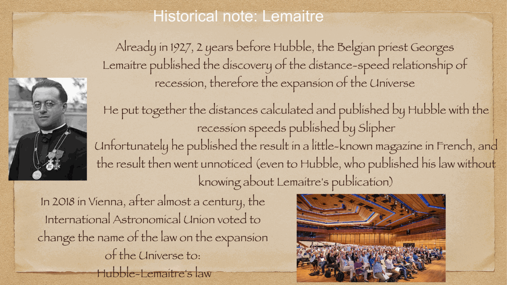

---

## the discovery of Cosmic Acceleration and Dark Energy (1998)

in 1998, two independent teams—the **High-Z Supernova Search Team** (led by Brian Schmidt and Adam Riess) and the **Supernova Cosmology Project** (led by Saul Perlmutter)—used Type Ia supernovae at $z \sim 0.5-1.0$ to measure the cosmic deceleration parameter $q_0$.

**the shocking discovery**: distant supernovae were systematically **$\sim 0.25$ magnitudes fainter** (and thus farther away) than predicted by any matter-dominated decelerating universe! 
consequence: the expansion of the universe is not slowing down under gravity, but is currently **accelerating**, driven by an unknown repulsive component: **Dark Energy ($\Lambda$)**. 

this monumental discovery earned Perlmutter, Schmidt, and Riess the **2011 Nobel Prize in Physics**.

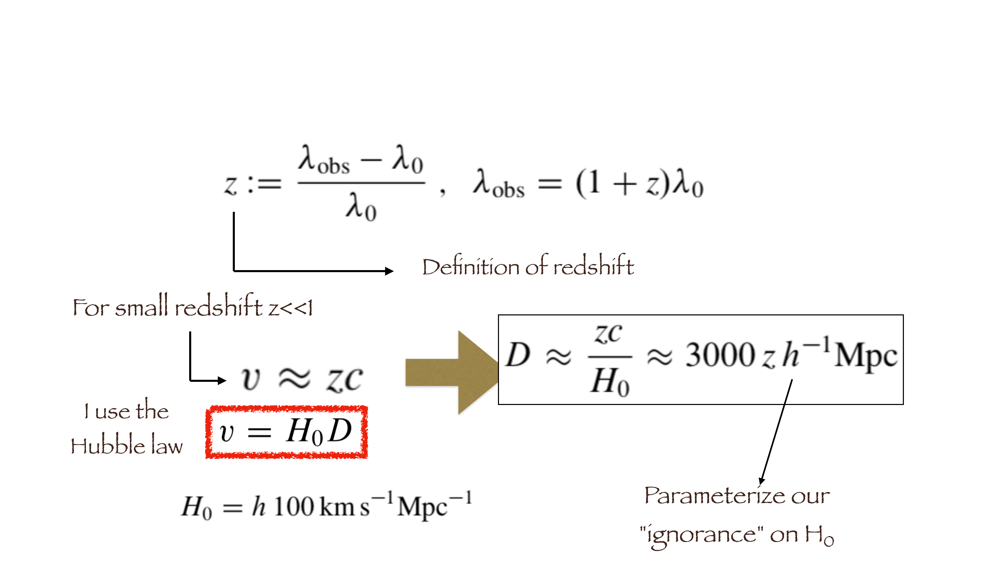

---

## see also

- [[Fundamentals_Astrophysics_Cosmology_MOC]]
- [[Parallax and standard candles]]
- [[Cepheids and supernovae]]
- [[Hubble's law and cosmological redshift]]
- [[Cosmic_inventory_dark_energy]]
- [[Supernovae and compact remnants]]

---

## observational astrophysics course slides (Prof. Paolo Cassata)

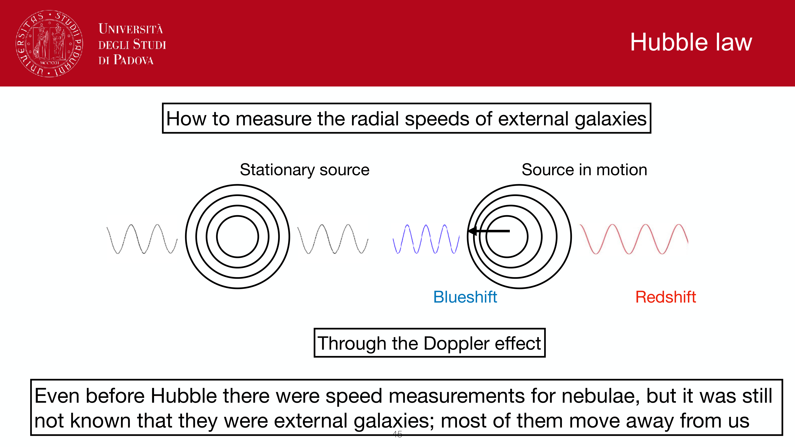
*Type Ia Supernovae: thermonuclear explosion of carbon-oxygen white dwarf accreting towards Chandrasekhar mass.*

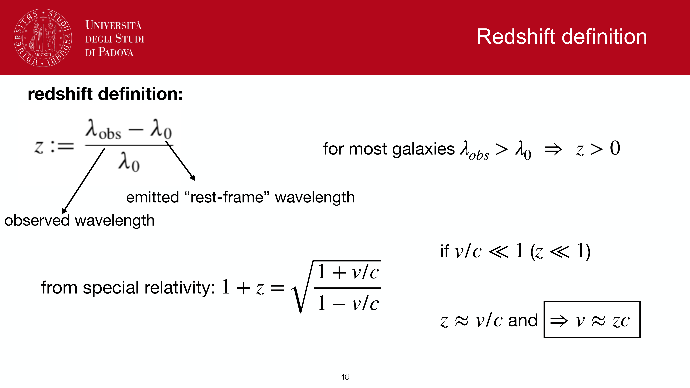
*Peak luminosity M_B ~ -19.3 mag (bolometric luminosity L ~ 10^43 erg/s, competing with host galaxy).*

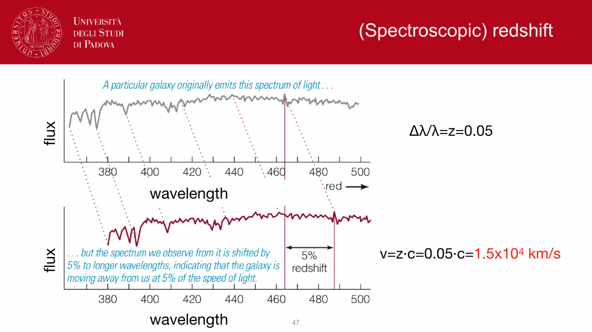
*Light curve decline rate: Delta m_15(B) parameter.*

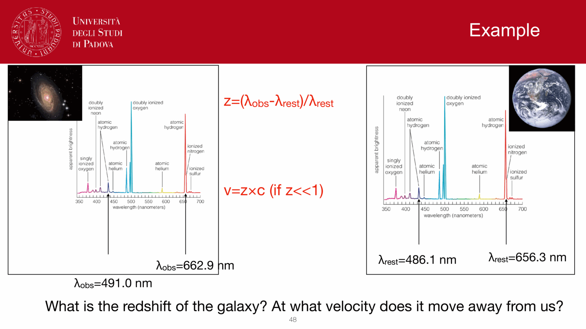
*Mark Phillips 1993 relation: broader/slower light curves are intrinsically brighter.*

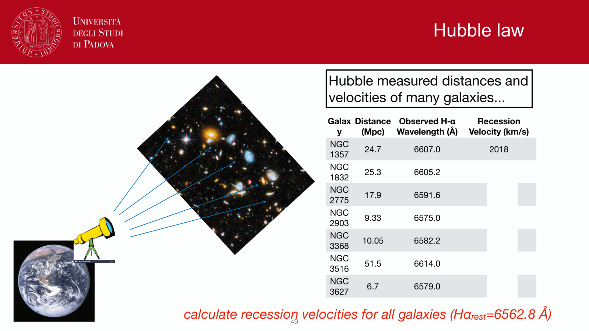
*Light curve stretch factor s and modern standardization light curve fitters (SALT2, MLCS2k2).*

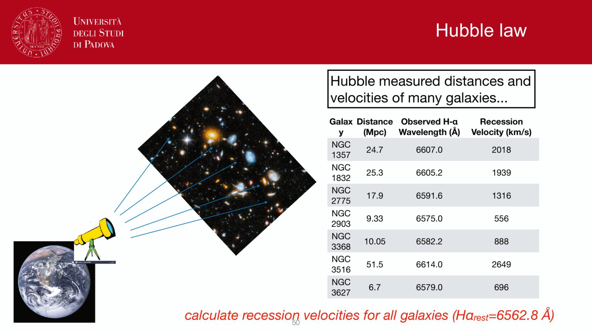
*Standardized candle precision: residual scatter sigma_mag ~ 0.12-0.15 mag (~6-7% distance error).*

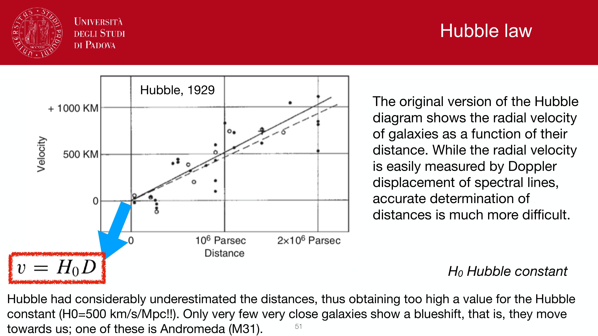
*High-Z Supernova Search Team and Supernova Cosmology Project (1998).*

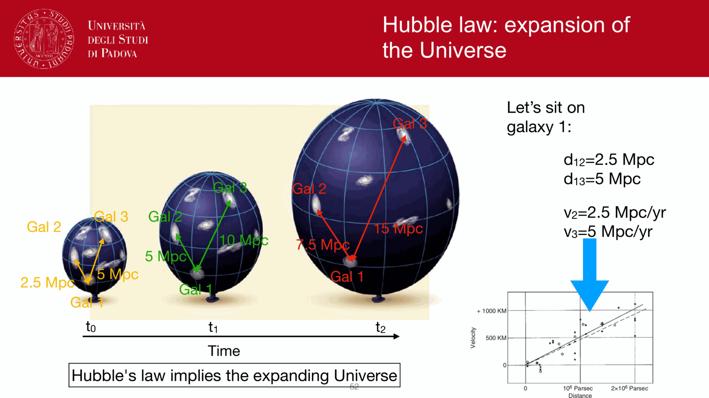
*Discovery of cosmic acceleration and dark energy (Nobel Prize 2011).*

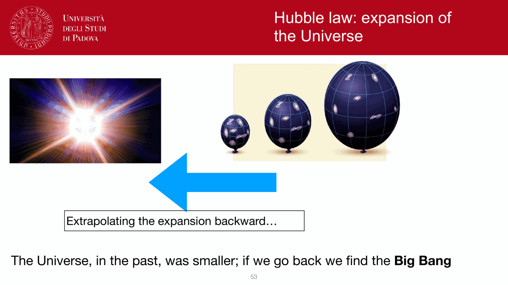
*Hubble diagram of Type Ia SNe out to z > 1.*

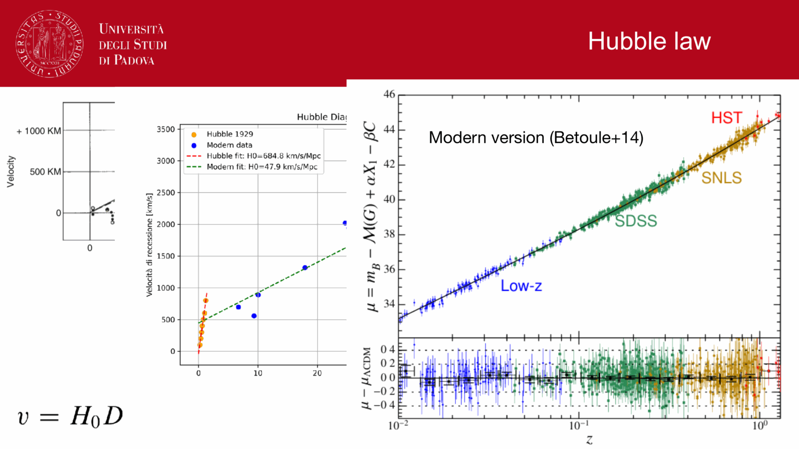
*Systematic uncertainties: dust extinction, host galaxy mass step, progenitor metallicity.*

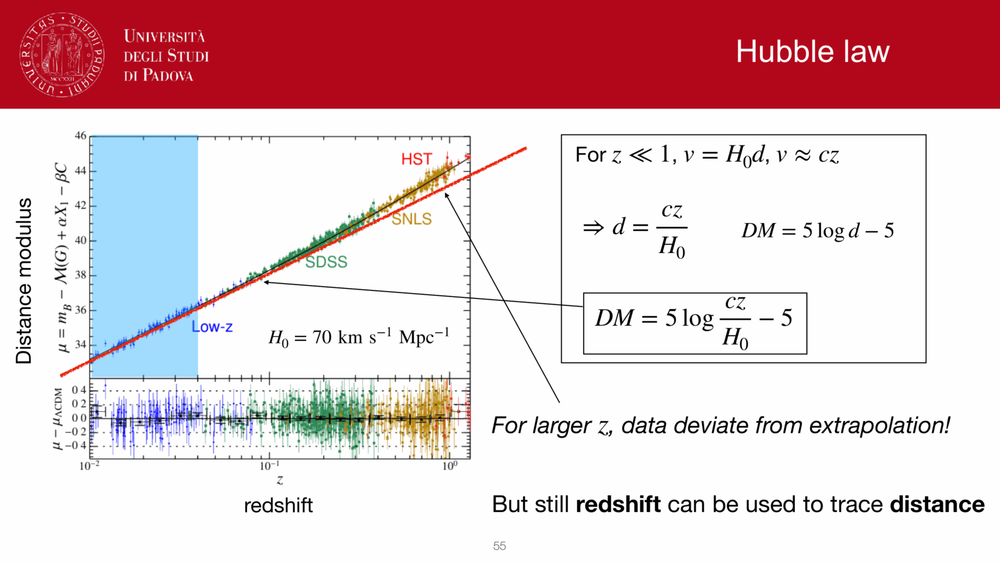
*Single-degenerate vs double-degenerate progenitor channels.*

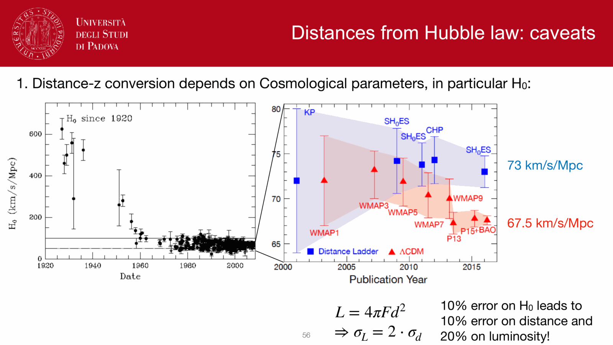
*Type Ia SNe as anchor for cosmological parameter estimation (Omega_m, Omega_Lambda, w).*

## Linked References

- [[Cepheid period-luminosity relation]]
- [[Cepheids and supernovae]]
- [[Cosmological constant]]
- [[Deceleration parameter]]
- [[Distance ladder derivations]]
- [[Galactic novae spectroscopy]]
- [[Hubble flow distances]]
- [[Hubble law]]
- [[Hubble's law and cosmological redshift]]
- [[Limb darkening]]
- [[Luminosity distance]]
- [[Parallax and standard candles]]
- [[Supernova Hubble diagram]]
- [[Supernova spectroscopy]]
- [[Supernovae and compact remnants]]
- [[Surface brightness fluctuations]]
- [[Symbiotic star spectroscopy]]
- [[TRGB tip of the red giant branch]]
- [[Variable stars as standard candles]]
- [[Fundamentals_Astrophysics_Cosmology_MOC]]
- [[Observational_Astrophysics_MOC]]

