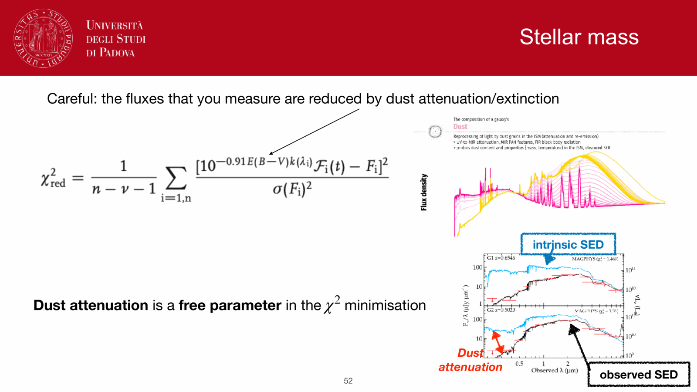
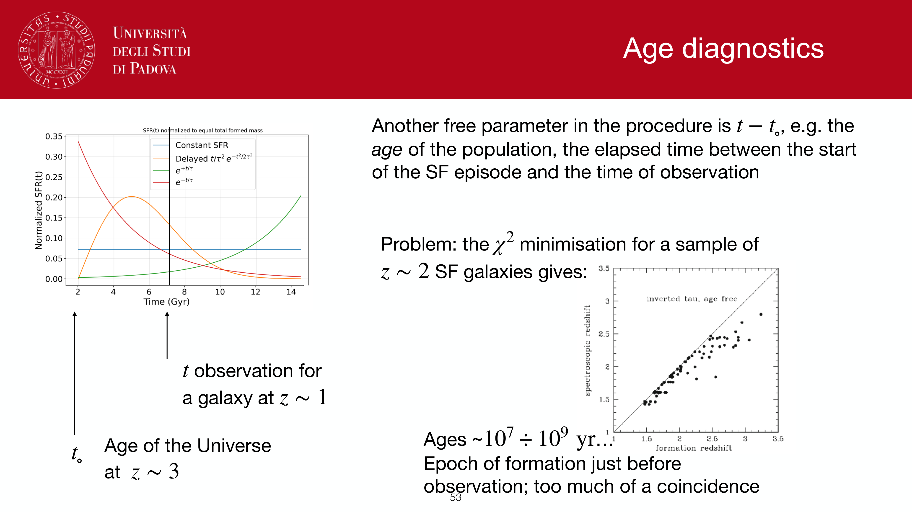
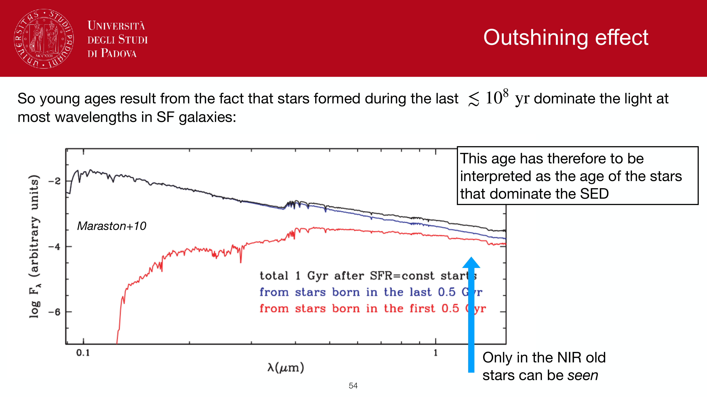


the **rest-frame ultraviolet continuum** ($\lambda \approx 1250\text{--}2800$ Å, typically centered at $1500$ Å or $2800$ Å) is a direct tracer of star formation in galaxies. It is emitted directly by the hot photospheres of short-lived, intermediate-to-massive main-sequence stars ($M \gtrsim 3\text{--}5\,M_\odot$). Because the ultraviolet continuum is redshifted into optical and near-infrared observer bands at high redshift, UV observations form the foundation for tracking galaxy assembly across cosmic dawn ($z \sim 2\text{--}12$).

---

### physical basis and steady-state timescale

for a star-forming galaxy, massive O and B stars dominate the UV luminosity ($L_\nu \propto M^{3.5}$). Because these stars have lifetimes of $\tau_{\rm MS} \sim 10\text{--}100$ Myr, continuous star formation establishes an equilibrium where birth rates equal death rates:

$$\frac{d L_\nu(\mathrm{UV})}{dt} \approx 0 \quad \text{for } t > 100\text{ Myr}$$

once this steady state is reached, the emergent monochromatic UV luminosity $L_\nu(\mathrm{UV})$ scales in direct linear proportion to the star formation rate averaged over the preceding $\sim 100$ Myr.

---

### standard calibrations

calibrations are derived from stellar population synthesis models (e.g., Starburst99, BC03) assuming constant star formation, solar metallicity, and a specified IMF:

#### Salpeter (1955) IMF ($0.1\text{--}100\,M_\odot$):
$$\mathrm{SFR}_{\rm UV} [M_\odot/\mathrm{yr}] = 1.4 \times 10^{-28}\, L_\nu(\mathrm{UV})\,[\mathrm{erg\,s^{-1}\,Hz^{-1}}] \quad (\text{Kennicutt 1998})$$

#### Chabrier (2003) IMF:
$$\mathrm{SFR}_{\rm UV} [M_\odot/\mathrm{yr}] = 0.88 \times 10^{-28}\, L_\nu(\mathrm{UV})\,[\mathrm{erg\,s^{-1}\,Hz^{-1}}] \quad (\text{Madau \& Dickinson 2014})$$

the conversion between IMFs is:
$$\mathrm{SFR}_{\rm Chabrier} = \frac{\mathrm{SFR}_{\rm Salpeter}}{1.58} = \mathrm{SFR}_{\rm Salpeter} \times 10^{-0.24}$$

---

### the dust challenge: attenuation and the IRX-$\beta$ relation

the primary systematic uncertainty in UV star formation rates is **dust attenuation**. Interstellar dust preferentially absorbs and scatters ultraviolet photons:
$$A_{1500} \approx (2.5\text{--}4.5) \times A_V$$
in typical star-forming disk galaxies ($A_V \sim 1$), the emergent UV flux is suppressed by factors of $10\text{--}50$ ($A_{1500} \approx 2.5\text{--}4$ mag). Raw, uncorrected UV star formation rates can underestimate the true SFR by an order of magnitude.

#### 1. panchromatic energy balance (UV + IR)
when far-infrared photometry is available, the most robust total star formation rate combines unobscured UV and obscured IR emission:
$$\mathrm{SFR}_{\rm tot} = \mathrm{SFR}_{\rm UV, obs} + \mathrm{SFR}_{\rm IR}$$

#### 2. the UV continuum slope $\beta$ and the meurer relation
when infrared data are unavailable (e.g., for faint galaxies at $z > 3$), dust attenuation must be inferred from the rest-frame UV continuum slope $\beta$, defined by:
$$f_\lambda \propto \lambda^\beta \quad (\text{measured over } 1250\text{--}2600\text{ Å})$$

dust reddening tilts the spectrum to redder (less negative) values of $\beta$. Meurer, Heckman & Calzetti (1999) established the empirical **IRX-$\beta$ relation** for local starburst galaxies:
$$\mathrm{IRX} \equiv \log_{10}\left( \frac{L_{\rm TIR}}{L_{\rm UV}} \right) = \log_{10}\left( 10^{0.4\,A_{1600}} - 1 \right) + \mathrm{const}$$
$$A_{1600} = 4.43 + 1.99\,\beta$$

- an unattenuated, dust-free young starburst has an intrinsic slope $\beta_0 \approx -2.23$ ($A_{1600} = 0$).
- measuring $\beta$ allows direct reconstruction of the dust-corrected UV luminosity:
  $$L_\nu^{\rm corrected}(\mathrm{UV}) = L_\nu^{\rm obs}(\mathrm{UV}) \cdot 10^{0.4\,A_{1600}}$$

---

### observational advantages and high-redshift application

1. **photometric efficiency at high redshift**:
   - for galaxies at $z \ge 2$, rest-frame UV is redshifted directly into optical ground-based filters ($U, B, V, R, I$).
   - enables wide-field selection of millions of high-$z$ galaxies via the **Lyman-break dropout technique** without requiring infrared instruments.
2. **spatially resolved star formation**:
   - high spatial resolution of optical/UV space telescopes (HST, JWST) allows mapping star-forming clumps and spiral arms on sub-kiloparsec scales.

---

### failure modes and caveats

- **bursty star formation**: if a galaxy undergoes a burst of star formation that quenched $< 100$ Myr ago, the UV continuum remains bright even though active star formation has ceased, leading to significant overestimation of the instantaneous SFR.
- **dust curve variation**: the IRX-$\beta$ relation depends on dust geometry and grain composition. Low-metallicity dwarf galaxies and SMC-like dust follow a steeper attenuation curve, falling below the Meurer relation (overestimating $A_{\rm UV}$ if Calzetti dust is assumed).
- **intrinsic $\beta$ variations**: variations in stellar metallicity ($Z < 0.1\,Z_\odot$) and binary stellar evolution (BPASS) can drive intrinsic slopes down to $\beta_0 \approx -2.6$, shifting the zero-point of dust corrections.

---

## see also

- [Observational_Astrophysics_MOC](../../04_Atlas/Observational_Astrophysics_MOC.html)
- [Stellar_Astrophysics_MOC](../../04_Atlas/Stellar_Astrophysics_MOC.html)
- [SFR tracers from population synthesis](./SFR%20tracers%20from%20population%20synthesis.html)
- [H-alpha SFR tracer](./H-alpha%20SFR%20tracer.html)
- [IR SFR tracer](./IR%20SFR%20tracer.html)
- [Dust attenuation in synthetic populations](./Dust%20attenuation%20in%20synthetic%20populations.html)
- [SED fitting basics](./SED%20fitting%20basics.html)
- [Photometric redshifts](./Photometric%20redshifts.html)
- [Initial mass function](./Initial%20mass%20function.html)
- [Star formation history of a population](./Star%20formation%20history%20of%20a%20population.html)

---

## observational astrophysics course slides (Prof. Paolo Cassata)

*UV SFR tracer: non-ionizing UV continuum (1500-2800 A), tracing ~100 Myr star formation.*

*Kennicutt UV calibration: SFR(M_Sun/yr) = 1.4 x 10^(-28) * L_nu(UV) (erg/s/Hz).*

*Dust correction via UV continuum slope beta and Meurer IRX-beta relation.*


  <h4 class="backlinks-title">Linked References (20)</h4>
  <ul class="backlinks-list">
    <li class="backlink-item-wrap"><a href="./Dust%20attenuation%20and%20extinction%20curves.html" class="backlink-item">Dust attenuation and extinction curves</a></li>
    <li class="backlink-item-wrap"><a href="./Dust%20attenuation%20in%20synthetic%20populations.html" class="backlink-item">Dust attenuation in synthetic populations</a></li>
    <li class="backlink-item-wrap"><a href="./Galaxy%20time%20scales.html" class="backlink-item">Galaxy time scales</a></li>
    <li class="backlink-item-wrap"><a href="./H-alpha%20SFR%20tracer.html" class="backlink-item">H-alpha SFR tracer</a></li>
    <li class="backlink-item-wrap"><a href="./IR%20SFR%20tracer.html" class="backlink-item">IR SFR tracer</a></li>
    <li class="backlink-item-wrap"><a href="./Initial%20mass%20function.html" class="backlink-item">Initial mass function</a></li>
    <li class="backlink-item-wrap"><a href="./Madau%20plot.html" class="backlink-item">Madau plot</a></li>
    <li class="backlink-item-wrap"><a href="../../04_Atlas/Observational_Astrophysics_MOC.html" class="backlink-item">Observational_Astrophysics_MOC</a></li>
    <li class="backlink-item-wrap"><a href="../../04_Atlas/Observational_Cosmology_MOC.html" class="backlink-item">Observational_Cosmology_MOC</a></li>
    <li class="backlink-item-wrap"><a href="./Other%20SFR%20tracer%20lines.html" class="backlink-item">Other SFR tracer lines</a></li>
    <li class="backlink-item-wrap"><a href="../../02_Literature/Lectures/Observational_Cosmology/Pablo_03_Star_formation_in_galaxies.html" class="backlink-item">Pablo_03_Star_formation_in_galaxies</a></li>
    <li class="backlink-item-wrap"><a href="./Planck%20law%20Wien%20Stefan-Boltzmann.html" class="backlink-item">Planck law Wien Stefan-Boltzmann</a></li>
    <li class="backlink-item-wrap"><a href="./SFR%20tracer%20comparison.html" class="backlink-item">SFR tracer comparison</a></li>
    <li class="backlink-item-wrap"><a href="./SFR%20tracers%20from%20population%20synthesis.html" class="backlink-item">SFR tracers from population synthesis</a></li>
    <li class="backlink-item-wrap"><a href="./SPS%20code%20families.html" class="backlink-item">SPS code families</a></li>
    <li class="backlink-item-wrap"><a href="./Star%20formation%20history%20parametrizations.html" class="backlink-item">Star formation history parametrizations</a></li>
    <li class="backlink-item-wrap"><a href="./Star%20formation%20rate%20and%20sSFR.html" class="backlink-item">Star formation rate and sSFR</a></li>
    <li class="backlink-item-wrap"><a href="./UV%20luminosity%20function.html" class="backlink-item">UV luminosity function</a></li>
    <li class="backlink-item-wrap"><a href="./UV%20slope%20and%20IRX-beta%20relation.html" class="backlink-item">UV slope and IRX-beta relation</a></li>
    <li class="backlink-item-wrap"><a href="./Why%20hot%20massive%20stars%20dominate%20luminosity.html" class="backlink-item">Why hot massive stars dominate luminosity</a></li>
  </ul>

