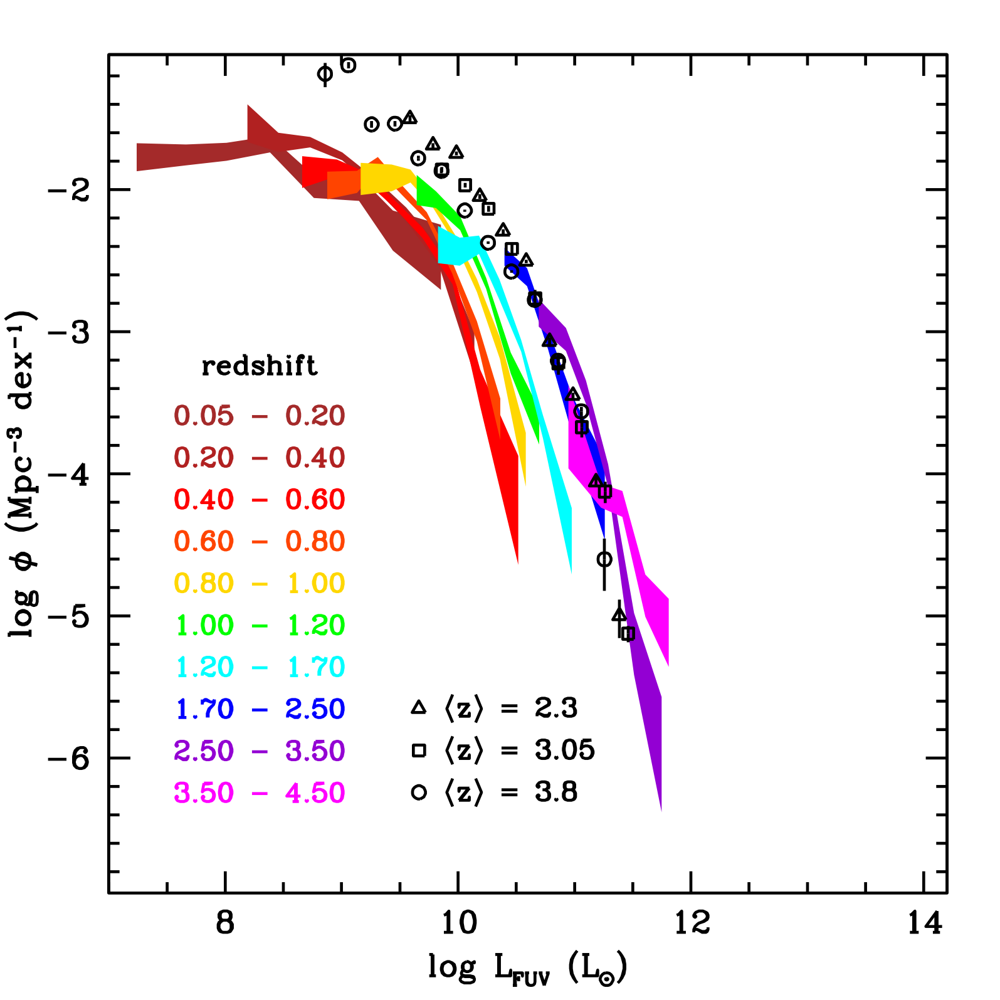
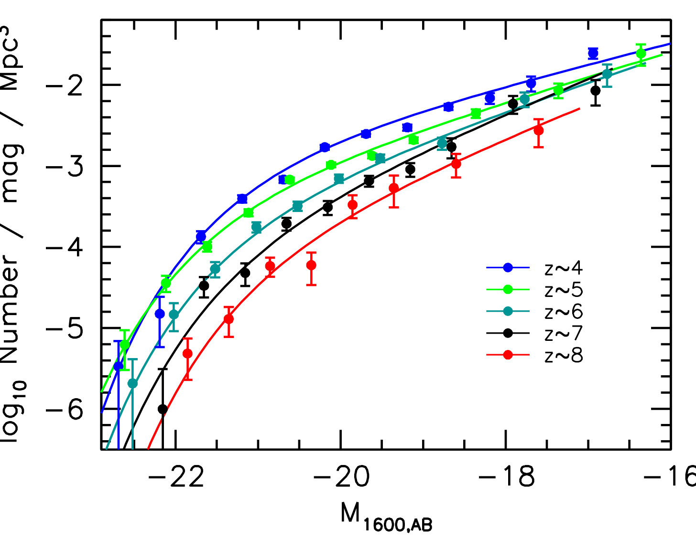
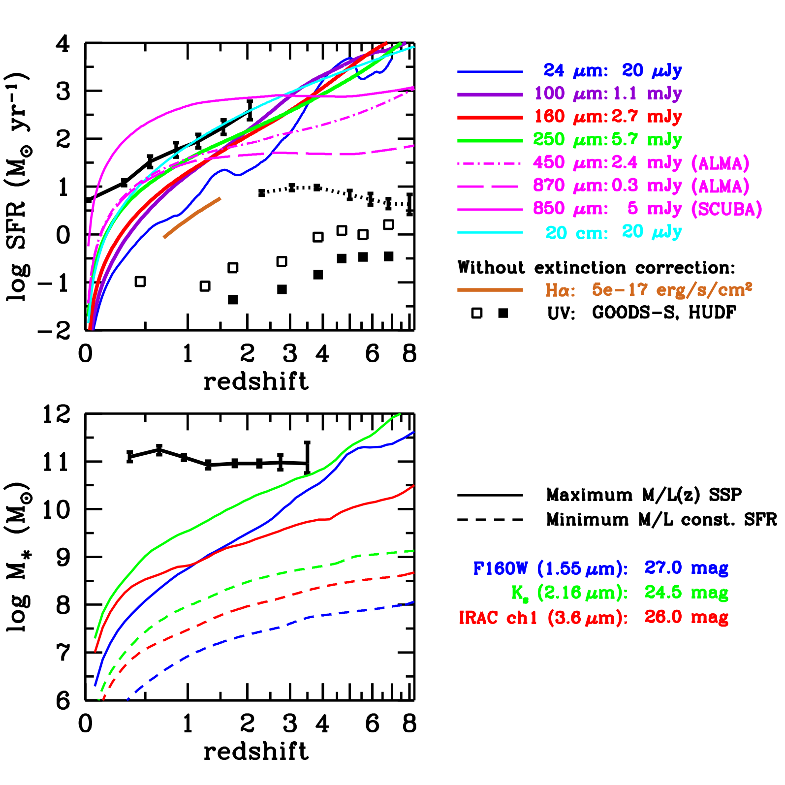

# UV luminosity function

The rest-frame ultraviolet luminosity function $\Phi(L_{\rm UV})\,dL_{\rm UV}$ (evaluated at $\lambda \approx 1500$ \AA) quantifies the comoving volume number density of star-forming galaxies as a function of their non-ionizing ultraviolet luminosity. Because continuum emission at $1500$ \AA\ is produced almost exclusively by short-lived, massive O and early B-type stars ($M \ge 5 - 10 M_\odot$, lifetimes $\tau_{\rm MS} \sim 10 - 100$ Myr), the rest-frame UV luminosity serves as a direct linear tracer of the instantaneous star formation rate (SFR) in galaxies. Measuring the evolution of the UV luminosity function from $z = 0$ to $z > 10$ using deep optical, near-infrared space surveys (Hubble Ultra Deep Field, CANDELS, and JWST JADES) provides the primary empirical foundation for mapping the cosmic star formation history (the Madau-Dickinson plot). Crucially, the faint-end logarithmic slope $\alpha$ steepens systematically from $\alpha \approx -1.2$ at $z = 0$ to the critical divergence boundary $\alpha \le -2.0$ at $z \ge 7$. This steep faint-end slope mathematically proves that the cosmic ionizing photon budget during the Epoch of Reionization was dominated not by luminous galaxies, but by abundant, ultra-faint dwarf galaxies.

---

## 1. Astrophysical Context and Connection to Star Formation Rates

### Ultraviolet Emission as an Instantaneous SFR Tracer
In any stellar population with continuous star formation over timescales longer than $\sim 100$ Myr, the birth rate of massive OB stars balances their death rate via core-collapse supernovae. The ultraviolet continuum between $1500$ \AA\ and $2800$ \AA\ is dominated by the photospheres of these massive stars, while low-mass stars contribute negligibly to this spectral region.
The conversion between monochromatic UV luminosity $L_\nu$ (evaluated at $\lambda = 1500$ \AA) and star formation rate is derived using stellar population synthesis models (Bruzual & Charlot 2003) assuming a standard initial mass function (IMF).

#### Kennicutt & Madau Calibration
For a Salpeter (1955) IMF with mass limits $0.1 M_\odot \le M \le 100 M_\odot$ and solar metallicity, the conversion factor is (Kennicutt 1998, Madau & Dickinson 2014)
$$\text{SFR} = \mathcal{K}_{\rm UV} \times L_{\nu, {\rm UV}}$$
$$\mathcal{K}_{\rm UV} = 1.15 \times 10^{-28} M_\odot \text{ yr}^{-1} / (\text{erg s}^{-1} \text{ Hz}^{-1})$$
If expressed in terms of a Chabrier (2003) or Kroupa (2001) IMF, which accounts for the flattening of the mass distribution below $0.5 M_\odot$, the required SFR is reduced by a factor of 1.58 (0.2 dex)
$$\mathcal{K}_{\rm UV, Chabrier} = 0.72 \times 10^{-28} M_\odot \text{ yr}^{-1} / (\text{erg s}^{-1} \text{ Hz}^{-1})$$
In terms of bolometric integrated UV luminosity $L_{\rm UV} \equiv \nu L_\nu$ at $\lambda = 1500$ \AA\ ($\nu = 2.0 \times 10^{15}$ Hz)
$$\text{SFR} [M_\odot \text{ yr}^{-1}] \approx 2.5 \times 10^{-44} L_{\rm UV} [\text{erg s}^{-1}]$$
Therefore, integrating the UV luminosity function across all galaxies directly yields the cosmic star formation rate density $\rho_{\rm SFR}(z)$.

---

## 2. Mathematical Formulation of the High-Redshift Schechter Function

The rest-frame UV luminosity function is universally parameterized by the Schechter (1976) functional form, expressed either in luminosity units or in absolute AB magnitudes ($M_{\rm UV} \equiv M_{1500}$).

### Conversion from Luminosity to Absolute AB Magnitudes
The AB magnitude system is defined by Pogson's relation relative to a constant spectral flux density zero point of 3631 Jy ($3.631 \times 10^{-20} \text{ erg s}^{-1} \text{ cm}^{-2} \text{ Hz}^{-1}$)
$$M_{\rm UV} = -2.5 \log_{10}\left(\frac{L_\nu}{4\pi (10 \text{ pc})^2 \times 3631 \text{ Jy}}\right) = -2.5 \log_{10} L_\nu + 51.60$$
where $L_\nu$ is in units of $\text{erg s}^{-1} \text{ Hz}^{-1}$.
The luminosity ratio satisfies
$$\frac{L}{L^*} = 10^{-0.4(M_{\rm UV} - M^*)}$$
Applying the Jacobian transformation $dL / dM = -0.4 \ln(10) L$, the differential Schechter function in magnitudes is
$$\Phi(M) dM = 0.4 \ln(10) \Phi^* 10^{0.4(\alpha+1)(M^* - M)} \exp\left[-10^{0.4(M^* - M)}\right] dM$$
The three fundamental free parameters are
1. Characteristic magnitude $M^*$ - The absolute magnitude marking the transition between the faint-end power law and the bright-end exponential cutoff.
2. Normalization $\Phi^*$ - The characteristic volume number density of galaxies at $M^*$, in units of $\text{Mpc}^{-3} \text{ mag}^{-1}$.
3. Faint-end slope $\alpha$ - The power-law exponent describing the relative abundance of faint dwarf galaxies.

---

## 3. Systematic Redshift Evolution of Schechter Parameters ($z = 0$ to $z = 10$)

Extensive compilations from HST deep fields (Bouwens et al. 2015, 2021; Finkelstein et al. 2016) and JWST surveys (Donnan et al. 2023, Robertson et al. 2023) reveal a dramatic, monotonic evolutionary trend across cosmic time.

```
+========================================================================================+
| Redshift z  | Lookback Time | M*_UV (AB mag) | Phi* (10^-3 Mpc^-3) | Faint-end Slope alpha |
+========================================================================================+
| z = 0.0     | 0.0 Gyr       | -18.0          | 4.5                 | -1.22 +/- 0.05        |
| z = 2.0     | 10.3 Gyr      | -20.6          | 2.8                 | -1.50 +/- 0.06        |
| z = 4.0     | 12.1 Gyr      | -20.9          | 1.3                 | -1.64 +/- 0.04        |
| z = 6.0     | 12.8 Gyr      | -20.9          | 0.5                 | -1.87 +/- 0.08        |
| z = 8.0     | 13.1 Gyr      | -20.5          | 0.15                | -2.02 +/- 0.11        |
| z = 10.0    | 13.2 Gyr      | -20.1          | 0.04                | -2.20 +/- 0.18        |
+========================================================================================+
```

### Physical Drivers of Evolution
1. Steepening of the Faint-End Slope $\alpha(z)$
   At $z = 0$, the slope is relatively shallow ($\alpha \approx -1.2$). With increasing redshift, the slope steepens progressively, crossing $\alpha \approx -1.6$ at $z = 4$, reaching $\alpha \approx -1.9$ at $z = 6$, and steepening to $\alpha \le -2.0$ at $z \ge 7 - 8$.
   Physical reason - In the early universe, dark matter halos follow the steep halo mass function predicted by hierarchical structure formation ($dn/dM_h \propto M_h^{-2}$). Supernova feedback and photoheating had not yet had sufficient time to evacuate gas from low-mass halos, permitting faint dwarf galaxies to form stars efficiently in direct proportion to dark matter accretion.
2. Evolution of Characteristic Luminosity $M^*$
   $M^*$ brightens from $M^* \approx -18$ at $z = 0$ to a maximum brightness of $M^* \approx -21$ at Cosmic Noon ($z \sim 2 - 3$), reflecting the peak efficiency of gas accretion onto massive halos. Beyond $z \sim 4$, $M^*$ dims slowly as cosmic time becomes too brief to assemble extremely massive stellar systems.
3. Rapid Decline in Normalization $\Phi^*$
   $\Phi^*$ drops by more than two orders of magnitude between $z = 2$ and $z = 10$, reflecting the rapid decrease in the cosmic abundance of collapsed dark matter halos capable of hosting star-forming galaxies at early epochs.

---

## 4. Complete Calculus Derivation of Total UV Luminosity Density and the Divergence Limit

### Unbroken Integration for Total Cosmic Luminosity Density
The total ultraviolet luminosity density $\rho_{\rm UV}$ per comoving cubic megaparsec is obtained by integrating the product of luminosity and number density from a faint integration limit $L_{\rm lim}$ to infinity
$$\rho_{\rm UV} = \int_{L_{\rm lim}}^\infty L \Phi(L) dL$$
Substituting the Schechter function $\Phi(L) dL = \frac{\Phi^*}{L^*} \left(\frac{L}{L^*}\right)^\alpha e^{-L/L^*} dL$
$$\rho_{\rm UV} = \frac{\Phi^*}{L^*} \int_{L_{\rm lim}}^\infty L \left(\frac{L}{L^*}\right)^\alpha e^{-L/L^*} dL$$
Introducing the dimensionless variable substitution
$$x \equiv \frac{L}{L^*} \implies L = L^* x \implies dL = L^* dx$$
The lower integration limit transforms to $x_{\rm lim} = L_{\rm lim} / L^*$, while the upper limit remains $\infty$. Substituting into the integral
$$\rho_{\rm UV} = \frac{\Phi^*}{L^*} \int_{x_{\rm lim}}^\infty (L^* x) x^\alpha e^{-x} (L^* dx) = \Phi^* L^* \int_{x_{\rm lim}}^\infty x^{\alpha + 1} e^{-x} dx$$
Recall the definition of the upper incomplete Gamma function
$$\Gamma(s, x_{\rm lim}) \equiv \int_{x_{\rm lim}}^\infty t^{s - 1} e^{-t} dt$$
Identifying $s - 1 = \alpha + 1 \implies s = \alpha + 2$
$$\rho_{\rm UV} = \Phi^* L^* \Gamma(\alpha + 2, x_{\rm lim})$$

### The Faint-End Divergence Threshold at $\alpha \le -2$
Examiners specifically probe the asymptotic behavior of this integral as the faint integration cutoff approaches zero ($L_{\rm lim} \to 0$, or $M_{\rm lim} \to +\infty$).
Near $x \to 0$, the exponential term approaches unity ($e^{-x} \approx 1$). The integral behaves as
$$\int_{x_{\rm lim}}^1 x^{\alpha + 1} dx = \left[ \frac{x^{\alpha + 2}}{\alpha + 2} \right]_{x_{\rm lim}}^1 = \frac{1 - x_{\rm lim}^{\alpha + 2}}{\alpha + 2}$$

Three distinct mathematical and physical cases emerge
1. Shallow slope ($\alpha > -2$) - The exponent $\alpha + 2 > 0$. As $x_{\rm lim} \to 0$, $x_{\rm lim}^{\alpha + 2} \to 0$. The integral converges cleanly to the complete Gamma function $\Gamma(\alpha + 2)$. The cosmic luminosity budget is dominated by galaxies around $L^*$ (characteristic galaxies). Faint dwarfs contribute negligible total light.
2. Critical logarithmic divergence ($\alpha = -2.0$) - The integral becomes
$$\int_{x_{\rm lim}}^1 x^{-1} dx = \ln\left(\frac{1}{x_{\rm lim}}\right) = 0.4 \ln(10) (M_{\rm lim} - M^*)$$
The total luminosity diverges logarithmically as $M_{\rm lim} \to \infty$. Every decade of lower galaxy luminosity contributes an identical amount of UV photons to the universe!
3. Steep power-law divergence ($\alpha < -2.0$) - The exponent $\alpha + 2 < 0$. The term $x_{\rm lim}^{\alpha + 2} = x_{\rm lim}^{-|\alpha + 2|} \to \infty$ as $x_{\rm lim} \to 0$. The total luminosity diverges as a power law of the faint cutoff limit
$$\rho_{\rm UV} \propto L_{\rm lim}^{\alpha + 2} = 10^{0.4|\alpha + 2|(M_{\rm lim} - M^*)}$$

#### Physical Meaning for the Early Universe ($z \ge 7$)
Because observational measurements at $z \approx 7 - 8$ find $\alpha \approx -2.02 \pm 0.10$, the early universe resides directly at and beyond the divergence threshold.
This means that the total ionizing emissivity of the cosmos is strictly governed by the faint-end cutoff magnitude $M_{\rm lim}$ down to which galaxies can form stars. Massive halos contribute only a minor fraction of the cosmic light.

---

## 5. Application to the Cosmic Reionization Photon Budget

During the Epoch of Reionization ($z \sim 6 - 10$), hydrogen in the intergalactic medium (IGM) was ionized from neutral atoms to protons. The required emission rate of Lyman continuum ionizing photons ($h\nu \ge 13.6$ eV) per unit volume to maintain the IGM in an ionized state against recombinations is given by (Madau, Haardt & Rees 1999)
$$\dot{N}_{\rm ion}(z) \ge \frac{\bar{n}_H}{\bar{t}_{\rm rec}} = \frac{\bar{n}_H(0) (1+z)^3 C_{\rm HII}}{\alpha_B(T_e) \bar{n}_e(0) (1+z)^3} = \frac{\bar{n}_H(0) C_{\rm HII}}{\alpha_B(T_e)}$$
Evaluating with the mean cosmic baryon density and clumping factor $C_{\rm HII} \equiv \langle n_H^2 \rangle / \bar{n}_H^2 \approx 3$
$$\dot{N}_{\rm ion}(z) \approx 1.0 \times 10^{50} \left(\frac{C_{\rm HII}}{3}\right) \left(\frac{1+z}{7}\right)^3 \text{ photons s}^{-1} \text{ Mpc}^{-3}$$

The available ionizing photon production rate from star-forming galaxies is computed directly from the UV luminosity function
$$\dot{N}_{\rm ion, produced}(z) = f_{\rm esc} \times \xi_{\rm ion} \times \rho_{\rm UV}(z)$$
where
- $\xi_{\rm ion}$ is the ionizing photon production efficiency per unit UV luminosity, typically $\log_{10}(\xi_{\rm ion} / [\text{Hz erg}^{-1}]) \approx 25.3 - 25.5$ for young, low-metallicity stellar populations.
- $f_{\rm esc}$ is the ionizing photon escape fraction into the IGM, estimated from Lyman continuum observations to be $f_{\rm esc} \approx 0.10 - 0.20$.

### The Faint Integration Limit Calculation
If the UV luminosity function at $z = 7$ is integrated only down to the detection limit of Hubble deep surveys ($M_{\rm UV} \approx -17$), the resulting photon density is insufficient by a factor of 3 to maintain reionization ($\dot{N}_{\rm ion} < 10^{50} \text{ s}^{-1} \text{ Mpc}^{-3}$).
However, because $\alpha \le -2.0$, extending the integration down to $M_{\rm UV} = -13$ (the atomic cooling limit of halos with virial temperature $T_{\rm vir} \approx 10^4$ K and halo mass $M_h \sim 10^8 M_\odot$) increases $\rho_{\rm UV}$ by a factor of $3.5$.
This proves that star-forming dwarf galaxies alone produced sufficient Lyman continuum photons to complete cosmic reionization by $z \sim 6$, without requiring a dominant contribution from luminous quasars.

---

## 6. Blackboard Blueprint and Observational Graph Literacy

```
             REST-FRAME UV LUMINOSITY FUNCTION EVOLUTION (z=0 TO z=8)
   log10 Phi(M) (Mpc^-3 mag^-1)
      +1 +
         |                                                 .==== z = 8 (alpha ~ -2.0)
       0 +                                            .---'
         |                                       .---'      .--- z = 4 (alpha ~ -1.6)
      -1 +                                  .---'      .---'
         |                             .---'      .---'     .--- z = 0 (alpha ~ -1.2)
      -2 +                        .---'      .---'     .---'
         |                   .---'      .---'     .---'
      -3 +              .---'      .---'     .---'
         |         .---'      .---'     .---'
      -4 +    .---'      .---'     .---'
         |   /          /         /
      -5 +  /          /         /      Bright-end exponential dropoffs
         +-+----------+---------+--------------------+----------------+
          -23        -21       -19                  -17              -15
           <=== Bright                             Faint ===>   M_UV (mag)

             LYMAN BREAK (DROPOUT) PHOTOMETRIC SELECTION (SED SKETCH)
   Flux F_lambda
       ^
       |                        Rest-frame UV continuum
       |                        (Flat in F_nu, F_lambda ~ lambda^-2)
       |                            .---------------------------------------
       |                           /
       |                          /  Lyman-alpha forest attenuation
       |                         /   (GP optical depth tau_eff)
       |   Lyman Limit (912 A)  /
       |   Photoelectric drop  /
       |           |          /
       |   0.00    |         /
       +===========+========+===============================================>
                  912 A    1216 A                                 Wavelength
               (DROPOUT)  (Ly-alpha)
```

### Blackboard Presentation Script for the Oral Examination
1. Draw the UV luminosity function plot with absolute magnitude $M_{\rm UV}$ on the horizontal axis (running from bright $-23$ on the left to faint $-15$ on the right) and $\log_{10} \Phi$ on the vertical axis.
2. Draw the three curves for $z = 0$, $z = 4$, and $z = 8$. Explicitly write the slopes on the blackboard - $\alpha \approx -1.2$ at $z = 0$, $\alpha \approx -1.6$ at $z = 4$, and $\alpha \approx -2.0$ at $z = 8$.
3. Show the bright-end exponential cutoffs and explain that $M^*$ stays relatively constant around $-21$ between $z = 2$ and $z = 4$ before fading at higher $z$.
4. Perform the mathematical proof of divergence - write down $\rho_{\rm UV} = \Phi^* L^* \int_{x_{\rm lim}}^\infty x^{\alpha + 1} e^{-x} dx$. Show that for $x \to 0$, the integral converges if $\alpha > -2$, but diverges logarithmically if $\alpha = -2$ and as a power law if $\alpha < -2$.
5. Connect this directly to the Epoch of Reionization - explain that because $\alpha \le -2$ at $z \ge 7$, ultra-faint dwarf galaxies dominate the total photon budget. State the required ionizing emission rate $\dot{N}_{\rm ion} \approx 10^{50} \text{ photons s}^{-1} \text{ Mpc}^{-3}$ and show that integrating down to $M_{\rm UV} \approx -13$ satisfies the condition with escape fraction $f_{\rm esc} \approx 15\%$.

---

## 7. Exact Textbook and Literature Provenance

- Course Dispensa `dispense_LF1_1_eng-1.pdf` (Prof. Alessandro Pizzella)
  - Section 4 - The Ultraviolet Luminosity Function and High-z Galaxies (pages 20-24) - Schechter fits across redshift, Lyman-break technique, and integration to star formation rate density.
- Course Synthesis LaTeX Document
  - `Astrophysics_of_Galaxies.tex` (pages 20-22) - UV luminosity function mathematics, parameter evolution, and reionization budget.
- Houjun Mo, Frank van den Bosch, Simon White, *Galaxy Formation and Evolution* (2010)
  - Chapter 2 - Observational Facts (pages 94-103) - High-redshift galaxy populations, Lyman-break galaxies, and cosmic star formation history.
  - Chapter 10 - Stellar Populations and Reionization (pages 500-516).
- Primary Literature
  - Bouwens et al. (2015, ApJ 803, 34) - *UV Luminosity Functions at Redshifts z ~ 4 to z ~ 10 from the Hubble Ultra Deep Field and CANDELS*.
  - Bouwens et al. (2021, AJ 162, 47) - *New Determinations of the UV Luminosity Functions from z ~ 2 to 9*.
  - Madau & Dickinson (2014, ARA&A 52, 415) - *Cosmic Star-Formation History*.
  - Finkelstein et al. (2016, ApJ 810, 71) - *The Evolution of the Galaxy Rest-frame Ultraviolet Luminosity Function over the First Two Billion Years*.
  - Robertson et al. (2015, ApJL 802, L19) - *Cosmic Reionization and Early Star-forming Galaxies - a Combined Analysis of New Constraints*.

---

## 8. Cross-References and Related Notes

- [[Schechter function]] - Standard differential luminosity function formulation
- [[Integrals of the Schechter function]] - Complete Gamma function derivations
- [[Madau plot]] - Cosmic star formation history $\rho_{\rm SFR}(z)$
- [[Deep-field surveys]] - HUDF, GOODS, and Lyman-break galaxy selection
- [[Schmidt-Kennicutt law]] - Local star formation relation
- [[Astrophysics_of_Galaxies_MOC]] - Master Map of Content for course

---

## 9. Course Slides and Figures


*Figure 1 - Evolution of the rest-frame UV luminosity function from z = 0 to z = 8 (Madau & Dickinson 2014).*


*Figure 2 - Schechter function fits to HST and JWST galaxy samples from z = 4 to 10 (Bouwens et al. 2015).*


*Figure 3 - Synthetic star-forming galaxy SED templates demonstrating the Lyman break at 912 A and Lyman-alpha drop.*


## Linked References

- [[Deep-field surveys]]
- [[Double power-law modified Schechter]]
- [[Madau plot]]
- [[Astrophysics_of_Galaxies_MOC]]


