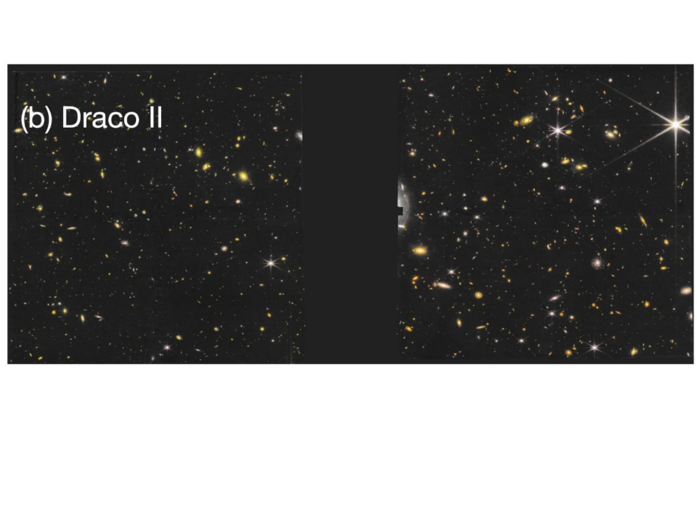
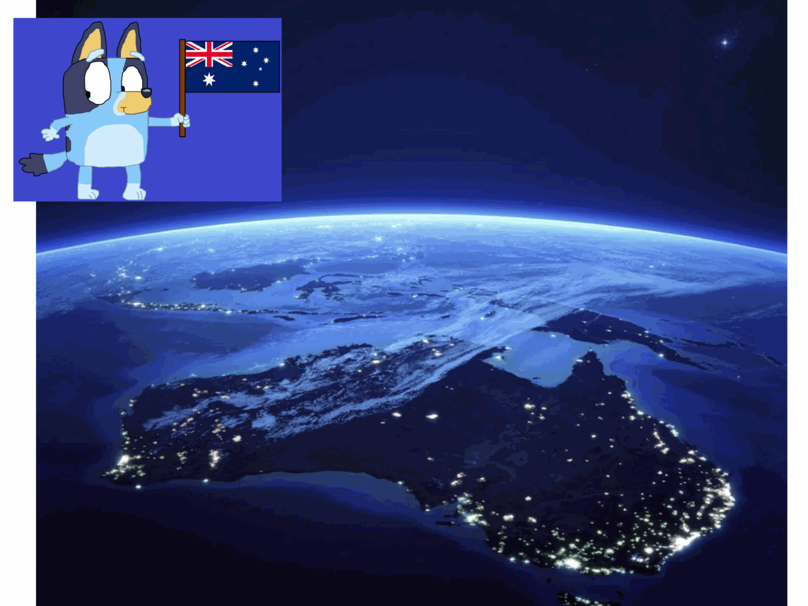
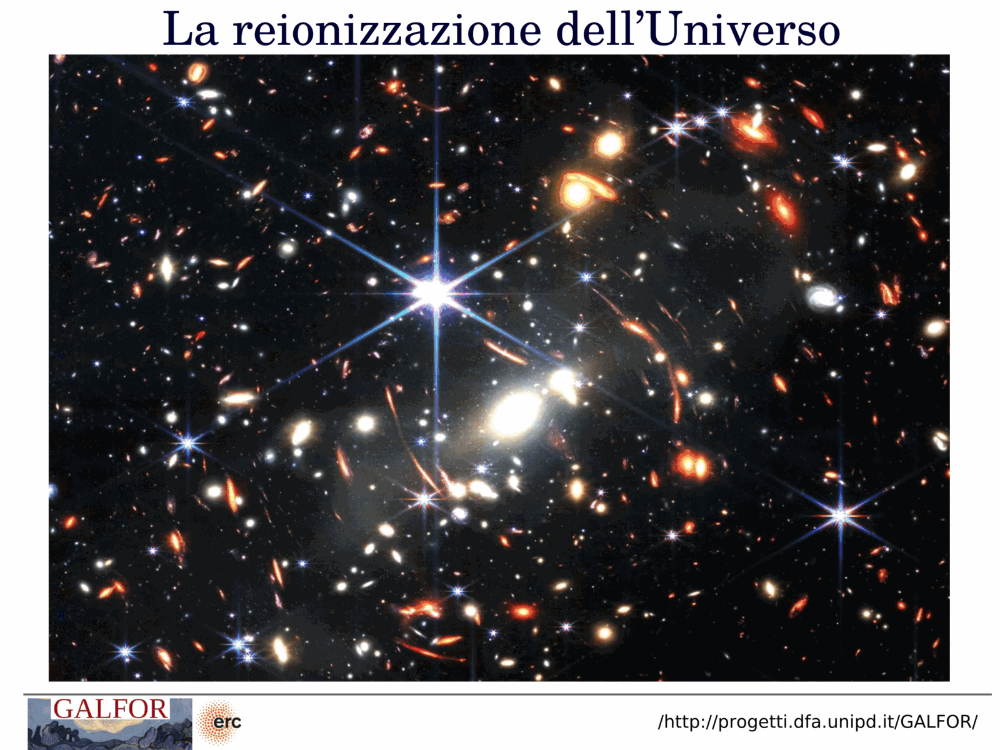
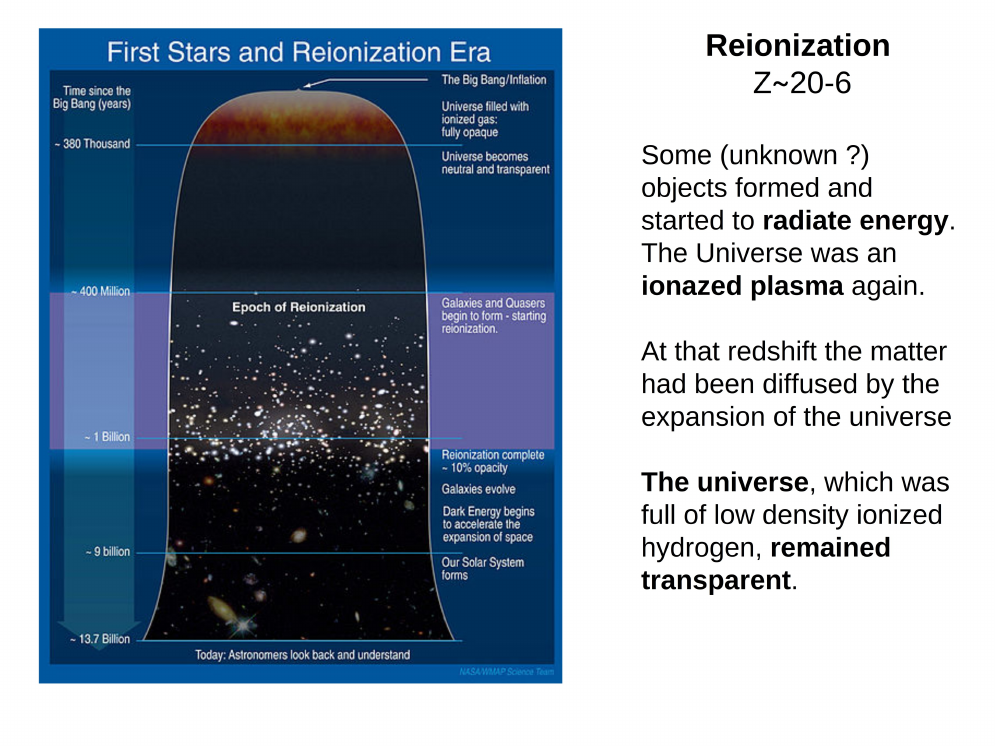
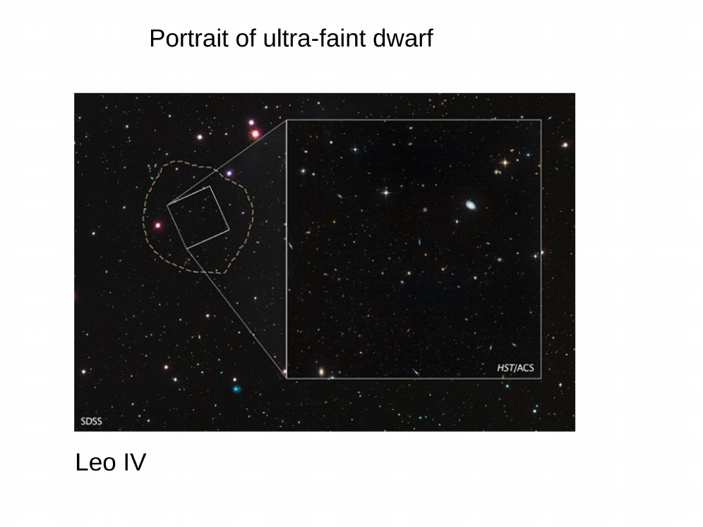
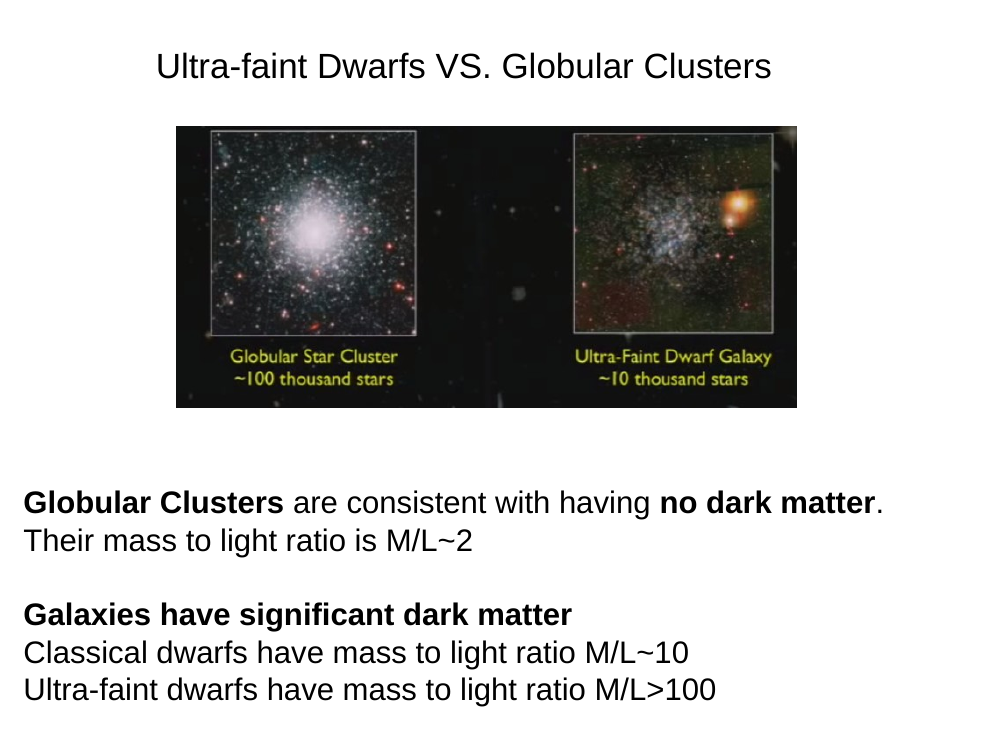
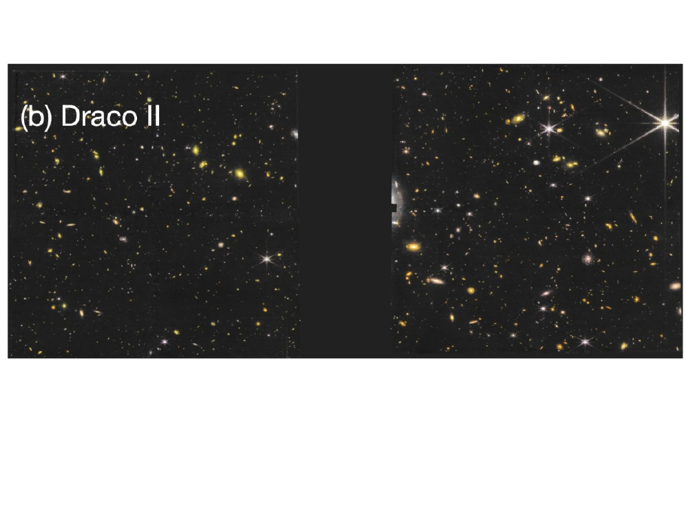


ultra-faint dwarf galaxies (UFDGs) are the lowest-luminosity galaxies known. they sit at the extreme end of the dwarf galaxy luminosity function and are the closest things in the local universe to the smallest dark-matter-bound systems that can host stars.

**operational definition** (willman & strader 2012, simon 2019):

- **luminosity**: $M_V > -7.7$ (some authors say $M_V > -8$). this corresponds to total stellar mass $M_\star \lesssim 10^5 M_\odot$. for context, classical dwarf spheroidals like draco have $M_V \sim -8.8$, while UFDGs go down to $M_V \approx -1.5$ (cetus iii, virgo i, the very faintest).
- **internal kinematics**: stellar velocity dispersion $\sigma_v \sim 2$-$5$ km/s. there is no rotation; UFDGs are **pressure-supported**.
- **metallicity**: mean $[\text{Fe/H}] \sim -2.5$ to $-3.0$, with internal spreads of $\sim 0.5$-$1$ dex. some contain extremely metal-poor stars ($[\text{Fe/H}] < -3$), among the most metal-poor stars in the Universe.
- **size**: half-light radius $r_h \sim 30$-$100$ pc.
- **dynamics**: mass-to-light ratios $M/L \sim 100$-$10^4$ within the half-light radius. dynamical masses $\sim 10^6$-$10^7 M_\odot$.

## UFD vs globular cluster: the diagnostic boundary

what distinguishes a UFDG from a globular cluster of comparable luminosity (Milone 2026, Lecture 5):

| property | globular cluster | ultra-faint dwarf |
|---|---|---|
| half-light radius $r_h$ | $\sim 3$-$10$ pc | $\sim 30$-$100$ pc |
| mass-to-light $M/L$ | $\sim 2$ (no DM) | $\gtrsim 100$ (DM dominated) |
| $[{\rm Fe/H}]$ spread | none (single [Fe/H]) | significant spread |
| dark matter | consistent with zero | dominant |

UFDGs look like extensions of the dwarf galaxy sequence in luminosity-size-$M/L$ space, **not** extensions of the GC sequence. a useful mnemonic: GCs are compact, self-gravitating, chemically homogeneous in iron. UFDGs are extended, DM-dominated, and chemically spread.

**discovery history**:

- before 2005, only $\sim 10$ milky way satellites were known (the classical dSphs).
- SDSS data release 5 onward, willman, belokurov, koposov and collaborators ran matched-filter searches on the imaging photometry and uncovered around 15 new objects in 2005-2010 (willman 1, ursa major i/ii, coma berenices, segue 1/2, leo iv/v, etc.). these were the first UFDGs.
- the **dark energy survey** (DES, southern hemisphere) added another $\sim 20$ objects from 2015 onward, including reticulum ii, eridanus ii, tucana ii/iii/iv/v, horologium i, etc.
- **pan-STARRS** and **HSC** filled in more, with **gaia astrometry** confirming membership and characterising orbits.
- now $\sim 60$ candidate UFDGs are known around the milky way, with similar populations being mapped around M31. LSST will push the census to $\sim 100$ within a few years.

**why they matter**:

- they probe the faint end of galaxy formation, **the regime where reionisation feedback shuts off star formation** (see [UFDG star formation histories](./UFDG%20star%20formation%20histories.html)).
- they constrain the nature of dark matter: warm dark matter or fuzzy DM models predict cutoffs in the subhalo mass function that would suppress UFDGs.
- they are the chemically simplest galaxies and preserve nucleosynthetic signatures of the very first generations (see [Pop III remnants in UFDGs](./Pop%20III%20remnants%20in%20UFDGs.html)).
- they are the modern equivalent of the building blocks that the milky way halo was assembled from, so they connect directly to galactic archaeology of the halo (see [Halo accretion from dwarf galaxies](./Halo%20accretion%20from%20dwarf%20galaxies.html)).

a useful pedagogical warning: the UFDG/GC boundary is fuzzy. a few systems (segue 1, willman 1, crater ii) have been debated for years. the resolution is usually deeper photometry plus more spectroscopic members, which firms up either a metallicity spread (favours UFDG) or a single isochrone (favours GC).

## reionisation and the age of ultra-faint dwarfs

**Brown et al. 2014** used deep HST photometry to infer the ages of six ultra-faint dwarfs (CVn II, Ursa Major I, Leo IV, Hercules, Boötes I, Coma Ber). the result: **$\sim 80\%$ of their stars formed by $z \sim 6$ and $100\%$ by $z \sim 3$**. the similarly ancient populations across all six systems suggest that star formation in the smallest dark-matter sub-halos was suppressed by a **global outside influence** — most plausibly the **epoch of reionisation** ($z \sim 6$-$10$).

this makes UFDGs the quintessential **fossil galaxies**: their stars formed before or during reionisation, and the UV background from the first galaxies + quasars photoevaporated their residual gas, permanently shutting off star formation.

## JWST + HST observations of Boötes I

**Muratore et al. 2026 (A&A, in press)** combined JWST NIRCam + HST observations to produce extremely precise photometry of the UFD Boötes I. the CMD reveals a **very narrow sub-giant branch (SGB)**, which challenges the conclusion that most stars formed $> 13$ Gyr ago. a narrow SGB constrains the age spread: if there were a significant internal age spread ($\gtrsim 1$ Gyr), the SGB would be broadened.

this is an exam-relevant conceptual question: **why does a narrow SGB imply a short star-formation timescale?** answer: the SGB luminosity is the most age-sensitive feature of the CMD at old ages (more so than the TO for old populations), so its width directly bounds $\Delta \tau$.

## reference papers

- **Willman et al. 2005** — Willman 1, first SDSS UFDG.
- **Belokurov et al. 2007** — five new UFDGs from SDSS.
- **Brown et al. 2014** — HST ages of six UFDs: reionisation quenching.
- **Simon 2019 review** — kinematics + DM content of dwarfs.
- **Frebel & Norris 2015 review** — chemical signatures of UFDGs.
- **Ji et al. 2016** — r-process enhancement in Reticulum II.
- **Muratore et al. 2026** — JWST + HST Boötes I photometry.

see also [UFDG dark matter content](./UFDG%20dark%20matter%20content.html), [UFDG star formation histories](./UFDG%20star%20formation%20histories.html), [UFDG search via deep CMD](./UFDG%20search%20via%20deep%20CMD.html), [Pop III remnants in UFDGs](./Pop%20III%20remnants%20in%20UFDGs.html), [Halo accretion from dwarf galaxies](./Halo%20accretion%20from%20dwarf%20galaxies.html), [Stellar populations I II III](./Stellar%20populations%20I%20II%20III.html), [Stellar_Astrophysics_MOC](../../04_Atlas/Stellar_Astrophysics_MOC.html)

---

## Complete Lecture Slide Panels & Observational Evidence (Lecture 05 — Ultra-Faint Dwarf Galaxies & Dark Matter)

> **Context**: *UFDG discovery via SDSS/DES, extreme mass-to-light ratios (M/L ~ 100-1000), dark matter subhalo constraints, and truncation of star formation at reionization.*

The following slides from Prof. Antonino Milone's lecture series provide the direct observational, photometric, and theoretical foundations for this topic:

*Figure P05-01: L05_p05_UFDG-05.png — Observational data, CMD morphology, and diagnostics from Lecture 05 — Ultra-Faint Dwarf Galaxies & Dark Matter.*

*Figure P05-02: LAntonino_p05_01.png — Observational data, CMD morphology, and diagnostics from Lecture 05 — Ultra-Faint Dwarf Galaxies & Dark Matter.*

*Figure P05-03: LAntonino_p05_02.png — Observational data, CMD morphology, and diagnostics from Lecture 05 — Ultra-Faint Dwarf Galaxies & Dark Matter.*

*Figure P05-04: LAntonino_p05_03.png — Observational data, CMD morphology, and diagnostics from Lecture 05 — Ultra-Faint Dwarf Galaxies & Dark Matter.*

*Figure P05-05: LAntonino_p05_04.png — Observational data, CMD morphology, and diagnostics from Lecture 05 — Ultra-Faint Dwarf Galaxies & Dark Matter.*

*Figure P05-06: LAntonino_p05_05.png — Observational data, CMD morphology, and diagnostics from Lecture 05 — Ultra-Faint Dwarf Galaxies & Dark Matter.*

*Figure P05-07: LAntonino_p05_06.png — Observational data, CMD morphology, and diagnostics from Lecture 05 — Ultra-Faint Dwarf Galaxies & Dark Matter.*

*Figure P05-08: LAntonino_p05_07.png — Observational data, CMD morphology, and diagnostics from Lecture 05 — Ultra-Faint Dwarf Galaxies & Dark Matter.*

*Figure P05-09: LAntonino_p05_08.png — Observational data, CMD morphology, and diagnostics from Lecture 05 — Ultra-Faint Dwarf Galaxies & Dark Matter.*

*Figure P05-10: LAntonino_p05_09.png — Observational data, CMD morphology, and diagnostics from Lecture 05 — Ultra-Faint Dwarf Galaxies & Dark Matter.*

*Figure P05-11: LAntonino_p05_10.png — Observational data, CMD morphology, and diagnostics from Lecture 05 — Ultra-Faint Dwarf Galaxies & Dark Matter.*

*Figure P05-12: LAntonino_p05_11.png — Observational data, CMD morphology, and diagnostics from Lecture 05 — Ultra-Faint Dwarf Galaxies & Dark Matter.*

*Figure P05-13: LAntonino_p05_12.png — Observational data, CMD morphology, and diagnostics from Lecture 05 — Ultra-Faint Dwarf Galaxies & Dark Matter.*

*Figure P05-14: LAntonino_p05_13.png — Observational data, CMD morphology, and diagnostics from Lecture 05 — Ultra-Faint Dwarf Galaxies & Dark Matter.*

*Figure P05-15: LAntonino_p05_14.png — Observational data, CMD morphology, and diagnostics from Lecture 05 — Ultra-Faint Dwarf Galaxies & Dark Matter.*

*Figure P05-16: LAntonino_p05_15.png — Observational data, CMD morphology, and diagnostics from Lecture 05 — Ultra-Faint Dwarf Galaxies & Dark Matter.*

*Figure P05-17: LAntonino_p05_16.png — Observational data, CMD morphology, and diagnostics from Lecture 05 — Ultra-Faint Dwarf Galaxies & Dark Matter.*

*Figure P05-18: LAntonino_p05_17.png — Observational data, CMD morphology, and diagnostics from Lecture 05 — Ultra-Faint Dwarf Galaxies & Dark Matter.*

*Figure P05-19: LAntonino_p05_18.png — Observational data, CMD morphology, and diagnostics from Lecture 05 — Ultra-Faint Dwarf Galaxies & Dark Matter.*

*Figure P05-20: LAntonino_p05_19.png — Observational data, CMD morphology, and diagnostics from Lecture 05 — Ultra-Faint Dwarf Galaxies & Dark Matter.*

*Figure P05-21: LAntonino_p05_20.png — Observational data, CMD morphology, and diagnostics from Lecture 05 — Ultra-Faint Dwarf Galaxies & Dark Matter.*

*Figure P05-22: LAntonino_p05_21.png — Observational data, CMD morphology, and diagnostics from Lecture 05 — Ultra-Faint Dwarf Galaxies & Dark Matter.*

*Figure P05-23: LAntonino_p05_22.png — Observational data, CMD morphology, and diagnostics from Lecture 05 — Ultra-Faint Dwarf Galaxies & Dark Matter.*

*Figure P05-24: LAntonino_p05_23.png — Observational data, CMD morphology, and diagnostics from Lecture 05 — Ultra-Faint Dwarf Galaxies & Dark Matter.*

*Figure P05-25: LAntonino_p05_24.png — Observational data, CMD morphology, and diagnostics from Lecture 05 — Ultra-Faint Dwarf Galaxies & Dark Matter.*

*Figure P05-26: LAntonino_p05_25.png — Observational data, CMD morphology, and diagnostics from Lecture 05 — Ultra-Faint Dwarf Galaxies & Dark Matter.*

*Figure P05-27: Lecture05pI_p15-15.png — Observational data, CMD morphology, and diagnostics from Lecture 05 — Ultra-Faint Dwarf Galaxies & Dark Matter.*

*Figure P05-28: Lecture05pI_p25-25.png — Observational data, CMD morphology, and diagnostics from Lecture 05 — Ultra-Faint Dwarf Galaxies & Dark Matter.*

*Figure P05-29: Lecture05pI_p35-35.png — Observational data, CMD morphology, and diagnostics from Lecture 05 — Ultra-Faint Dwarf Galaxies & Dark Matter.*

*Figure P05-30: Lecture05pI_p5-05.png — Observational data, CMD morphology, and diagnostics from Lecture 05 — Ultra-Faint Dwarf Galaxies & Dark Matter.*


  <h4 class="backlinks-title">Linked References (9)</h4>
  <ul class="backlinks-list">
    <li class="backlink-item-wrap"><a href="./Halo%20accretion%20from%20dwarf%20galaxies.html" class="backlink-item">Halo accretion from dwarf galaxies</a></li>
    <li class="backlink-item-wrap"><a href="./Pop%20III%20nucleosynthesis%20signatures.html" class="backlink-item">Pop III nucleosynthesis signatures</a></li>
    <li class="backlink-item-wrap"><a href="./Pop%20III%20remnants%20in%20UFDGs.html" class="backlink-item">Pop III remnants in UFDGs</a></li>
    <li class="backlink-item-wrap"><a href="./Population%20III%20stars.html" class="backlink-item">Population III stars</a></li>
    <li class="backlink-item-wrap"><a href="./Search%20for%20Pop%20III%20stars%20in%20dwarf%20galaxies.html" class="backlink-item">Search for Pop III stars in dwarf galaxies</a></li>
    <li class="backlink-item-wrap"><a href="../../04_Atlas/Stellar_Astrophysics_MOC.html" class="backlink-item">Stellar_Astrophysics_MOC</a></li>
    <li class="backlink-item-wrap"><a href="./UFDG%20dark%20matter%20content.html" class="backlink-item">UFDG dark matter content</a></li>
    <li class="backlink-item-wrap"><a href="./UFDG%20search%20via%20deep%20CMD.html" class="backlink-item">UFDG search via deep CMD</a></li>
    <li class="backlink-item-wrap"><a href="./UFDG%20star%20formation%20histories.html" class="backlink-item">UFDG star formation histories</a></li>
  </ul>

