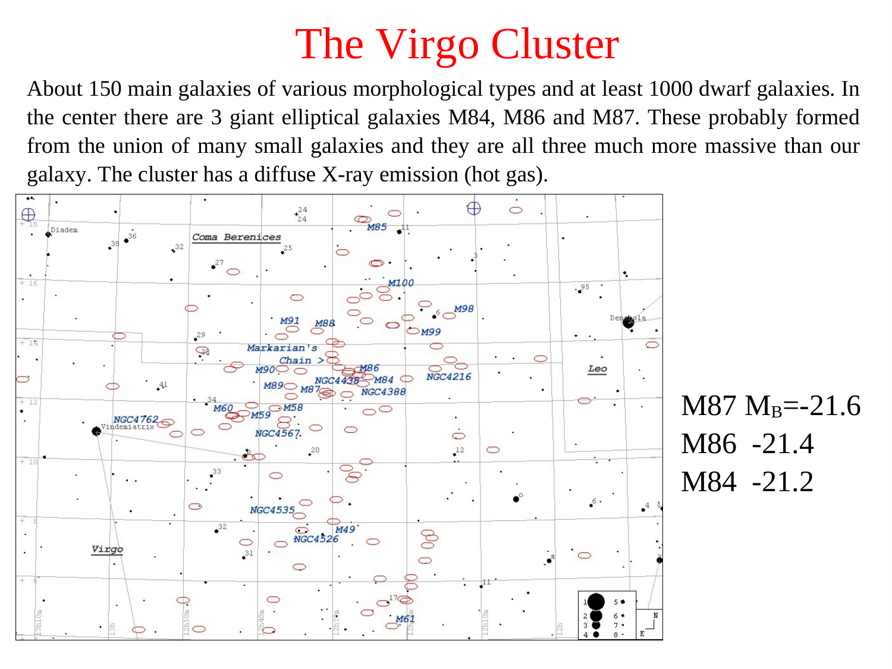
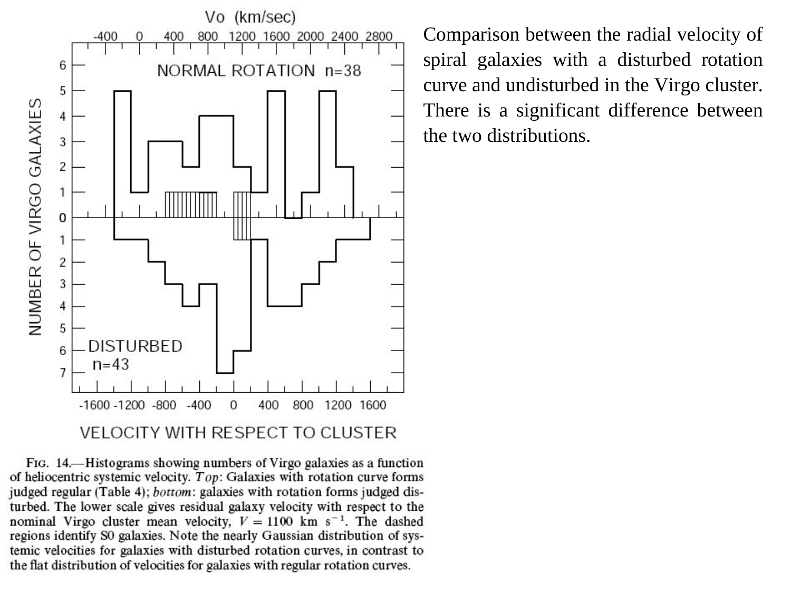
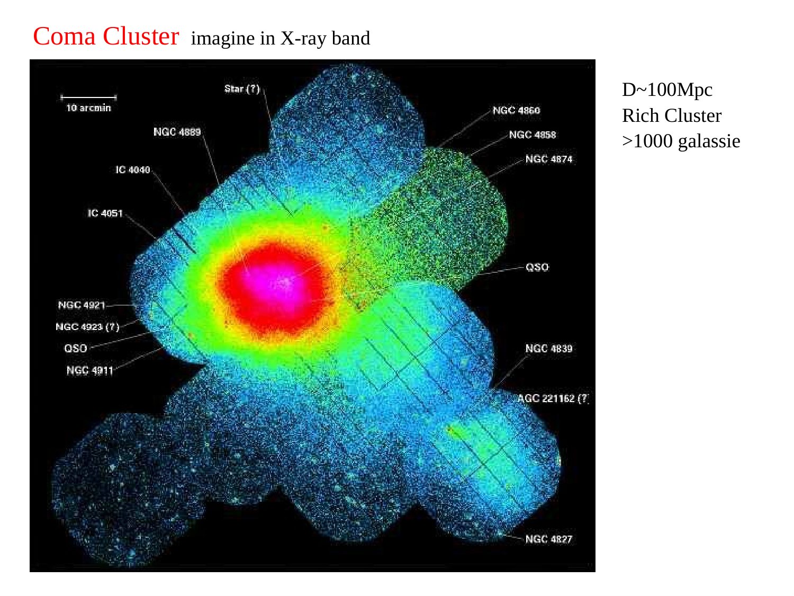

# Virgo cluster

The Virgo Cluster is the nearest rich, irregular, dynamically young galaxy cluster to the Milky Way, situated at a distance of $d \approx 16.5 \pm 0.1 \pm 1.1$ Mpc (redshift $z \approx 0.0036$). Spanning approximately $10^\circ \times 12^\circ$ on the sky in the constellations Virgo and Coma Berenices, it contains over 1300 confirmed member galaxies. The cluster is characterized by an un-relaxed, highly substructured dynamical morphology consisting of multiple merging sub-clusters - Cluster A (dominated by the central supergiant elliptical M87), Cluster B (centered on the massive elliptical M49 to the south), and Cluster C (centered on M86, which is falling into the cluster from behind at a high blueshifted peculiar velocity of $v_{\rm rel} \approx -1500 \text{ km s}^{-1}$). Because of its proximity, Virgo serves as the primary observational anchor for the extragalactic distance scale and provides a live astrophysical laboratory for observing environmental galaxy transformations in action, most notably ram-pressure stripping of interstellar gas from infalling spiral galaxies.

---

## 1. Astrophysical Context and Phenomenological Structure

### Basic Physical Parameters
- Distance and Redshift - Mean heliocentric recession velocity $v_{\rm sys} \approx 1079 \pm 10 \text{ km s}^{-1}$. Distance $d = 16.5$ Mpc, established via primary distance indicators (Cepheid variable stars with the Hubble Space Telescope Key Project, Surface Brightness Fluctuations SBF, and Planetary Nebula Luminosity Function PNLF). At this distance, $1^\circ$ corresponds to a physical scale of $288$ kpc.
- Morphological Classification - Irregular, non-virialized cluster (Bautz-Morgan Class III). In contrast to the centrally concentrated, spherical Coma cluster, Virgo has a clumpy, irregular spatial distribution and an extended velocity distribution with line-of-sight velocity dispersion $\sigma_r \approx 700 - 800 \text{ km s}^{-1}$.
- Late-Type Galaxy Fraction - Spirals and irregulars constitute approximately $55\%$ of all member galaxies in Virgo, whereas early-type spheroids (E and S0) dominate the core. This is a much higher spiral fraction than in relaxed rich clusters like Coma (where late-type galaxies constitute $< 20\%$), indicating that Virgo is dynamically young and actively accreting field galaxies from the surrounding cosmic web.

### The Sub-Cluster Hierarchy
Virgo is not a single virialized potential well, but rather an ongoing hierarchical merger of distinct sub-groups
1. Cluster A (The M87 Sub-Cluster) - The primary and most massive gravitational potential well ($M \sim 4 \times 10^{14} M_\odot$), centered on the central cD galaxy M87 (NGC 4486, $v_{\rm helio} = 1307 \text{ km s}^{-1}$). Cluster A is surrounded by hot, diffuse, X-ray emitting gas ($T_X \approx 2.5$ keV) detected by ROSAT and XMM-Newton.
2. Cluster B (The M49 Sub-Cluster) - Located approximately $4.5^\circ$ south of M87, centered on the giant elliptical M49 (NGC 4472, $v_{\rm helio} = 997 \text{ km s}^{-1}$). Cluster B is falling northward toward Cluster A.
3. Cluster C (The M86 Infall Group) - Centered on the elliptical galaxy M86 (NGC 4406). M86 exhibits a strong blueshift relative to the cluster mean ($v_{\rm helio} \approx -244 \text{ km s}^{-1}$, approaching the Milky Way), indicating that it is plunging through the core of Cluster A from behind at a relative velocity exceeding $1500 \text{ km s}^{-1}$. X-ray observations show a long, stripped gaseous tail trailing M86 as its interstellar medium is stripped by ram pressure against the ICM of M87.

---

## 2. Dynamical Mass and Virial Equilibrium Analysis

### Virial Mass Calculation
Although Virgo is dynamically un-relaxed on cluster-wide scales, the core of Cluster A around M87 can be approximated in virial equilibrium.
The line-of-sight velocity dispersion of galaxies within the central $1.5$ Mpc of M87 is
$$\sigma_r \approx 760 \pm 40 \text{ km s}^{-1} = 7.6 \times 10^7 \text{ cm s}^{-1}$$
The gravitational harmonic mean radius of the galaxy distribution is
$$R_v \approx 1.5 \text{ Mpc} \approx 4.63 \times 10^{24} \text{ cm}$$
Applying the Virial Theorem mass estimator
$$M_{\rm vir} = \frac{3 \sigma_r^2 R_v}{G}$$
Substituting numerical values
$$M_{\rm vir} = \frac{3 \times (7.6 \times 10^7 \text{ cm s}^{-1})^2 \times (4.63 \times 10^{24} \text{ cm})}{6.674 \times 10^{-8} \text{ cm}^3 \text{ g}^{-1} \text{ s}^{-2}} \approx 1.2 \times 10^{48} \text{ g} \approx 6.0 \times 10^{14} M_\odot$$
Independent determinations from X-ray hydrostatic equilibrium of the $2.5$ keV gas halo yield total enclosed masses of
$$M(< 1.5 \text{ Mpc}) = (4.2 - 6.5) \times 10^{14} M_\odot$$
The total optical luminosity is $L_B \approx 1.2 \times 10^{12} L_\odot$, giving an overall mass-to-light ratio of
$$\left(\frac{M}{L}\right)_B \approx 350 - 500 M_\odot / L_\odot$$
This confirms that like Coma, Virgo is heavily dominated by dark matter ($> 85\%$).

---

## 3. Ram-Pressure Stripping and Environmental Transformation in Action

Because Virgo is dense enough to sustain an intracluster medium ($\rho_{\rm ICM} \sim 10^{-27} \text{ g cm}^{-3}$) while retaining a large population of gas-rich infalling spiral galaxies, it provides the definitive astrophysical testing ground for ram-pressure stripping (Gunn & Gott 1972).

### The Gunn & Gott (1972) Stripping Condition
As a spiral galaxy of stellar surface mass density $\Sigma_*$ and cold gas surface density $\Sigma_g$ orbits through the ICM with velocity $v_{\rm rel}$, it experiences an aerodynamic ram pressure
$$P_{\rm ram} = \rho_{\rm ICM} v_{\rm rel}^2$$
The restoring gravitational force per unit area exerted by the galaxy's disk trying to retain the gas is
$$F_{\rm grav} = 2 \pi G \Sigma_*(r) \Sigma_g(r)$$
Stripping occurs at all radii $r$ where ram pressure exceeds the gravitational restoring force
$$P_{\rm ram} > 2 \pi G \Sigma_*(r) \Sigma_g(r)$$

### Observable Signatures of Stripping in Virgo Spirals
1. Truncated H I Disks - In field spirals, neutral atomic gas ($H\text{ I}$) extends to $1.5 - 2.0$ times the optical stellar radius ($R_{\rm HI} > R_{25}$). In Virgo cluster spirals, $H\text{ I}$ is heavily stripped from the outer disk inward, producing sharply truncated gas disks where $R_{\rm HI} < 0.3 - 0.5 R_{25}$ while the stellar disk remains completely undisturbed (e.g. NGC 4522, NGC 4402).
2. Asymmetric Gas Tails and Bow Shocks - Very Large Array (VLA) VIVA survey (Virgo Cluster Survey of Emission-line Stars) images reveal long, one-sided tails of stripped neutral hydrogen gas stretching tens of kiloparsecs behind infalling galaxies, pointing away from the cluster center M87.
3. H I Deficiency - The H I deficiency parameter is defined as
$$\text{Def}_{\rm HI} \equiv \log_{10}[M_{\rm HI, exp}(D_{25}, T)] - \log_{10}[M_{\rm HI, obs}]$$
where $M_{\rm HI, exp}$ is the expected gas mass for an isolated field galaxy of identical optical diameter and morphological type. Spirals in the core of Virgo exhibit $\text{Def}_{\rm HI} \approx 0.5 - 1.2$, indicating that up to $90\%$ of their initial gas reservoirs have been stripped.
4. Quenching and the Spiral-to-S0 Transformation - Once cold interstellar gas is stripped by ram pressure, star formation halts on a rapid timescale ($\tau < 0.5$ Gyr). As the disk fades and its spiral arms dissolve, the galaxy transforms morphologically into an anemic spiral or a lenticular (S0) galaxy.

---

## 4. The Extragalactic Distance Scale Anchor

Because of its moderate distance, Virgo played a pivotal role in resolving the 20th-century controversy between the short distance scale ($H_0 \approx 50 \text{ km s}^{-1} \text{ Mpc}^{-1}$, Sandage & Tammann) and long distance scale ($H_0 \approx 100 \text{ km s}^{-1} \text{ Mpc}^{-1}$, de Vaucouleurs).

### Distance Methods Applied to Virgo
1. HST Cepheid Key Project (Freedman et al. 2001) - Resolved Cepheid variable stars in multiple Virgo spirals (M100, M98, M88), establishing the period-luminosity relation distance $d = 16.5 \pm 0.1 \text{ (stat)} \pm 1.1 \text{ (sys)}$ Mpc.
2. Surface Brightness Fluctuations (SBF, Tonry et al. 2001) - Measured spatial Poisson fluctuations of red giant branch stars in early-type galaxies, yielding $d = 16.7 \pm 0.8$ Mpc.
3. Planetary Nebula Luminosity Function (PNLF, Ciardullo et al.) - Using the invariant bright-end exponential cutoff of $[O\text{ III}]\ \lambda 5007$ planetary nebulae, yielding $d = 16.4 \pm 1.0$ Mpc.
4. Tip of the Red Giant Branch (TRGB) - Color-magnitude diagrams of resolved stars in Virgo outskirts yielding consistent distances $d \approx 16.5$ Mpc.

---

## 5. Blackboard Blueprint and Observational Graph Literacy

```
               VIRGO CLUSTER DYNAMICAL SUB-STRUCTURE (SKY MAP)
   Declination (deg)
     +16 +
         |                                  (M86 Group)
     +14 +                           .-------*-------.   v_helio ~ -244 km/s
         |                          /  CLUSTER C      \  (Plunging in from
     +12 +                         |   M86 Blueshift   |  behind M87)
         |                         |                   |
     +10 +                     .---|-------*-----------|---.
         |                    /    |     (M87)         |    \
      +8 +                   |      '-----------------'      |  CLUSTER A
         |                   |      X-RAY PLASMA CORE        |  v_helio ~ 1307 km/s
      +6 +                    \     M ~ 4 x 10^14 M_sun     /   (Primary potential well)
         |                     '---------------------------'
      +4 +                                      |
         |                                      | Infalling northward
      +2 +                              .-------*-------.
         |                             /     (M49)       \  CLUSTER B
       0 +                            |   CLUSTER B       | v_helio ~ 997 km/s
         +===+===========+===========+=\=================/=+===========+
            12h40m      12h30m      12h20m      12h10m      12h00m
                               Right Ascension (J2000)

             RAM-PRESSURE STRIPPING IN VIRGO SPIRALS (H I VS STARS)
   Surface Density (arb)
       ^
       |     [Stellar Disk Sigma_*]   [Undisturbed Outer Stars]
       |         .---------------------------------------------------.
       |        /                                                     \
       |       /     [Truncated H I Disk Sigma_g]                      \
       |      /          .-------------.                                \
       |     /          /               \                                \
       |    /          /  P_ram > F_grav \                                \
       |   /          /   Stripping edge  \                                \
       +==+==========+=========+===========+==============================+===>
                    -R_HI     0.0         +R_HI                         R_25 Radius
                    (H I cutoff at R_HI ~ 0.4 R_25)
```

### Blackboard Presentation Script for the Oral Examination
1. Draw the RA-Dec sky map showing the irregular, elongated structure of Virgo.
2. Mark the three major sub-clusters
   - Cluster A in the center around giant elliptical M87 ($v \approx 1307$ km/s), marking the X-ray emitting core.
   - Cluster B to the south around M49 ($v \approx 997$ km/s), falling northward into Cluster A.
   - Cluster C to the northwest around M86 ($v \approx -244$ km/s), emphasizing that M86 is blueshifted and plunging through the cluster from behind at a relative speed $> 1500$ km/s.
3. State the Virial mass $M_{\rm vir} \approx 6 \times 10^{14} M_\odot$ and contrast it with Coma ($M \sim 1.5 \times 10^{15} M_\odot$). Explain that Virgo has lower mass, lower density, and is much younger dynamically.
4. Contrast the spiral galaxy fraction in Virgo ($\sim 55\%$) with that of Coma ($< 20\%$).
5. Write the Gunn & Gott ram-pressure stripping formula $P_{\rm ram} = \rho_{\rm ICM} v_{\rm rel}^2 > 2\pi G \Sigma_* \Sigma_g$.
6. Draw the radial surface density diagram comparing the undisturbed stellar disk out to $R_{25}$ with the severely truncated H I gas disk ($R_{\rm HI} \approx 0.4 R_{25}$), citing NGC 4522 as the classic archetype.

---

## 6. Exact Textbook and Literature Provenance

- Course Lecture Slides
  - `Astrophysic_gal_5_LG-1.pdf` (slides 17-26) - Virgo cluster structure, sub-groups, galaxy kinematics, and ram-pressure stripping.
- Course Synthesis LaTeX Document
  - `Astrophysics_of_Galaxies.tex` (Part V - Nearby Universe and Clusters, page 39) - Virgo cluster properties and distance scale.
- Peter Schneider, *Extragalactic Astronomy and Cosmology* (2015, Springer)
  - Chapter 6 - Clusters and Groups of Galaxies (pages 278-282) - The Virgo cluster, M87, morphological mix, and environmental stripping.
- Houjun Mo, Frank van den Bosch, Simon White, *Galaxy Formation and Evolution* (2010)
  - Chapter 2 - Observational Facts (pages 89-94) - Nearby clusters and groups.
  - Chapter 12 - Galaxy Interactions and Transformations (pages 590-595) - Ram-pressure stripping physics and the Gunn & Gott condition.
- Primary Literature
  - Gunn & Gott (1972, ApJ 176, 1) - *On the Infall of Matter into Clusters of Galaxies and Some Effects on Their Evolution*.
  - Freedman et al. (2001, ApJ 553, 47) - *Final Results from the Hubble Space Telescope Key Project to Measure the Hubble Constant*.
  - Chung et al. (2009, AJ 138, 1741) - *VIVA - VLA Imaging of Virgos in Atomic Gas*.
  - Binggeli, Sandage & Tammann (1985, AJ 90, 1681) - *Studies of the Virgo Cluster. II. A Catalog of 2096 Galaxies in the Virgo Cluster Area*.

---

## 7. Cross-References and Related Notes

- [Coma cluster](Coma%20cluster.html) - Archetype of rich regular clusters and Zwicky Virial discovery
- [Local Group galaxies](Local%20Group%20galaxies.html) - Kahn-Woltjer timing argument and local structure
- [Galaxy color, density and morphology](Galaxy%20color%2C%20density%20and%20morphology.html) - Dressler morphology-density relation
- [H I regions](H%20I%20regions.html) - 21 cm line emission and gas reservoirs
- [Astrophysics_of_Galaxies_MOC](../../04_Atlas/Astrophysics_of_Galaxies_MOC.html) - Master Map of Content for course

---

## 8. Course Slides and Figures


*Figure 1 - Large-scale optical image of the Virgo cluster core highlighting M87 and Markarian's Chain.*


*Figure 2 - X-ray map from ROSAT showing Cluster A and Cluster B sub-structures.*


*Figure 3 - VLA H I contours showing truncated disks and ram-pressure stripped tails in Virgo spirals.*

<div class="backlinks-section">
  <h4 class="backlinks-title">Linked References (3)</h4>
  <ul class="backlinks-list">
    <li class="backlink-item-wrap"><a href="Coma%20cluster.html" class="backlink-item">Coma cluster</a></li>
    <li class="backlink-item-wrap"><a href="Local%20Group%20galaxies.html" class="backlink-item">Local Group galaxies</a></li>
    <li class="backlink-item-wrap"><a href="../../04_Atlas/Astrophysics_of_Galaxies_MOC.html" class="backlink-item">Astrophysics_of_Galaxies_MOC</a></li>
  </ul>
</div>

