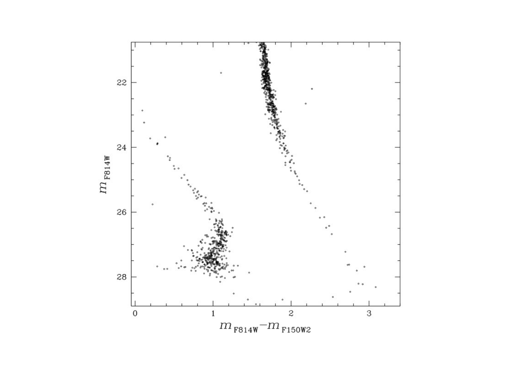
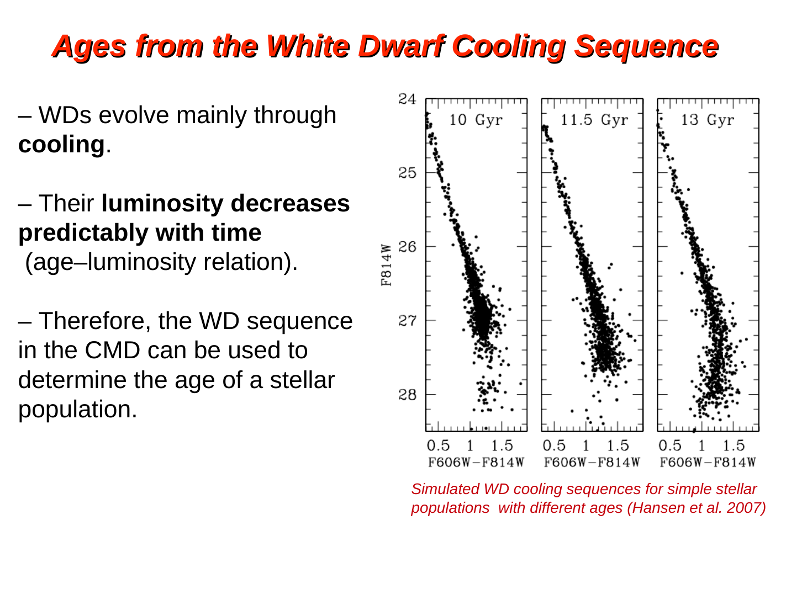
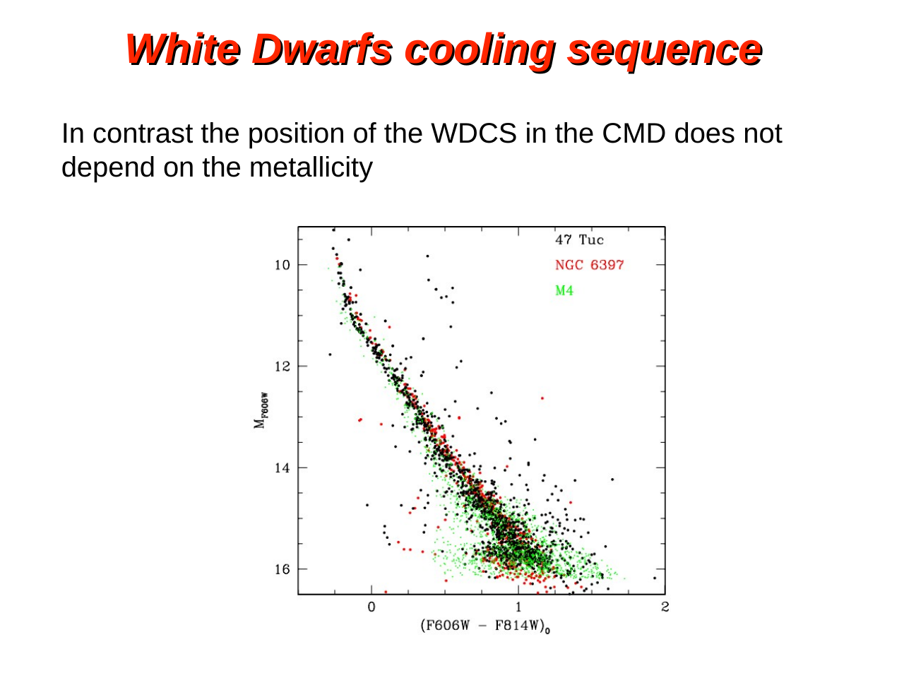
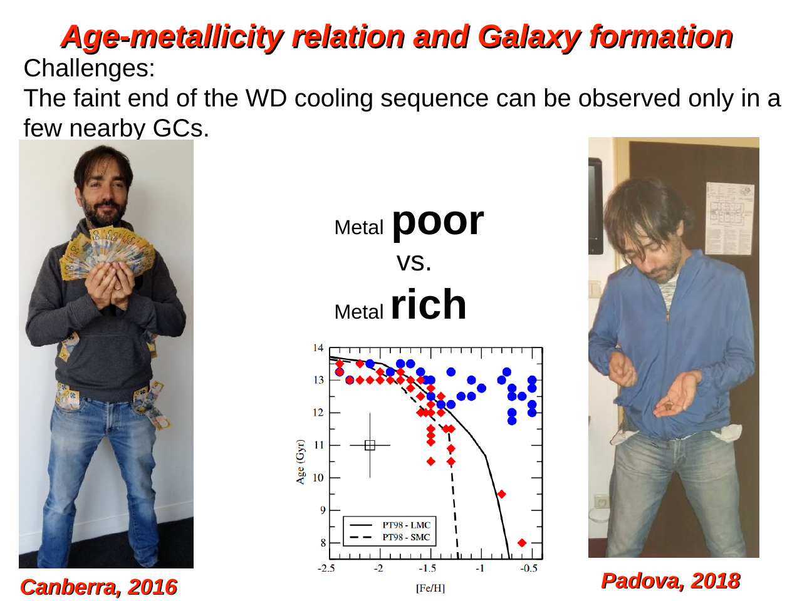
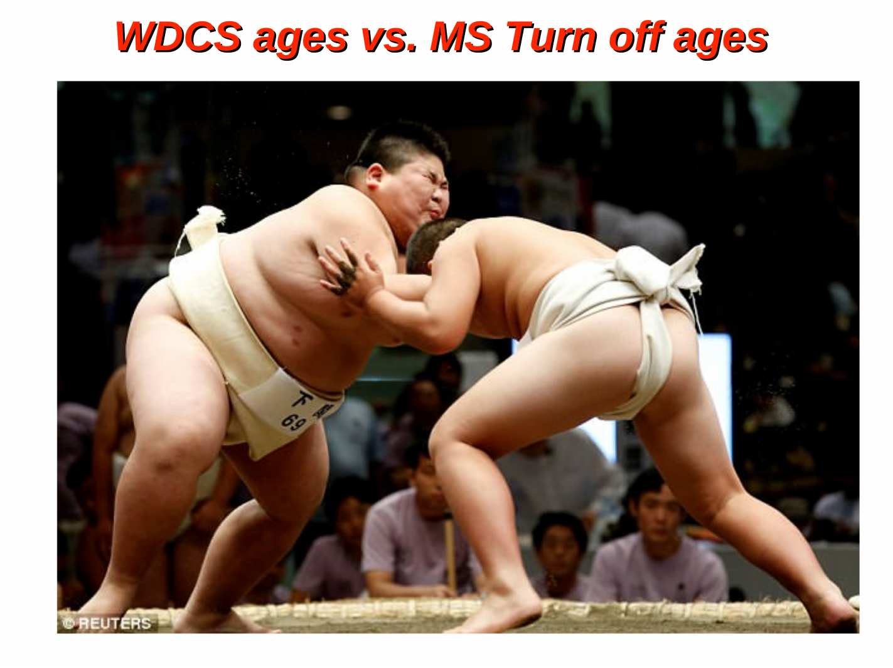
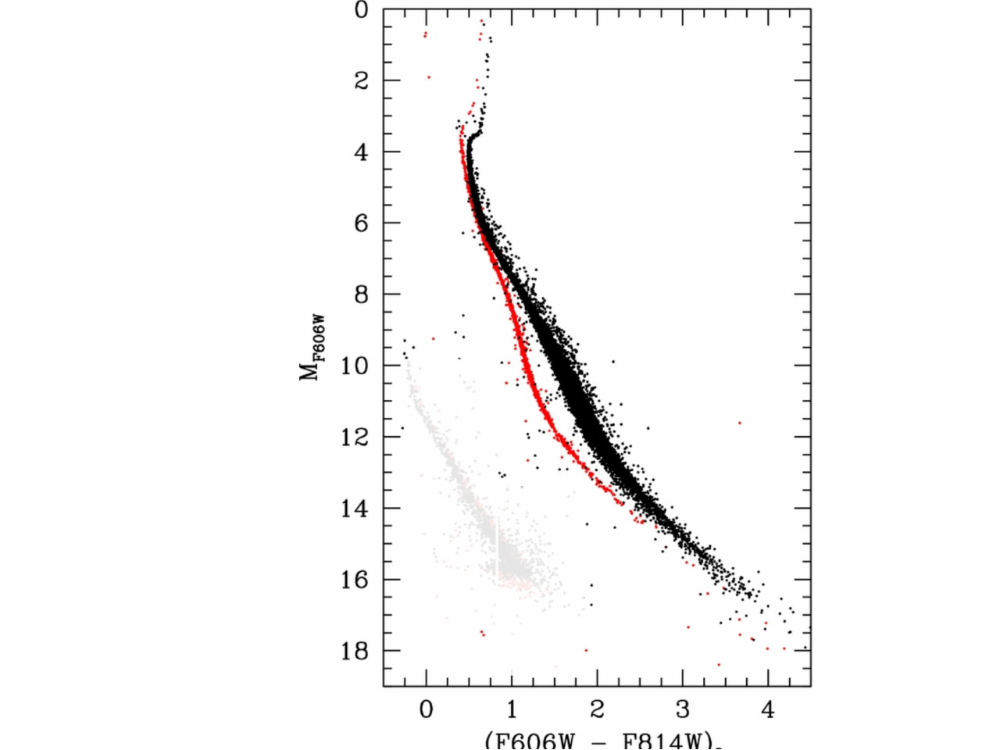
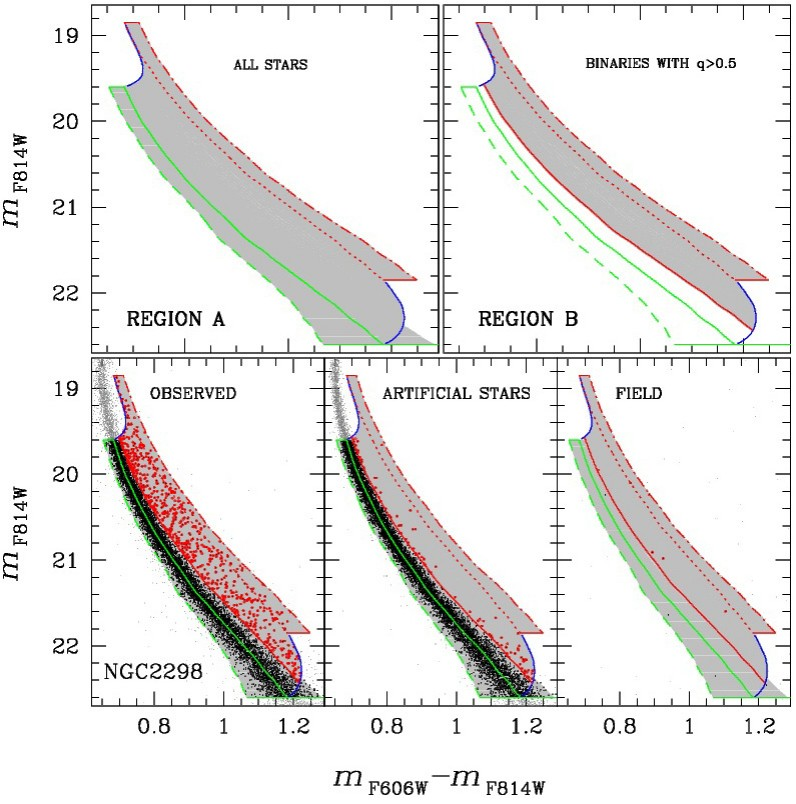

the **white dwarf cooling sequence (WDCS)** is the locus of [white dwarfs](White%20dwarf%20overview.html) on a [color-magnitude diagram](Color-magnitude%20diagrams%20of%20clusters.html). it appears below the main sequence at faint magnitudes, extending $\sim 5$-$8$ mag from $M_V \sim 10$ (newly formed hot WDs) to $M_V \sim 16$-$18$ (oldest cooled WDs). because WDs evolve by simple **passive cooling**, the WDCS provides an **independent age clock** that complements the main sequence turn-off.

## location on the CMD

a typical CMD of a globular cluster shows the WDCS as a faint, blueward-curving sequence:

- WDs start out **hot + bright** (top of WDCS, $M_V \sim 10$, blue colors);
- they cool monotonically along a near-vertical track in pure-cooling models;
- at $T_{\rm eff} < 5000$ K, hydrogen-rich atmospheres turn **bluer** again due to **collision-induced absorption (CIA)** of H$_2$ in the IR;
- the WDCS thus has a characteristic **hook** at faint magnitudes (see [WDCS turn to blue and CIA](WDCS%20turn%20to%20blue%20and%20CIA.html)).

## age dating from the WDCS luminosity function

the most powerful use of the WDCS is to date a cluster from the **luminosity function (LF)** of WDs. the procedure:

1. construct $N(L)$ vs $L$ for cluster WDs in $\sim 0.5$ mag bins;
2. compare to theoretical predictions from WD cooling models at various ages;
3. the location of the cutoff peak (oldest WDs) gives the cluster age.

this method is independent of the main sequence turn-off age (which depends on stellar interior physics) and provides a powerful cross-check.

## NGC 6397: the calibration cluster

**Hansen et al. 2007, ApJ 671, 380** applied this to NGC 6397 using HST/ACS deep photometry. the result:

$$t_{\rm WDCS} = 11.47 \pm 0.47 \text{ Gyr}$$

compared to the main-sequence turn-off age:

$$t_{\rm MSTO} = 11.6 \pm 1.0 \text{ Gyr}$$

the agreement is excellent + within the uncertainties. this is one of the **triumphs of stellar physics**: two completely independent age techniques (nuclear burnout vs passive cooling) give consistent ages.

## comparison with the MSTO age

| feature | MSTO age | WDCS age |
|---|---|---|
| sensitivity to age | $\sim 0.1$ mag/Gyr at old ages | $\sim 0.4$ mag/Gyr at $\sim 2$-$3$ Gyr (better young), $\sim 0.1$ mag at old |
| sensitivity to metallicity | strong (more metal $\to$ redder TO) | weak |
| sensitivity to distance | moderate | moderate |
| photometric depth | bright stars, easier | very faint, requires HST + nearby clusters |
| systematic uncertainties | atomic + nuclear cross-sections | EOS at high density, crystallisation onset |

so the two methods are **complementary**, with different systematic errors. agreement between them gives confidence in absolute cluster ages.

## practical observational challenges

constructing the WDCS in a globular cluster is observationally extreme:

- WDs are intrinsically **very faint** ($M_V \sim 13$-$16$);
- only **nearby clusters** ($d < 5$ kpc) allow WD photometry to the LF cutoff;
- crowding limits the field; HST-ACS or JWST-NIRCam needed;
- $\sim$ years of integration time for the deepest fields.

clusters with published WDCS ages: NGC 6397, NGC 6791, M4, NGC 6752, 47 Tuc.

## the metallicity advantage

a critical advantage of the WDCS: **the position of the WD cooling sequence in the CMD does not depend on the cluster metallicity** (Milone 2026, Lecture 6a). this is because the WD has shed its envelope and the core composition (CO) is insensitive to the original stellar metallicity. in contrast, the MSTO colour is strongly affected by [Fe/H] via line blanketing + opacity, creating the [Age-metallicity degeneracy](Age-metallicity%20degeneracy.html).

this independence makes the WDCS especially powerful for comparing relative ages of clusters with different metallicities. comparison of NGC 6397 ([Fe/H] $\sim -2.1$, metal-poor) and 47 Tuc ([Fe/H] $\sim -0.7$, metal-rich) reveals that **47 Tuc is $\sim 2$ Gyr younger** than NGC 6397 — a result directly readable from the WD LF cutoff positions, without needing to disentangle metallicity effects.

## the strange case of NGC 6791

**NGC 6791** is an old, very metal-rich open cluster ($[{\rm Fe/H}] \sim +0.3$, age $\sim 8$-$9$ Gyr from MSTO) that posed a major puzzle for WDCS dating:

1. **Bedin et al. 2005**: the first deep WDCS luminosity function suggested an age of only $\sim 2.5$ Gyr from the LF cutoff position — **grossly inconsistent** with the $\sim 8$ Gyr MSTO age. this implied either the WD cooling theory or MSTO theory was incorrect. a major challenge for stellar evolution.

2. **Bedin et al. 2008a**: deeper HST observations revealed a **second, unexpected peak** in the WDCS luminosity function. the LF was bimodal, not consistent with a single WD cooling sequence. one proposed explanation: a population of **pure-helium white dwarfs** alongside the standard CO WDs.

3. **Bedin et al. 2009**: the resolution came from recognising that **NGC 6791 hosts a large binary fraction** ($f_{\rm bin} \approx 0.32 \pm 0.03$). about 34% of WDs are in **WD-WD binary systems**. the combined luminosity of two faint WDs mimics a single brighter WD, producing the second peak in the LF. when the binary fraction is properly modelled, the WDCS age becomes consistent with the MSTO age.

this case study is a beautiful illustration of how unresolved binaries can corrupt CMD analyses — a recurring theme across stellar astrophysics ([Binary stars in CMD](Binary%20stars%20in%20CMD.html)).

## why this matters

the WDCS age is the strongest single argument that:
- the universe is at least $\sim 13$ Gyr old;
- our understanding of stellar evolution is robust at the 5-10% level;
- cluster ages can be cross-validated by independent methods.

it also provides a key constraint on the early Galactic formation: GC ages tell us when the inner Galaxy assembled, with WDCS providing an independent check.

## reference papers

- **Hansen et al. 2007, ApJ 671, 380** — NGC 6397 WDCS age.
- **Mestel 1952** — original WD cooling theory.
- **Salaris & Cassisi 2006** — comprehensive review of WD cooling.
- **Bedin et al. 2005** — NGC 6791 WDCS age discrepancy.
- **Bedin et al. 2008a** — discovery of bimodal WD LF in NGC 6791.
- **Bedin et al. 2009** — WD-WD binary resolution to the NGC 6791 puzzle ($f_{\rm bin} \approx 34\%$).
- **Tremblay et al. 2019** — modern review of WD physics + ages.
- **Cassisi (private comm.)** — simulated WD cooling sequences (used as reference in lectures).

## see also

- [White dwarf overview](White%20dwarf%20overview.html)
- [White dwarf cooling theory](White%20dwarf%20cooling%20theory.html)
- [White dwarf types He CO ONeMg](White%20dwarf%20types%20He%20CO%20ONeMg.html)
- [Chandrasekhar mass limit](Chandrasekhar%20mass%20limit.html)
- [White dwarf mass-radius relation](White%20dwarf%20mass-radius%20relation.html)
- [WDCS turn to blue and CIA](WDCS%20turn%20to%20blue%20and%20CIA.html)
- [Age dating from the WD luminosity function](Age%20dating%20from%20the%20WD%20luminosity%20function.html)
- [WDCS vs MSTO ages comparison](WDCS%20vs%20MSTO%20ages%20comparison.html)
- [Initial-final mass relation IFMR](Initial-final%20mass%20relation%20IFMR.html)
- [Stellar_Astrophysics_MOC](../../04_Atlas/Stellar_Astrophysics_MOC.html)

---

## Complete Lecture Slide Panels & Observational Evidence (Lecture 06 — White Dwarf Cooling Sequences & Cosmochronology)

> **Context**: *Mestel cooling law, Hansen et al. (2007) NGC 6397 age (11.47 Gyr), carbon-oxygen degenerate cores, Coulomb crystallization, Debye cooling, and collision-induced absorption (CIA) blueward turn.*

The following slides from Prof. Antonino Milone's lecture series provide the direct observational, photometric, and theoretical foundations for this topic:

*Figure P06-01: L06_p07_WD_blueturn.png — Observational data, CMD morphology, and diagnostics from Lecture 06 — White Dwarf Cooling Sequences & Cosmochronology.*

*Figure P06-02: L06_p11_white_dwarf_HRD-11.png — Observational data, CMD morphology, and diagnostics from Lecture 06 — White Dwarf Cooling Sequences & Cosmochronology.*

*Figure P06-03: L06_p12_WD_cooling_age-12.png — Observational data, CMD morphology, and diagnostics from Lecture 06 — White Dwarf Cooling Sequences & Cosmochronology.*

*Figure P06-04: L06_p13_NGC6397_WDage.png — Observational data, CMD morphology, and diagnostics from Lecture 06 — White Dwarf Cooling Sequences & Cosmochronology.*

*Figure P06-05: L06_p17_WDCS_47Tuc.png — Observational data, CMD morphology, and diagnostics from Lecture 06 — White Dwarf Cooling Sequences & Cosmochronology.*

*Figure P06-06: L06_p19_isochrones_metallicity-19.png — Observational data, CMD morphology, and diagnostics from Lecture 06 — White Dwarf Cooling Sequences & Cosmochronology.*

*Figure P06-07: L06_p19_isochrones_metallicity.png — Observational data, CMD morphology, and diagnostics from Lecture 06 — White Dwarf Cooling Sequences & Cosmochronology.*

*Figure P06-08: L06_p21_age_FeH_relation.png — Observational data, CMD morphology, and diagnostics from Lecture 06 — White Dwarf Cooling Sequences & Cosmochronology.*

*Figure P06-09: LAntonino_p06_01.png — Observational data, CMD morphology, and diagnostics from Lecture 06 — White Dwarf Cooling Sequences & Cosmochronology.*

*Figure P06-10: LAntonino_p06_02.png — Observational data, CMD morphology, and diagnostics from Lecture 06 — White Dwarf Cooling Sequences & Cosmochronology.*

*Figure P06-11: LAntonino_p06_03.png — Observational data, CMD morphology, and diagnostics from Lecture 06 — White Dwarf Cooling Sequences & Cosmochronology.*

*Figure P06-12: LAntonino_p06_04.png — Observational data, CMD morphology, and diagnostics from Lecture 06 — White Dwarf Cooling Sequences & Cosmochronology.*

*Figure P06-13: LAntonino_p06_05.png — Observational data, CMD morphology, and diagnostics from Lecture 06 — White Dwarf Cooling Sequences & Cosmochronology.*

*Figure P06-14: LAntonino_p06_06.png — Observational data, CMD morphology, and diagnostics from Lecture 06 — White Dwarf Cooling Sequences & Cosmochronology.*

*Figure P06-15: LAntonino_p06_07.png — Observational data, CMD morphology, and diagnostics from Lecture 06 — White Dwarf Cooling Sequences & Cosmochronology.*

*Figure P06-16: LAntonino_p06_08.png — Observational data, CMD morphology, and diagnostics from Lecture 06 — White Dwarf Cooling Sequences & Cosmochronology.*

*Figure P06-17: LAntonino_p06_09.png — Observational data, CMD morphology, and diagnostics from Lecture 06 — White Dwarf Cooling Sequences & Cosmochronology.*

*Figure P06-18: LAntonino_p06_10.png — Observational data, CMD morphology, and diagnostics from Lecture 06 — White Dwarf Cooling Sequences & Cosmochronology.*

*Figure P06-19: LAntonino_p06_11.png — Observational data, CMD morphology, and diagnostics from Lecture 06 — White Dwarf Cooling Sequences & Cosmochronology.*

*Figure P06-20: LAntonino_p06_12.png — Observational data, CMD morphology, and diagnostics from Lecture 06 — White Dwarf Cooling Sequences & Cosmochronology.*

*Figure P06-21: LAntonino_p06_13.png — Observational data, CMD morphology, and diagnostics from Lecture 06 — White Dwarf Cooling Sequences & Cosmochronology.*

*Figure P06-22: LAntonino_p06_14.png — Observational data, CMD morphology, and diagnostics from Lecture 06 — White Dwarf Cooling Sequences & Cosmochronology.*

*Figure P06-23: LAntonino_p06_15.png — Observational data, CMD morphology, and diagnostics from Lecture 06 — White Dwarf Cooling Sequences & Cosmochronology.*

*Figure P06-24: LAntonino_p06_16.png — Observational data, CMD morphology, and diagnostics from Lecture 06 — White Dwarf Cooling Sequences & Cosmochronology.*

*Figure P06-25: LAntonino_p06_17.png — Observational data, CMD morphology, and diagnostics from Lecture 06 — White Dwarf Cooling Sequences & Cosmochronology.*

*Figure P06-26: LAntonino_p06_18.png — Observational data, CMD morphology, and diagnostics from Lecture 06 — White Dwarf Cooling Sequences & Cosmochronology.*

*Figure P06-27: LAntonino_p06_19.png — Observational data, CMD morphology, and diagnostics from Lecture 06 — White Dwarf Cooling Sequences & Cosmochronology.*

*Figure P06-28: LAntonino_p06_20.png — Observational data, CMD morphology, and diagnostics from Lecture 06 — White Dwarf Cooling Sequences & Cosmochronology.*

*Figure P06-29: LAntonino_p06_21.png — Observational data, CMD morphology, and diagnostics from Lecture 06 — White Dwarf Cooling Sequences & Cosmochronology.*

*Figure P06-30: LAntonino_p06_22.png — Observational data, CMD morphology, and diagnostics from Lecture 06 — White Dwarf Cooling Sequences & Cosmochronology.*

*Figure P06-31: LAntonino_p06_23.png — Observational data, CMD morphology, and diagnostics from Lecture 06 — White Dwarf Cooling Sequences & Cosmochronology.*

*Figure P06-32: LAntonino_p06_24.png — Observational data, CMD morphology, and diagnostics from Lecture 06 — White Dwarf Cooling Sequences & Cosmochronology.*

*Figure P06-33: LAntonino_p06_25.png — Observational data, CMD morphology, and diagnostics from Lecture 06 — White Dwarf Cooling Sequences & Cosmochronology.*

  <h4 class="backlinks-title">Linked References (4)</h4>
  <ul class="backlinks-list">
    <li class="backlink-item-wrap"><a href="Asymptotic%20giant%20branch%20AGB.html" class="backlink-item">Asymptotic giant branch AGB</a></li>
    <li class="backlink-item-wrap"><a href="Binary%20stars%20in%20CMD.html" class="backlink-item">Binary stars in CMD</a></li>
    <li class="backlink-item-wrap"><a href="Stellar%20evolutionary%20phases%20on%20the%20CMD.html" class="backlink-item">Stellar evolutionary phases on the CMD</a></li>
    <li class="backlink-item-wrap"><a href="../../04_Atlas/Stellar_Astrophysics_MOC.html" class="backlink-item">Stellar_Astrophysics_MOC</a></li>
  </ul>

