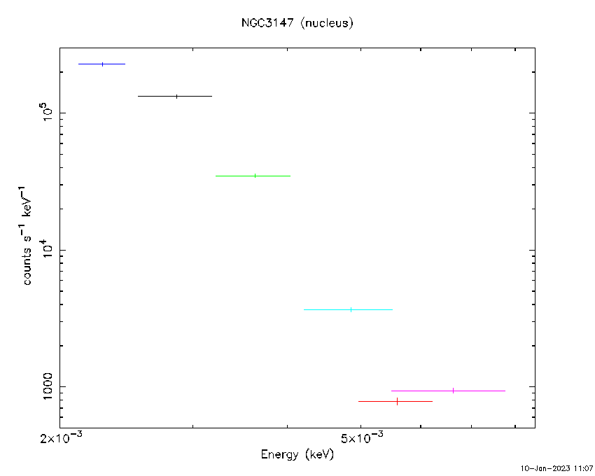
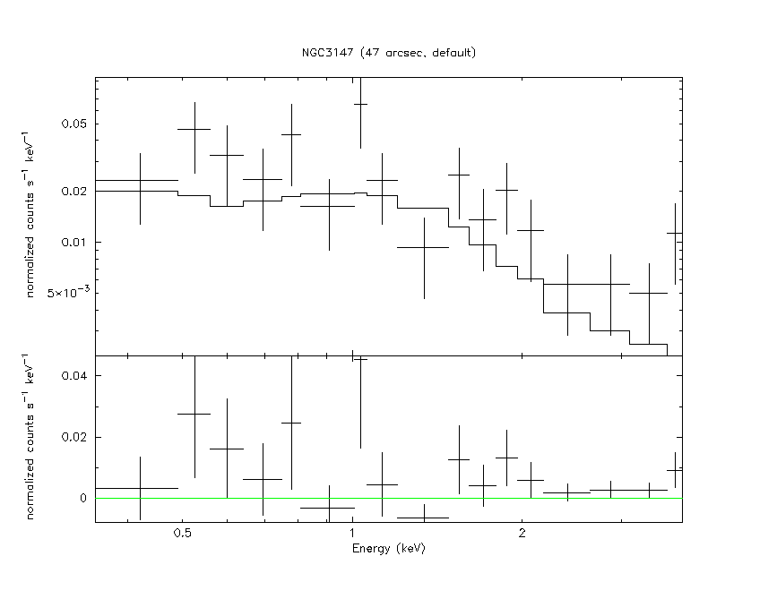

The idea of using the [Grazing incidence](Grazing%20incidence.html) reflection to focus X-rays was proposed in 1960 by **Giacconi & Rossi** *(JGR 65,773; A Telescope for Soft X-ray Astronomy)*
	a truncated parabolic mirror not located in the vertex of the parabola, like incase of optical telescopes, but in the arms,

Proposed scheme for a X-ray mirror that takes advantage of the grazing incidence (Giacconi & Rossi 1960, their Fig. 1) 

This configuration works well **only if the rays are parallel** to the optical axis, 
	but for different inclinations the telescope would be strongly affected by Coma Aberration

Therefore the useful field of view of the optics would be too small to produce any image in the focal plane *(Pareschi, Spiga & Pellicciari, 2021

The solution has been already found in 1952 by **Hans Wolter** who was working on X-ray microscopy.
	He proposed to use an **even number** of reflections from confocal conic-like optics.
		This combination of mirrors must fulfill the so-called Abbe sine condition to avoid Coma Aberration by ensuring the same optical path for all incident X-ray photons:
$$\frac{h}{\sin\theta}=R$$
(read more: Abbe sine condition - Wikipedia and Coma (optics) - Wikipedia)

Schematic representation of the principal Abbe surface. 

where $R$ is a constant radius. 

For astronomical objects, all rays may be considered parallel 
	and so the Abbe condition is satisfied if **the incident rays intersect the reflected ray direction in a spherical surface**, called principal Abbe Surface 

The Abbe condition $h= f\sin \alpha$ applied to the pair of mirrors. $q$ is the radius of the principal surface and corresponds to the focal length $f$ of the optical system that has length $L$. (Saha, Zhang, McClelland 2014)

In fact, the principal surface is not a sphere but a **paraboloid** that is well approximated by a sphere near the vertex of the optical system. 
	This means that the Abbe condition is really verified in the angular region close to the center of the field-of-view.

Wolter I configurations. (Pareschi, Spiga & Pellicciari 2021, their Fig. 13.) 

Wolter II configurations. (Pareschi, Spiga & Pellicciari 2021, their Fig. 13.)

Wolter III configurations. (Pareschi, Spiga & Pellicciari 2021, their Fig. 13.) 

In the Figures three possible configurations are reported:
- **Wolter I**: a hyperbolic mirror with focus F2 + a parabolic mirror with focus in F1.
- **Wolter II**: a hyperbolic mirror with focus F2 + a parabolic mirror with focus in F2.
- **Wolter III**: an elliptical mirror with focus F1 and F2 + a parabolic mirror with focus in F1.

The main difference between them is given by the **ratio between the focal length**
	the distance from the parabolic/hyperbolic intersection surface to the focus and the system length

**Wolter I** telescope has a **ratio < 1**
**Wolter II** has a **larger focal length** and can increase substantially the system length (similar to the Cassegrain configuration for optical telescopes). 
**Wolter III** telescope has the **shortest focal length.**

---

### High-Energy Laboratory Diagnostics & Instrument Panels

*Wolter Type-I optical design: co-axial, confocal paraboloid and hyperboloid grazing incidence mirror shells satisfying the Abbe sine condition.*

*Grazing incidence reflection: critical angle $\theta_c \approx \sqrt{2\delta} \approx 10^\prime \frac{\sqrt{\rho}}{E_{\rm keV}}$, high-Z gold/iridium coatings, and nested shell geometry.*

  <h4 class="backlinks-title">Linked References (5)</h4>
  <ul class="backlinks-list">
    <li class="backlink-item-wrap"><a href="Angular%20Resolution.html" class="backlink-item">Angular Resolution</a></li>
    <li class="backlink-item-wrap"><a href="Effective%20Area.html" class="backlink-item">Effective Area</a></li>
    <li class="backlink-item-wrap"><a href="Mechanical%20Collimator.html" class="backlink-item">Mechanical Collimator</a></li>
    <li class="backlink-item-wrap"><a href="Point%20Spread%20Function%20%28PSF%29.html" class="backlink-item">Point Spread Function (PSF)</a></li>
    <li class="backlink-item-wrap"><a href="../../04_Atlas/Lab_High-Energy_MOC.html" class="backlink-item">Lab_High-Energy_MOC</a></li>
  </ul>

