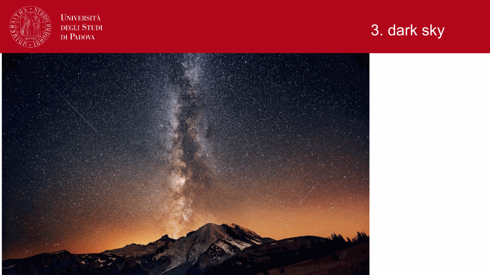
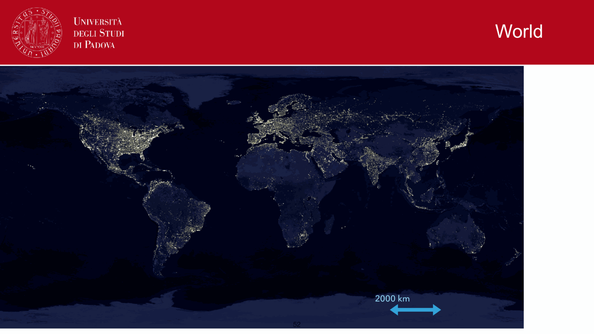
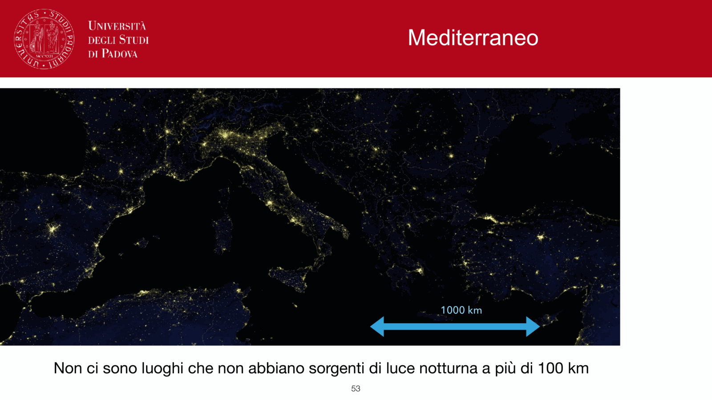
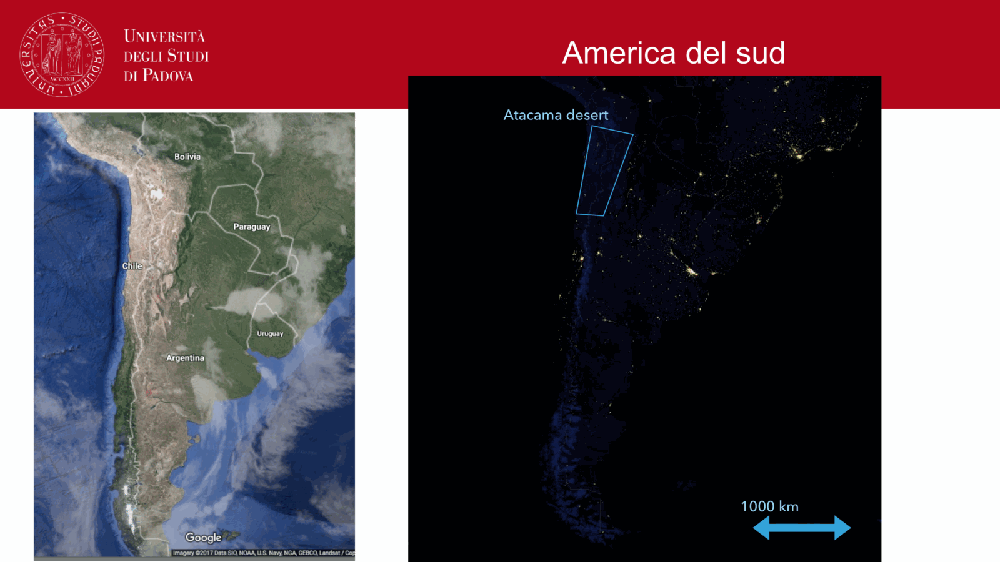
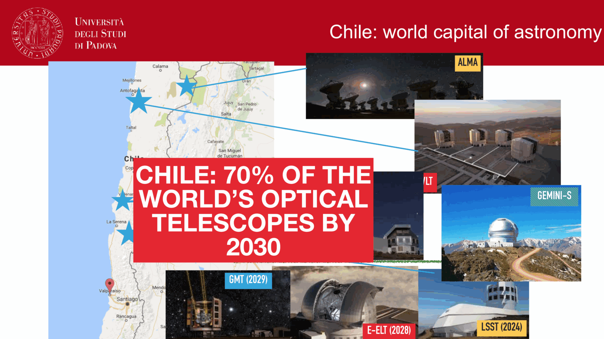


**adaptive optics (AO)** is the technique of measuring the atmospheric wavefront distortion in real time and correcting it with a deformable mirror, *before* the science detector sees the image. it is what breaks the seeing limit ([Atmospheric seeing](./Atmospheric%20seeing.html)) and recovers (most of) the diffraction limit at large telescopes.

## the components

every AO system has three essential pieces:

1. **wavefront sensor (WFS)**: measures the local tilt or curvature of the incoming wavefront across many subapertures. typical types:
   - **Shack-Hartmann WFS**: a lenslet array, each lenslet imaging a guide star; the displacement of each spot from its reference position gives the local tilt.
   - **curvature WFS**: measures intensity differences just inside and outside focus.
   - **pyramid WFS**: sensitive sensor on big modern AO (SPHERE, GPI).

2. **deformable mirror (DM)**: a thin mirror with $\sim 100$ to $10\,000$ actuators behind it. the control system commands actuator displacements that cancel the measured wavefront error. larger AO systems use multiple DMs (woofer + tweeter) and tip-tilt mirrors separately.

3. **control loop**: typical bandwidth $\sim 1$ kHz, set by the atmospheric coherence time $\tau_0 \sim 10$ ms. computes WFS measurement $\to$ DM command $\to$ apply.

## the Strehl ratio

the headline figure of merit is
$$S \equiv \frac{I_{\rm peak}^{\rm observed}}{I_{\rm peak}^{\rm diffraction-limited}}$$

between $0$ (no correction) and $1$ (perfect). a well-running AO system in the K-band can deliver $S \gtrsim 0.5$. in the visible, $S \sim 0.05$ to $0.15$ is more typical; the wavefront errors are a much larger fraction of $\lambda$.

Marechal approximation:
$$S \approx \exp(-\sigma_\phi^2)$$
with $\sigma_\phi$ the residual wavefront RMS in radians.

## key limits

### isoplanatic angle

the corrected patch is small. AO sees the wavefront only along the line to the guide star; far from the guide star, the atmospheric path is different, so the correction is wrong.
$$\theta_0 \propto \lambda^{6/5}$$
typical at K-band: $\theta_0 \sim 30''$.
typical at V-band: $\theta_0 \sim 5''$.

beyond $\theta_0$ from the guide star, Strehl drops. **multi-conjugate AO (MCAO)**, **ground-layer AO (GLAO)**, and **multi-object AO (MOAO)** extend the corrected field by using multiple guide stars and tomographic reconstruction.

### natural guide star availability

AO needs a bright reference, $V \lesssim 14$ for typical systems. the sky coverage with natural guide stars is poor away from the Galactic plane. workaround:

### laser guide stars

a sodium laser tuned to $589$ nm excites the mesospheric Na layer at $\sim 90$ km, producing an artificial point source. examples: Keck NGAO, VLT 4-LGS facility, Subaru. limitation: the laser samples only the lower atmosphere ("cone effect"); a natural tip-tilt star is still needed because the up-going and down-going laser path has zero net tip-tilt.

### temporal lag

the WFS measurement has integration time + readout latency, then DM command latency. by the time the DM moves, the atmosphere has already changed. residual wavefront error scales with $\tau_0$, the atmospheric coherence time.

## where AO works

| band | typical Strehl | comments |
|---|---|---|
| V (550 nm) | $\sim 0.05$ to $0.15$ | hardest; "extreme AO" needed |
| I (800 nm) | $\sim 0.2$ | doable on good nights |
| J (1.25$\,\mu$m) | $\sim 0.3$ to $0.4$ | comfortable |
| H (1.65$\,\mu$m) | $\sim 0.4$ to $0.5$ | strong scientific case |
| K (2.2$\,\mu$m) | $\sim 0.5$ to $0.7$ | the workhorse band for AO imaging |

so AO is **fundamentally a NIR technique**, and that is also where the major science case lives: high-resolution imaging of the Galactic Centre, exoplanet imaging (SPHERE, GPI), high-$z$ galaxy AO-IFU spectroscopy, lensing tomography.

## extreme AO and exoplanet imaging

second-generation systems (SPHERE on VLT, GPI on Gemini, MagAO-X on Magellan) push to $S \gtrsim 0.9$ in the H-band by using $> 1000$ actuators and kHz-rate sensing. this enables direct imaging of self-luminous exoplanets at $\sim 0.5''$ separations from their host stars.

## ELTs and AO

the next generation telescopes (ELT $39$ m, GMT $25$ m, TMT $30$ m) all rely on AO to deliver useful resolution. the diffraction limit at $30$ m, K-band, is $\sim 15$ mas, $30\times$ better than HST. without AO it would all be lost.

## see also

- [Atmospheric seeing](./Atmospheric%20seeing.html)
- [Earth atmosphere for observations](../Earth%20atmosphere%20for%20observations.html)
- [Telescope resolving power](../Telescope%20resolving%20power.html)
- [Point Spread Function (PSF)](../Point%20Spread%20Function%20%28PSF%29.html)
- [Rayleigh criterion](../Rayleigh%20criterion.html)
- [Observational_Astrophysics_MOC](../../../04_Atlas/Observational_Astrophysics_MOC.html)

---

## observational astrophysics course slides (Prof. Paolo Cassata)

*Adaptive Optics (AO) principle: real-time wavefront correction.*

*Wavefront sensors: Shack-Hartmann lenslet array and curvature sensor.*

*Deformable mirrors: piezo-electric actuators, stroke, and spatial degrees of freedom.*

*Isoplanatic angle theta_0 and coherence time tau_0: AO correction field of view.*

*Laser Guide Stars (LGS): sodium layer (90 km) vs Rayleigh beacon, cone effect, Strehl ratio.*


  <h4 class="backlinks-title">Linked References (12)</h4>
  <ul class="backlinks-list">
    <li class="backlink-item-wrap"><a href="../../../02_Literature/Lectures/Exoplanetary_Astrophysics/07_Direct_Imaging_Physics_and_High_Contrast_Techniques.html" class="backlink-item">07_Direct_Imaging_Physics_and_High_Contrast_Techniques</a></li>
    <li class="backlink-item-wrap"><a href="../../../04_Atlas/Astronomical_Interferometry_MOC.html" class="backlink-item">Astronomical_Interferometry_MOC</a></li>
    <li class="backlink-item-wrap"><a href="./Atmospheric%20dispersion.html" class="backlink-item">Atmospheric dispersion</a></li>
    <li class="backlink-item-wrap"><a href="../Atmospheric%20dispersion.html" class="backlink-item">Atmospheric dispersion</a></li>
    <li class="backlink-item-wrap"><a href="../Atmospheric%20layers.html" class="backlink-item">Atmospheric layers</a></li>
    <li class="backlink-item-wrap"><a href="./Atmospheric%20layers.html" class="backlink-item">Atmospheric layers</a></li>
    <li class="backlink-item-wrap"><a href="../Atmospheric%20scintillation.html" class="backlink-item">Atmospheric scintillation</a></li>
    <li class="backlink-item-wrap"><a href="./Atmospheric%20scintillation.html" class="backlink-item">Atmospheric scintillation</a></li>
    <li class="backlink-item-wrap"><a href="../Atmospheric%20seeing.html" class="backlink-item">Atmospheric seeing</a></li>
    <li class="backlink-item-wrap"><a href="./Atmospheric%20seeing.html" class="backlink-item">Atmospheric seeing</a></li>
    <li class="backlink-item-wrap"><a href="../Earth%20atmosphere%20for%20observations.html" class="backlink-item">Earth atmosphere for observations</a></li>
    <li class="backlink-item-wrap"><a href="../../../04_Atlas/Observational_Astrophysics_MOC.html" class="backlink-item">Observational_Astrophysics_MOC</a></li>
  </ul>

