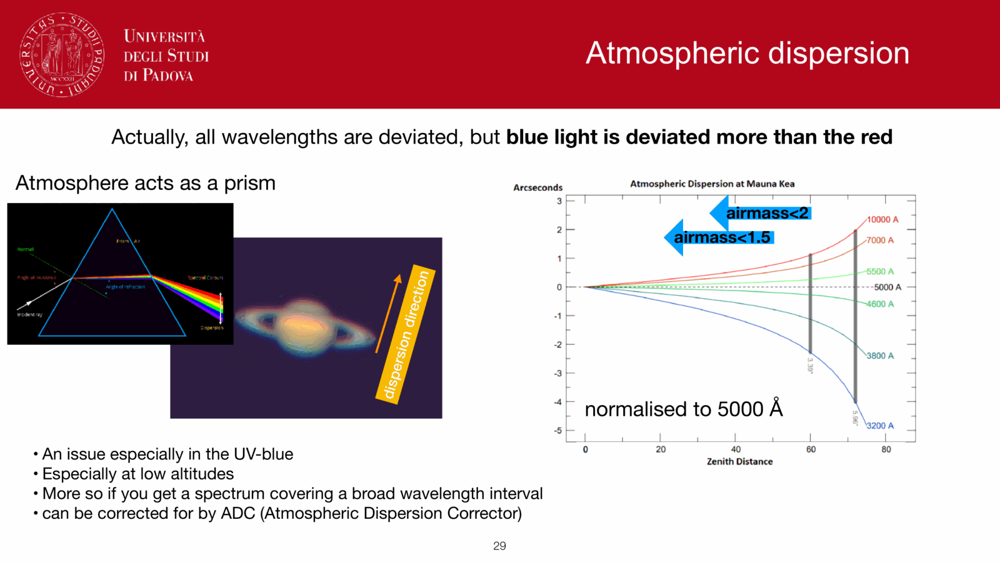
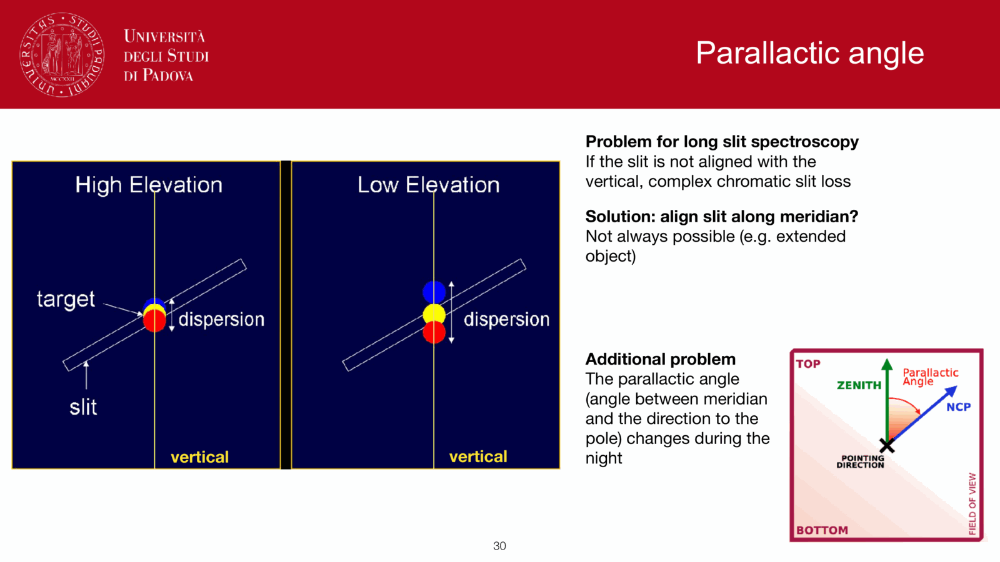


the atmospheric refractive index $n(\lambda)$ depends on wavelength: blue light is bent slightly more than red light. the consequence at $z > 0$ is that a white-light star image is **stretched into a small spectrum** along the radial direction. for high-resolution imaging or slit spectroscopy at high airmass, this has to be corrected.

## the geometry

refraction angle (see [Atmospheric refraction](./Atmospheric%20refraction.html)):
$$R(\lambda) \approx (n_0(\lambda) - 1)\tan z$$

since $n_0(\lambda) - 1$ varies with wavelength, $R(\lambda)$ does too. the differential between two wavelengths $\lambda_1$ and $\lambda_2$:
$$\Delta R = R(\lambda_1) - R(\lambda_2) = [n_0(\lambda_1) - n_0(\lambda_2)]\tan z$$

typical magnitude:
- $z = 30°$: $\Delta R(B \to R) \sim 1''$
- $z = 45°$: $\sim 1.5''$
- $z = 60°$: $\sim 3''$
- $z = 75°$: $\sim 5''$ (very bad)

## the practical impact

### imaging

a single-band image is unaffected (only one $\lambda$ to bend). but a wide-band image, especially in white light or with broad filters at high airmass, has chromatic PSF elongation.

at high airmass and broadband UBV photometry, the PSF becomes asymmetric, with the blue end of the PSF higher in altitude than the red. distorts photometric centroids and contaminates color measurements.

### slit spectroscopy

at fixed slit orientation, light at different wavelengths enters the slit through different paths through the atmosphere. if the slit is **not** aligned with the parallactic angle (the great circle from zenith to source), the blue and red ends of the spectrum vignette differently as they leak past the slit edges.

practical fix: **rotate the slit to the parallactic angle**. this makes dispersion direction parallel to the slit, so all wavelengths enter the slit cleanly. or use a wide slit and accept reduced spectral resolution.

### IFU spectroscopy

integral-field spectrographs (IFUs) are not vulnerable in the same way (no slit), but the chromatic PSF still complicates spaxel-level extraction.

## atmospheric dispersion correctors (ADCs)

for high-resolution imaging at $z > 30°$, an **ADC** is mandatory. it consists of a counter-rotating prism pair, each prism producing equal and opposite chromatic deviation. by adjusting their relative orientation, the net dispersion of the system equals $-\Delta R(\lambda)$ for the current zenith distance, cancelling the atmospheric dispersion at the focal plane.

modern AO instruments (NACO, SPHERE, KECK NIRC2) all include an ADC.

## sources of $n(\lambda)$

the refractive index of dry air at standard $T, P$:
$$n_0(\lambda) - 1 \approx 287.6 \times 10^{-6} \left[1 + 1.6 \times 10^{-2}/(\lambda^2/\mu m^2)\right]$$
weakly chromatic in the optical, more strongly so in the UV. water vapour adds a small correction.

## see also

- [Atmospheric refraction](./Atmospheric%20refraction.html)
- [Earth atmosphere for observations](../Earth%20atmosphere%20for%20observations.html)
- [Adaptive optics overview](./Adaptive%20optics%20overview.html)
- [Point Spread Function (PSF)](../Point%20Spread%20Function%20%28PSF%29.html)
- [Filter systems and bandpasses](../Filter%20systems%20and%20bandpasses.html)

---

## observational astrophysics course slides (Prof. Paolo Cassata)

*Atmospheric dispersion: wavelength-dependent refractive index n(lambda).*

*Atmospheric Dispersion Corrector (ADC) optical design with counter-rotating prisms.*


  <h4 class="backlinks-title">Linked References (2)</h4>
  <ul class="backlinks-list">
    <li class="backlink-item-wrap"><a href="./Atmospheric%20refraction.html" class="backlink-item">Atmospheric refraction</a></li>
    <li class="backlink-item-wrap"><a href="../../../04_Atlas/Observational_Astrophysics_MOC.html" class="backlink-item">Observational_Astrophysics_MOC</a></li>
  </ul>

