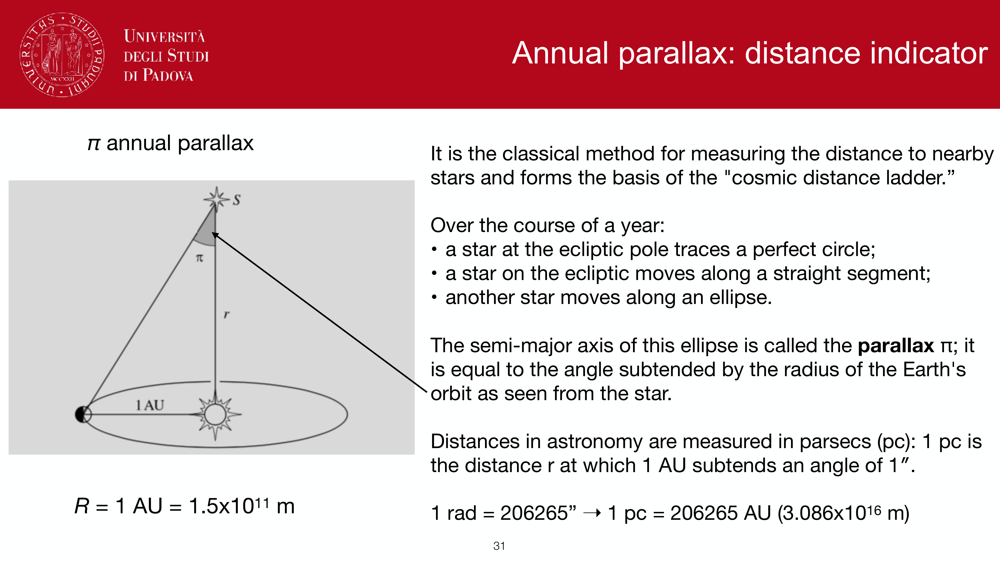


the atmospheric refractive index is $n > 1$, so light rays from astronomical sources bend on their way down through the atmosphere. consequence: a star appears at a slightly higher altitude than its true geometric altitude. for any precision pointing or astrometry this has to be modelled.

## the basic formula

at moderate zenith distances $z$, the **refraction angle** $R \equiv z_{\rm true} - z_{\rm apparent}$ is well-approximated by
$$R \approx (n_0 - 1)\tan z$$
with $n_0 - 1 \approx 2.93 \times 10^{-4}$ at sea level and standard conditions ($T = 0°$C, $P = 1013$ hPa). this evaluates to
$$\boxed{\, R \approx 60''\tan z \quad\text{at moderate } z\,}$$

so at $z = 45°$, $R \approx 60''$. at $z = 60°$, $R \approx 1.7'$. at $z = 75°$, $R \approx 3.7'$.

## the horizon limit

near the horizon, the simple $\tan z$ formula diverges and is wrong. realistic atmospheric ray-tracing gives
$$R(z = 90°) \approx 35'$$
at sea level. this is bigger than the angular diameter of the Sun or Moon, which means **the Sun is geometrically below the horizon when you see it sitting on the horizon at sunset**. similarly at sunrise.

useful rule of thumb: subtract $\sim 35'$ from the apparent altitude to get the true altitude near the horizon.

## color dependence (atmospheric dispersion)

$n(\lambda)$ depends weakly on wavelength, so $R(\lambda)$ does too. at $z > 0$ a white-light point source is elongated radially, with **blue light displaced more** than red. typical magnitude:
$$\Delta R(B \to R) \sim 1''\quad\text{at } z = 30°$$
$$\Delta R(B \to R) \sim 3''\quad\text{at } z = 60°$$

for high-resolution imaging or spectroscopy at $z > 30°$, an **atmospheric dispersion corrector** (ADC, a counter-rotating prism pair) is mandatory. see [Atmospheric dispersion](./Atmospheric%20dispersion.html).

## environmental dependence

$n_0 - 1$ depends on temperature and pressure:
$$n_0 - 1 \propto P/T$$
so on a hot day or at high altitude the refraction is smaller. at Mauna Kea ($P \approx 600$ hPa) the refraction is $\sim 60\%$ of the sea-level value. observatories provide refraction tables for their site.

## why this matters

- **telescope pointing**: any modern telescope control system folds refraction into the pointing model. catalog $(\alpha, \delta) \to$ apparent $(\alpha', \delta') \to$ alt-az $(A', a')$, all via published refraction tables.
- **timing of rise and set**: the Sun rises about $2$ minutes earlier and sets $2$ minutes later than the geometric horizon would predict. this is why "sunrise" in the almanac is when the upper limb just touches the geometric horizon.
- **astrometry**: photons from different angles refract differently, so absolute positions need refraction correction.
- **photometry at high airmass**: differential refraction within a wide-field image is non-zero, so very wide fields need a 2D refraction model, not just a single shift.

## see also

- [Earth atmosphere for observations](../Earth%20atmosphere%20for%20observations.html)
- [Atmospheric dispersion](./Atmospheric%20dispersion.html)
- [Atmospheric extinction](./Atmospheric%20extinction.html)
- [Equatorial system](../Equatorial%20system.html)
- [Horizontal alt-azimuth system](../Horizontal%20alt-azimuth%20system.html)
- [Precession nutation aberration parallax](../Precession%20nutation%20aberration%20parallax.html)

---

## observational astrophysics course slides (Prof. Paolo Cassata)

*Atmospheric refraction: Snell law in plane-parallel atmosphere, R = 60 arcsec tan z.*


  <h4 class="backlinks-title">Linked References (6)</h4>
  <ul class="backlinks-list">
    <li class="backlink-item-wrap"><a href="./Atmospheric%20dispersion.html" class="backlink-item">Atmospheric dispersion</a></li>
    <li class="backlink-item-wrap"><a href="../Atmospheric%20dispersion.html" class="backlink-item">Atmospheric dispersion</a></li>
    <li class="backlink-item-wrap"><a href="../../../04_Atlas/Fundamentals_Astrophysics_Cosmology_MOC.html" class="backlink-item">Fundamentals_Astrophysics_Cosmology_MOC</a></li>
    <li class="backlink-item-wrap"><a href="../../../04_Atlas/Observational_Astrophysics_MOC.html" class="backlink-item">Observational_Astrophysics_MOC</a></li>
    <li class="backlink-item-wrap"><a href="../Precession%20and%20nutation.html" class="backlink-item">Precession and nutation</a></li>
    <li class="backlink-item-wrap"><a href="../Precession%20nutation%20aberration%20parallax.html" class="backlink-item">Precession nutation aberration parallax</a></li>
  </ul>

