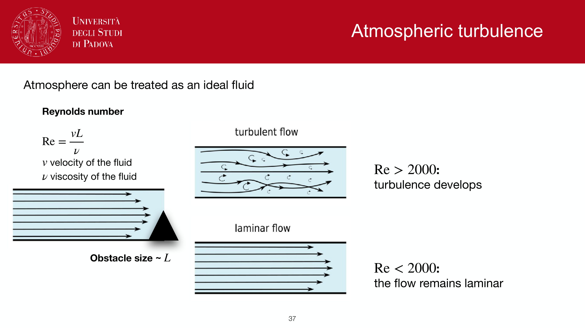
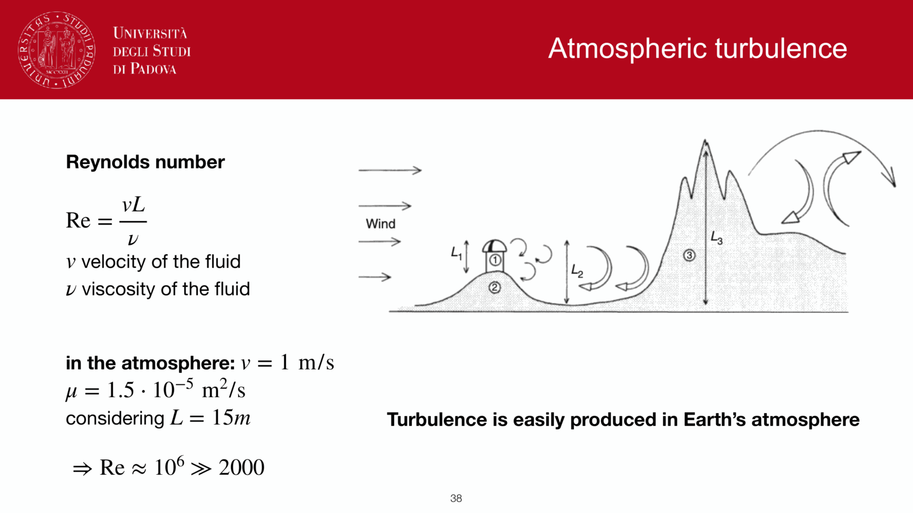
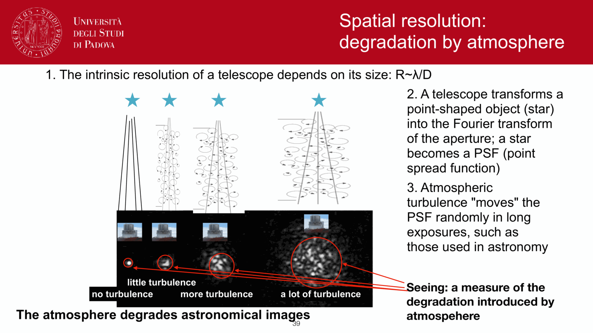
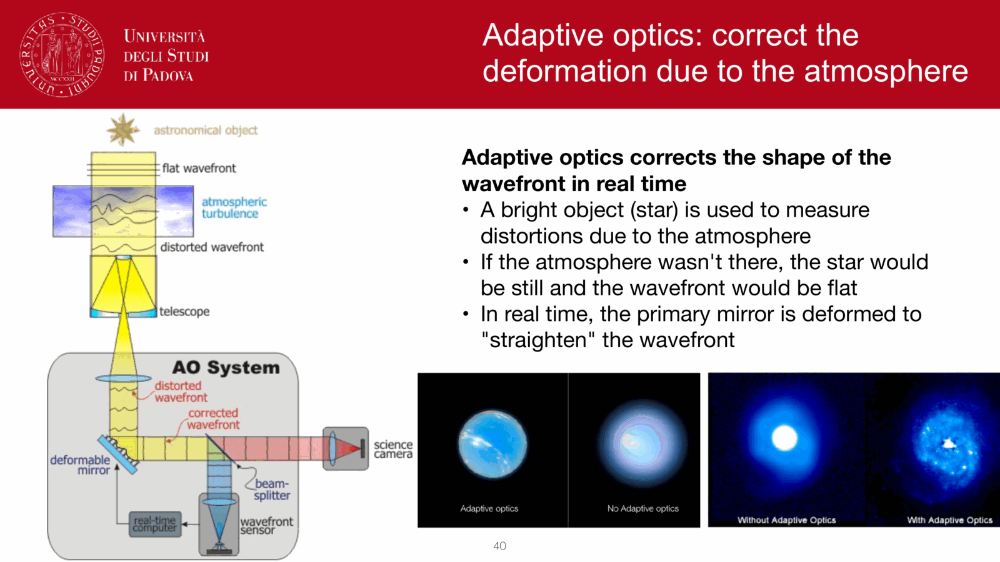
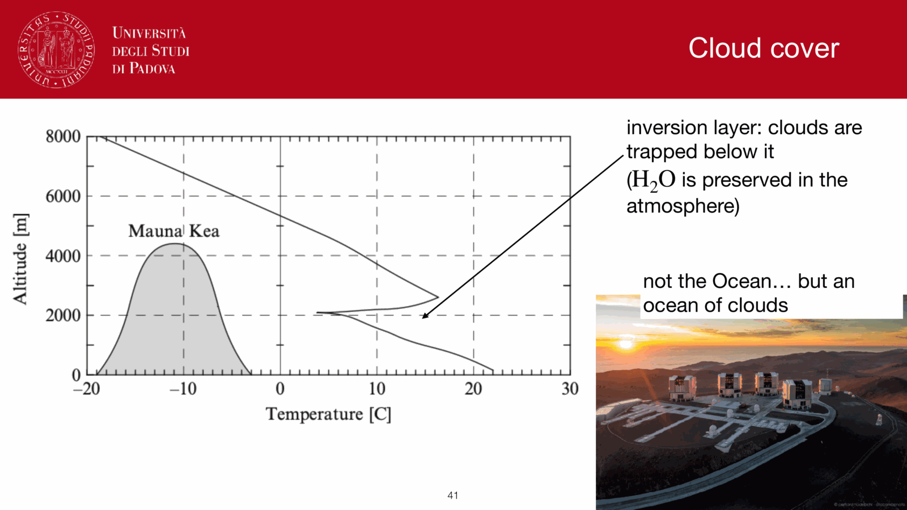
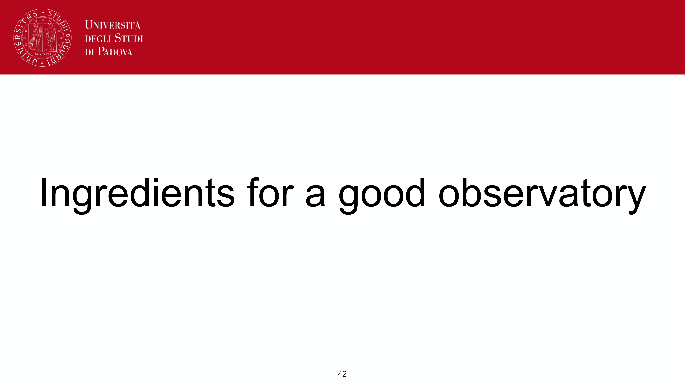
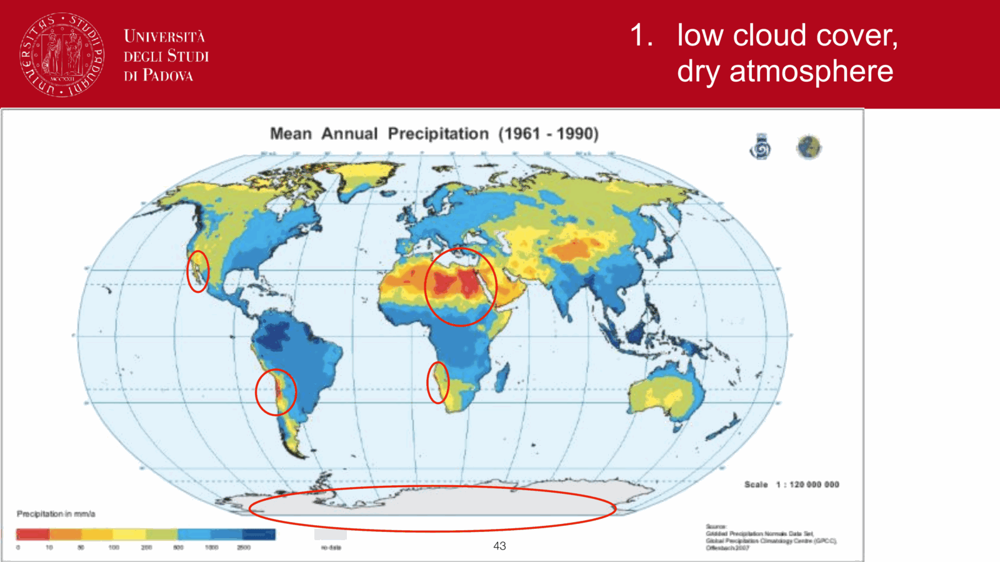
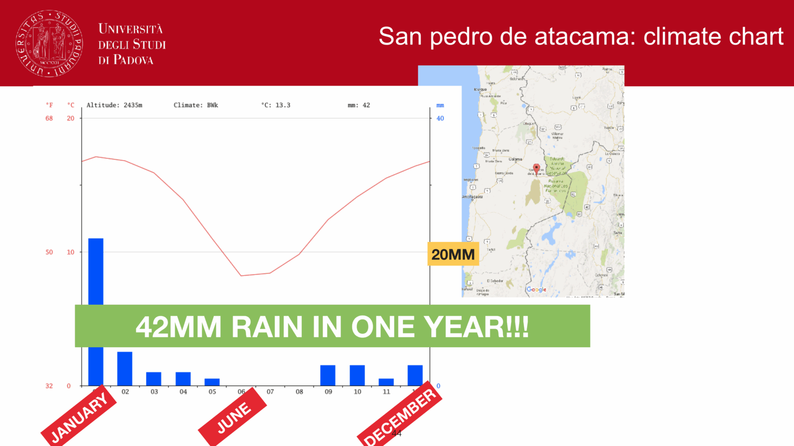


seeing is the **spatial blurring** of astronomical images caused by atmospheric turbulence. it is the single biggest practical limitation on ground-based optical resolution, and the reason every big optical telescope today either uses adaptive optics or accepts a $\sim 0.5''$ FWHM.

## the physical picture

a plane wave from a distant star arriving at the top of the atmosphere is essentially flat. on the way down through 100 km of turbulent air, refractive-index fluctuations distort the wavefront into a wrinkled surface. by the time it reaches the telescope, it is no longer a plane wave; the focal-plane image is no longer a diffraction-limited Airy disk; instead it is a smeared blob.

## the Fried parameter

the central scale is $r_0$, the **Fried parameter**: the diameter of an atmospheric coherence patch over which the wavefront error is roughly $1$ rad RMS. for Kolmogorov turbulence:
$$r_0 \propto \lambda^{6/5}\, (\sec z)^{-3/5}$$

so $r_0$ grows with wavelength and decreases at high airmass.

typical values at zenith in the visible ($\lambda = 500$ nm):
- median good site: $r_0 \approx 10$ to $20$ cm.
- excellent site (Mauna Kea, Paranal best nights): $r_0 \approx 30$ cm.
- urban site: $r_0 \approx 5$ cm.

at K-band ($2.2\,\mu$m), $r_0$ is $\sim 5$ times larger than in the visible.

## the seeing FWHM

the resulting image FWHM is:
$$\theta_{\rm seeing} \approx \frac{\lambda}{r_0} \propto \lambda^{-1/5}$$

so the FWHM has only weak wavelength dependence (much weaker than $r_0$ itself). for $r_0 = 15$ cm at $500$ nm:
$$\theta_{\rm seeing} \approx 0.7''$$

typical site values:
- median good site: $\theta_{\rm seeing} \sim 1''$.
- excellent site, best nights: $\theta_{\rm seeing} \sim 0.4''$.
- mediocre conditions: $\theta_{\rm seeing} \sim 2''$.

## the two regimes

the seeing-limited vs diffraction-limited boundary is set by $D = r_0$:
- **$D < r_0$**: diffraction-limited. FWHM $\approx 1.22 \lambda/D$. typical for amateur scopes in the visible.
- **$D > r_0$**: seeing-limited. FWHM $\approx \lambda/r_0$, **independent of $D$**. typical for professional telescopes in the visible.

the crossover $D = r_0 \sim 10$ to $30$ cm is *very small*. effectively all professional optical telescopes are seeing-limited.

a $4$ m and a $10$ m telescope deliver essentially the **same FWHM** at the same site in the visible without correction. the bigger telescope wins on photon collection ($D^2$ area), not resolution. this is the entire reason adaptive optics exists.

## why high mountains, why dry, why night

the troposphere boundary layer, especially the first $\sim 100$ m above ground, contributes a large fraction of the seeing because diurnal heating drives strong thermal turbulence. a high-altitude observatory escapes most of it. additional features:
- **trade-wind inversion**: at sites like Mauna Kea, a stable inversion layer caps turbulence below the summit.
- **dry air**: less convection, less water-vapour-driven thermal mixing.
- **night**: ground cools, boundary layer stratifies, seeing improves through the night until dawn.
- **dome seeing**: telescope dome and mirror itself can dominate if not actively cooled. modern domes have aggressive ventilation and active mirror temperature control.

## key consequences

- **resolution wall** at $\sim 0.5''$ in the visible from any ground site.
- **seeing is better in the IR**: $r_0 \propto \lambda^{6/5}$, so adaptive optics works much better at K than at V (a fixed wavefront error in nm is a smaller fraction of $\lambda$).
- **diffraction limit** of an $8$ m telescope in the visible is $\sim 0.015''$, but seeing limits us to $\sim 0.5''$ without AO. AO can recover most of this in the NIR.

## measuring seeing

site-monitoring instruments:
- **DIMM** (Differential Image Motion Monitor): measures seeing via differential motion of two PSFs from a single star, isolated from telescope tracking errors.
- **MASS** (Multi-Aperture Scintillation Sensor): vertical profile of turbulence.

published seeing for a site is the median over many years; a given night can be much better or much worse.

## see also

- [Earth atmosphere for observations](../Earth%20atmosphere%20for%20observations.html)
- [Adaptive optics overview](./Adaptive%20optics%20overview.html)
- [Atmospheric scintillation](./Atmospheric%20scintillation.html)
- [Seeing Effect](../Seeing%20Effect.html) — additional notes
- [Atmospheric layers](./Atmospheric%20layers.html)
- [Point Spread Function (PSF)](../Point%20Spread%20Function%20%28PSF%29.html)
- [Telescope resolving power](../Telescope%20resolving%20power.html)
- [Rayleigh criterion](../Rayleigh%20criterion.html)

---

## observational astrophysics course slides (Prof. Paolo Cassata)

*Seeing: spatial image degradation caused by turbulent mixing of air parcels with different temperatures.*

*Kolmogorov turbulence spectrum: energy cascade from outer scale L_0 to inner scale l_0.*

*Refractive index structure constant C_n^2(h) profile with altitude.*

*Fried parameter r_0 definition: coherence diameter of wavefront, r_0 proportional to lambda^(6/5).*

*Diffraction limit theta_diff = 1.22 lambda / D vs seeing limit theta_see = 0.98 lambda / r_0.*

*Seeing FWHM wavelength dependence: FWHM proportional to lambda^(-1/5) (better seeing in NIR).*

*Speckle patterns in short exposures (t < 10 ms) vs long-exposure seeing disk.*

*Speckle interferometry and lucky imaging techniques.*


  <h4 class="backlinks-title">Linked References (11)</h4>
  <ul class="backlinks-list">
    <li class="backlink-item-wrap"><a href="../Adaptive%20optics%20overview.html" class="backlink-item">Adaptive optics overview</a></li>
    <li class="backlink-item-wrap"><a href="./Adaptive%20optics%20overview.html" class="backlink-item">Adaptive optics overview</a></li>
    <li class="backlink-item-wrap"><a href="../Atmospheric%20layers.html" class="backlink-item">Atmospheric layers</a></li>
    <li class="backlink-item-wrap"><a href="./Atmospheric%20layers.html" class="backlink-item">Atmospheric layers</a></li>
    <li class="backlink-item-wrap"><a href="../Atmospheric%20scintillation.html" class="backlink-item">Atmospheric scintillation</a></li>
    <li class="backlink-item-wrap"><a href="./Atmospheric%20scintillation.html" class="backlink-item">Atmospheric scintillation</a></li>
    <li class="backlink-item-wrap"><a href="../Dispersion%20and%20spectral%20resolution.html" class="backlink-item">Dispersion and spectral resolution</a></li>
    <li class="backlink-item-wrap"><a href="../Earth%20atmosphere%20for%20observations.html" class="backlink-item">Earth atmosphere for observations</a></li>
    <li class="backlink-item-wrap"><a href="../../../04_Atlas/Observational_Astrophysics_MOC.html" class="backlink-item">Observational_Astrophysics_MOC</a></li>
    <li class="backlink-item-wrap"><a href="../Spectrograph%20design.html" class="backlink-item">Spectrograph design</a></li>
    <li class="backlink-item-wrap"><a href="../Useful%20constants%20and%20conversions.html" class="backlink-item">Useful constants and conversions</a></li>
  </ul>

