
the atmosphere is **opaque** at most wavelengths. observing windows are the gaps between absorption features, set mainly by H$_2$O, O$_2$, CO$_2$, and O$_3$. understanding which wavelengths get through tells me whether I can do science from the ground or need a satellite.

## the windows

| band | transparency | dominant absorber where it fails |
|---|---|---|
| UV ($\lambda < 300$ nm) | **opaque** | O$_3$ (Hartley + Huggins bands), O$_2$ |
| near-UV ($300$ to $400$ nm) | partial | Rayleigh + ozone tail |
| visible ($400$ to $700$ nm) | excellent | minor: O$_2$ A-band at $760$ nm, B-band at $690$ nm |
| near-IR Y, J, H, K, L, M ($1$ to $5\,\mu$m) | windows separated by H$_2$O bands | water vapour at $1.4$, $1.9$, $2.7$, $\dots\,\mu$m |
| mid-IR ($5$ to $25\,\mu$m) | partial | ozone $9.6\,\mu$m, CO$_2$ $15\,\mu$m, water |
| far-IR ($25$ to $300\,\mu$m) | **opaque** | water vapour, must use space (Herschel) |
| sub-mm ($300\,\mu$m to $1$ mm) | windows in dry sites | water vapour again |
| mm-wave ($1$ to $10$ mm) | mostly open | O$_2$ at $60$ and $118$ GHz, H$_2$O at $22$ and $183$ GHz |
| cm radio ($1$ cm to $1$ m) | excellent | minimal |
| long radio ($> 30$ m) | **opaque** | ionosphere reflects |

## the named NIR bands

these come from the spaces between water absorption bands, each named with a single letter:
- **Y** $\sim 1.0\,\mu$m
- **J** $\sim 1.25\,\mu$m
- **H** $\sim 1.65\,\mu$m
- **K** $\sim 2.2\,\mu$m
- **L** $\sim 3.5\,\mu$m
- **M** $\sim 4.8\,\mu$m
- **N** $\sim 10\,\mu$m
- **Q** $\sim 20\,\mu$m

each band's filter shape is constrained by the surrounding water bands, not by an arbitrary choice. atmospheric transmission is the reason JHK exist as separate bands and not one continuous IR channel.

## the absorbers

- **H$_2$O**: dominant in NIR and sub-mm. concentrated in the troposphere. precipitable water vapour (PWV, mm of water in the column) is the standard metric. typical sites: $\sim 1$ mm at Mauna Kea on a good night, $\sim 0.5$ mm at ALMA, $\sim 5$ mm at sea level.
- **O$_3$**: ozone in the stratosphere. cuts off UV at $\lambda < 320$ nm hard, with a weaker absorption at $\sim 9.6\,\mu$m.
- **O$_2$**: oxygen. discrete bands in the red (A, B, $\gamma$) and at $60$, $118$ GHz.
- **CO$_2$**: bands at $\sim 2$, $4.3$, $15\,\mu$m.

## practical consequences

- **UV science** ($\lambda < 300$ nm) requires space telescopes (HST/COS, GALEX, FUSE).
- **far-IR and most of mid-IR** require space (Spitzer, Herschel, JWST/MIRI) or stratospheric balloons (SOFIA).
- **sub-mm science** lives at the driest, highest sites: ALMA at $5000$ m, IRAM, JCMT.
- **NIR ground-based** is rich but band-limited: photometric pipelines must respect the JHK shapes.
- **VHF and below** distorted/blocked by the ionosphere; LOFAR/SKA-Low sit just above the cutoff.

## the practical "atmospheric transmission" curve

a transmission curve $T(\lambda)$ is the input to any exposure-time calculator. tools like ATRAN, TAPAS, or the ESO SkyCalc model the column transmission given site, airmass, PWV, and date. exposure planning at a real observatory always starts from one of these.

## see also

- [Earth atmosphere for observations](../Earth%20atmosphere%20for%20observations.html)
- [Atmospheric extinction](./Atmospheric%20extinction.html)
- [Atmospheric layers](./Atmospheric%20layers.html)
- [Sky brightness](../Sky%20brightness.html)
- [Atmospheric transmission](./Atmospheric%20transmission.html) — a related deeper note
- [Filter systems and bandpasses](../Filter%20systems%20and%20bandpasses.html)

---

## observational astrophysics course slides (Prof. Paolo Cassata)

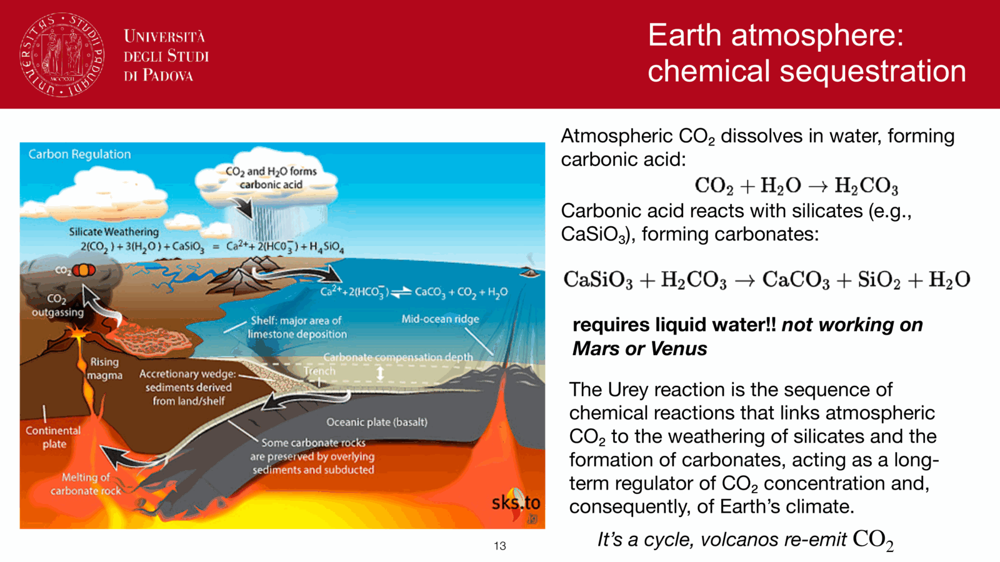
*Atmospheric transmission spectrum from gamma-rays to radio.*

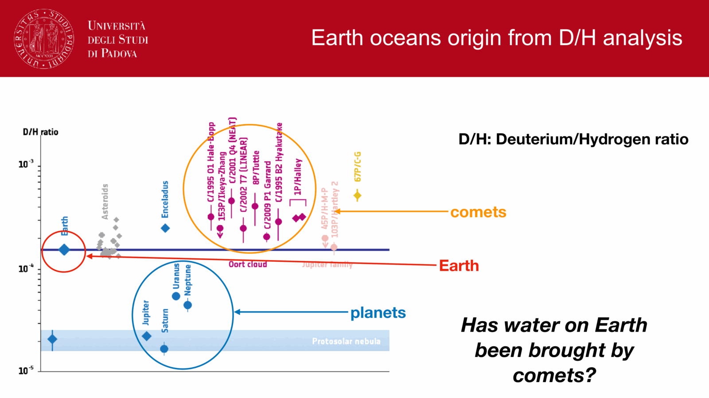
*Optical window (3000 A to 1 micron) bounded by ozone UV cut-off and H2O/O2 bands.*

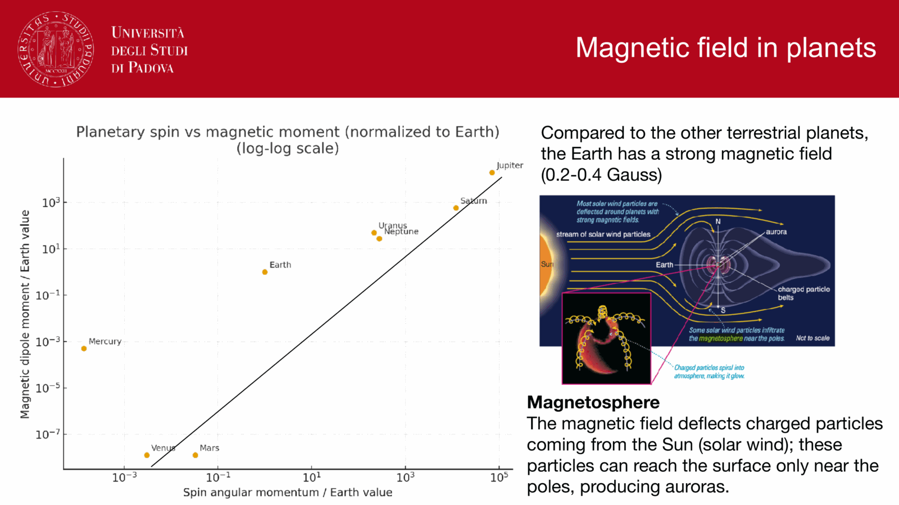
*Near-infrared windows: J (1.25 um), H (1.65 um), K (2.2 um).*

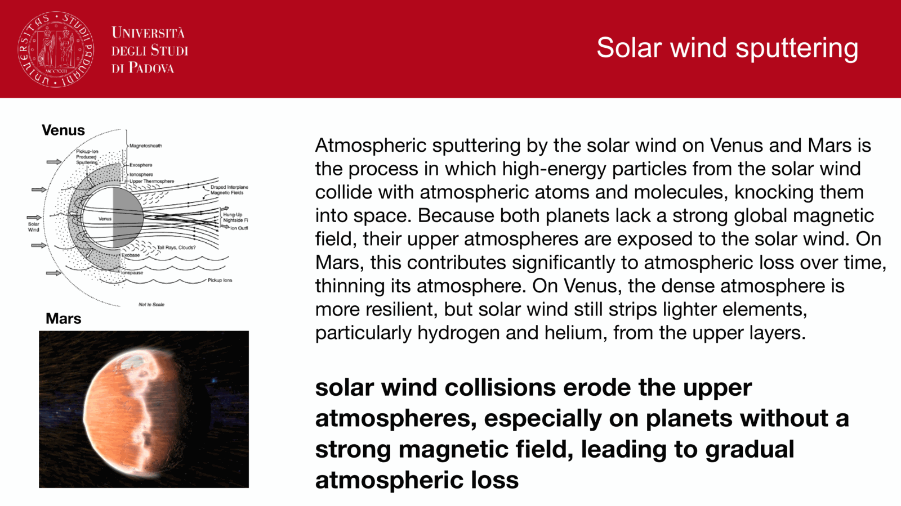
*Mid-infrared windows: L (3.5 um), M (4.8 um), N (10 um), Q (20 um).*

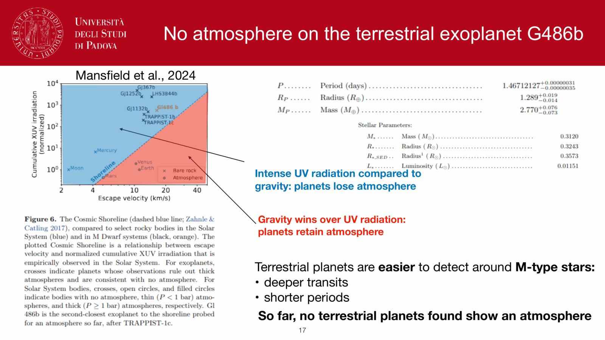
*Sub-millimeter and millimeter atmospheric transmission at high altitude sites (ALMA).*

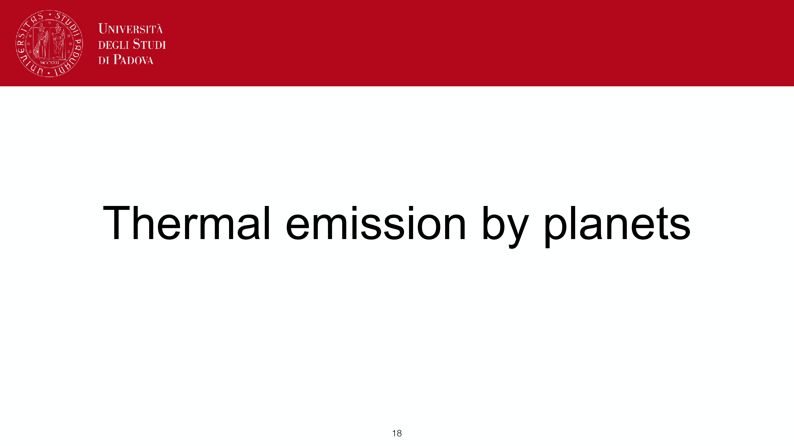
*Radio window (1 cm to 10 m) bounded by ionospheric plasma cut-off.*

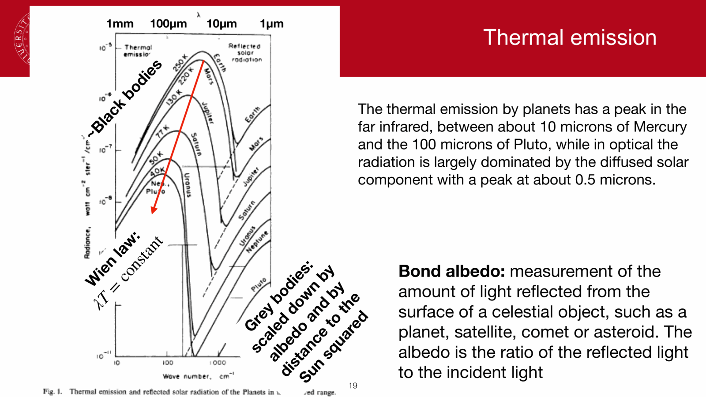
*Molecular absorption bands: H2O vibration-rotation, CO2 bands, CH4 bands.*

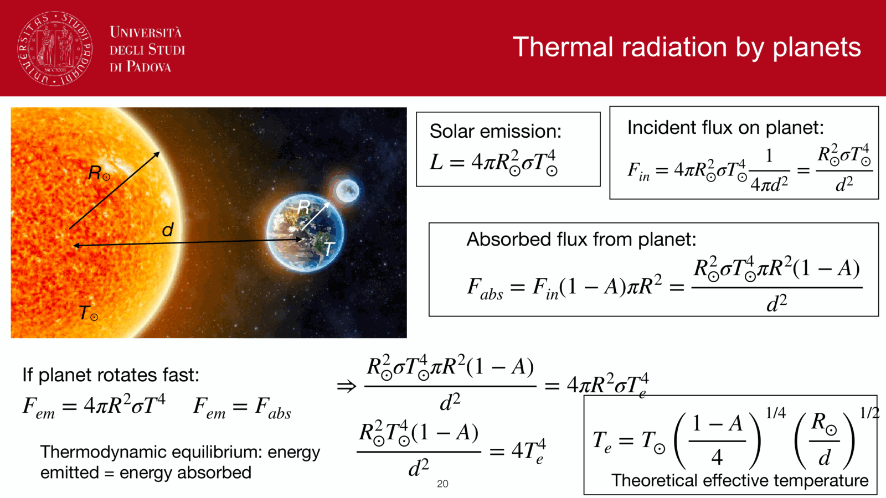
*Rayleigh scattering cross-section sigma_R proportional to lambda^(-4).*

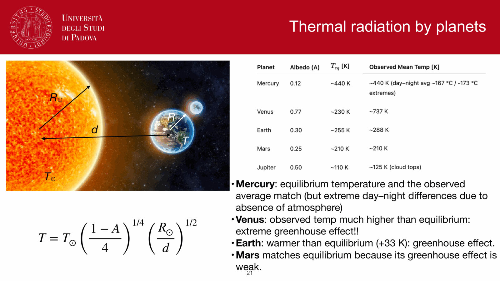
*Planetary thermal radiation: blackbody curves of Earth (300 K) and planets.*

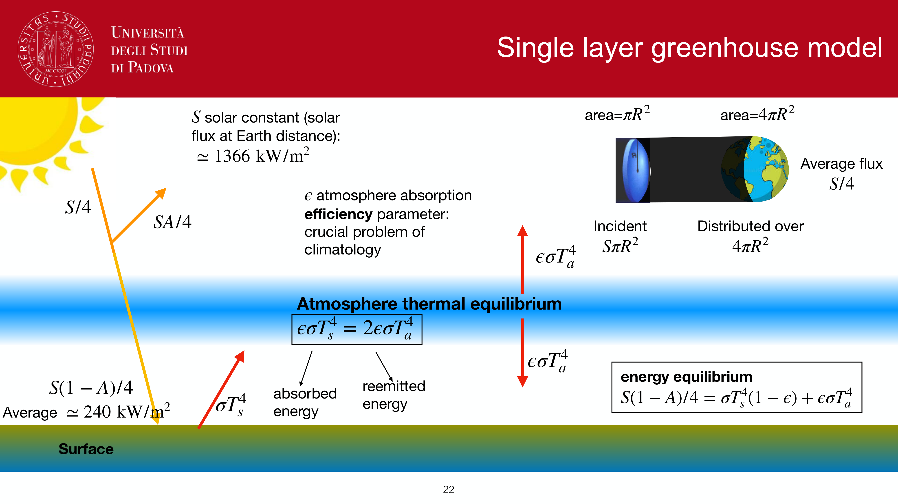
*Greenhouse effect and radiative equilibrium in Earth atmosphere.*

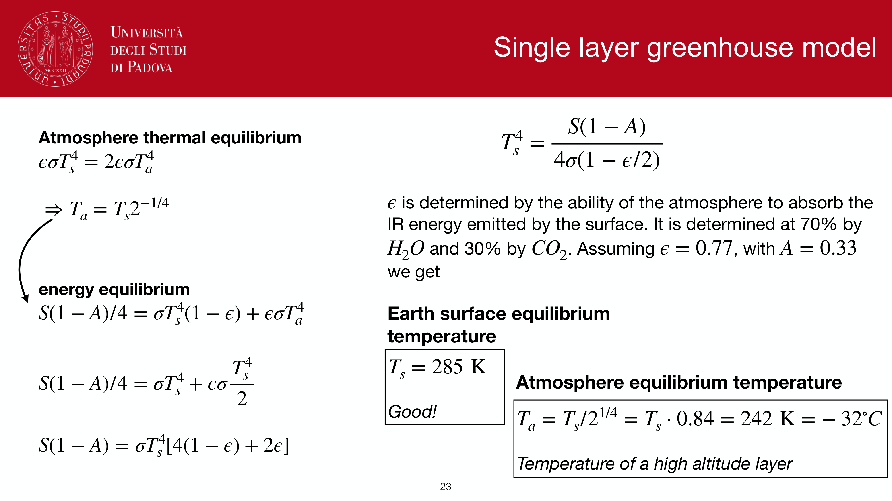
*Atmospheric telluric absorption line correction in stellar spectra.*

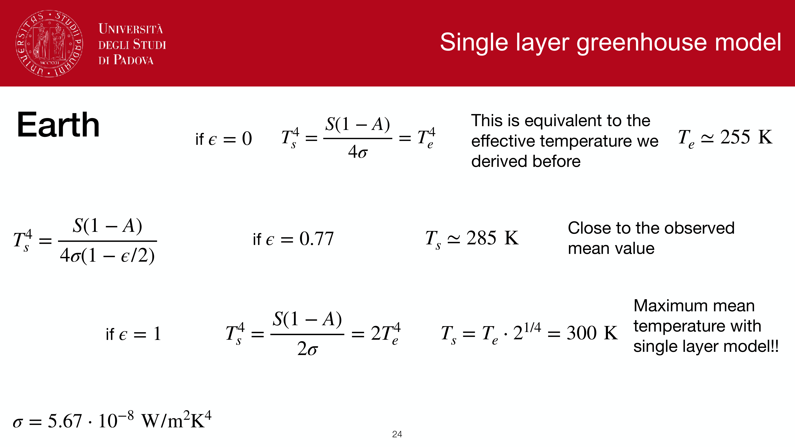
*Telluric standard star observation strategy.*


  <h4 class="backlinks-title">Linked References (7)</h4>
  <ul class="backlinks-list">
    <li class="backlink-item-wrap"><a href="../Atmospheric%20extinction.html" class="backlink-item">Atmospheric extinction</a></li>
    <li class="backlink-item-wrap"><a href="./Atmospheric%20extinction.html" class="backlink-item">Atmospheric extinction</a></li>
    <li class="backlink-item-wrap"><a href="../Atmospheric%20layers.html" class="backlink-item">Atmospheric layers</a></li>
    <li class="backlink-item-wrap"><a href="./Atmospheric%20layers.html" class="backlink-item">Atmospheric layers</a></li>
    <li class="backlink-item-wrap"><a href="../../../04_Atlas/Observational_Astrophysics_MOC.html" class="backlink-item">Observational_Astrophysics_MOC</a></li>
    <li class="backlink-item-wrap"><a href="../Sky%20brightness.html" class="backlink-item">Sky brightness</a></li>
    <li class="backlink-item-wrap"><a href="../Survey%20resources%20for%20Obs%20Astro.html" class="backlink-item">Survey resources for Obs Astro</a></li>
  </ul>

