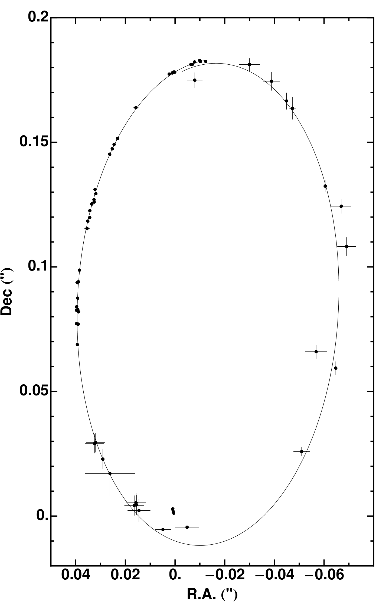
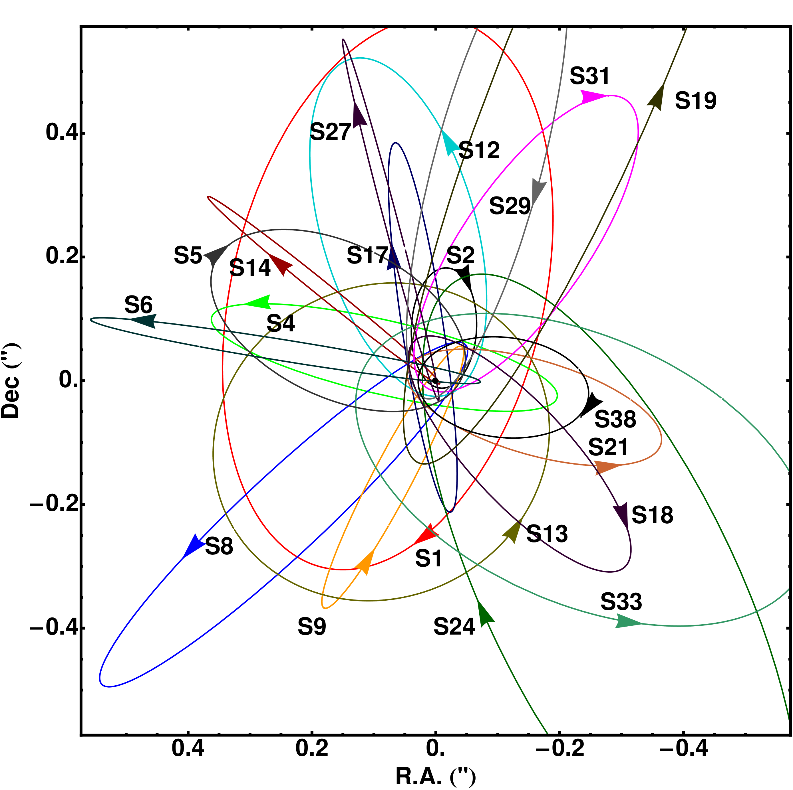
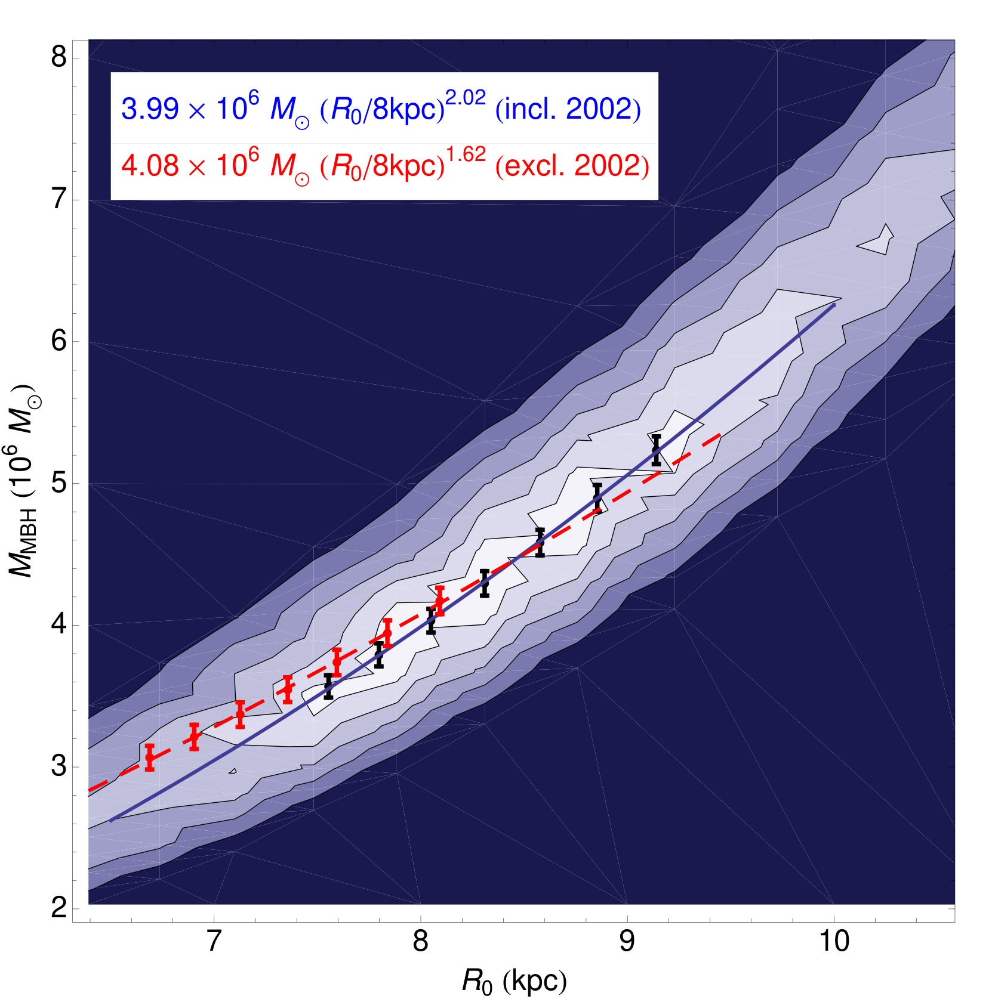
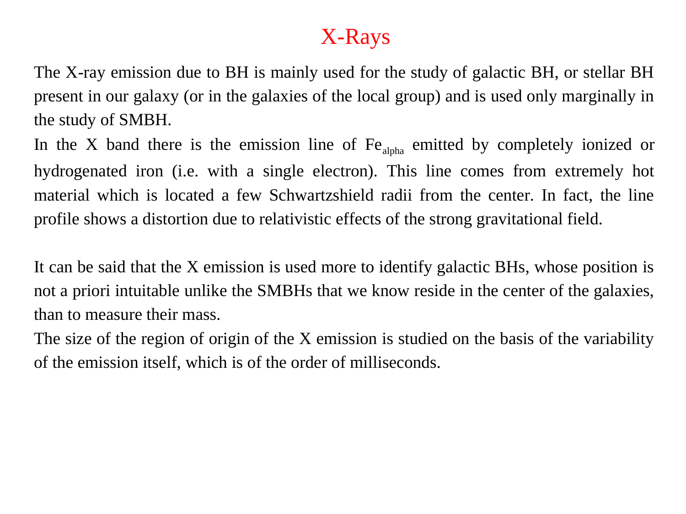
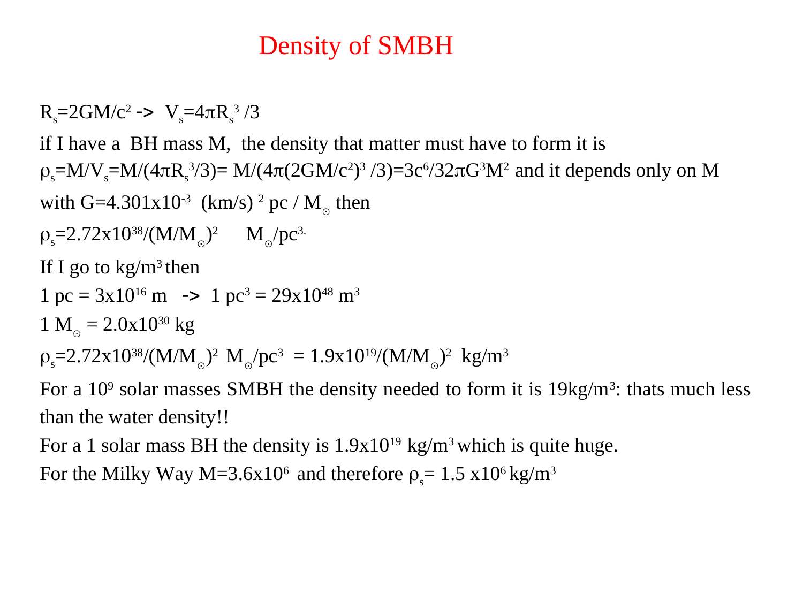
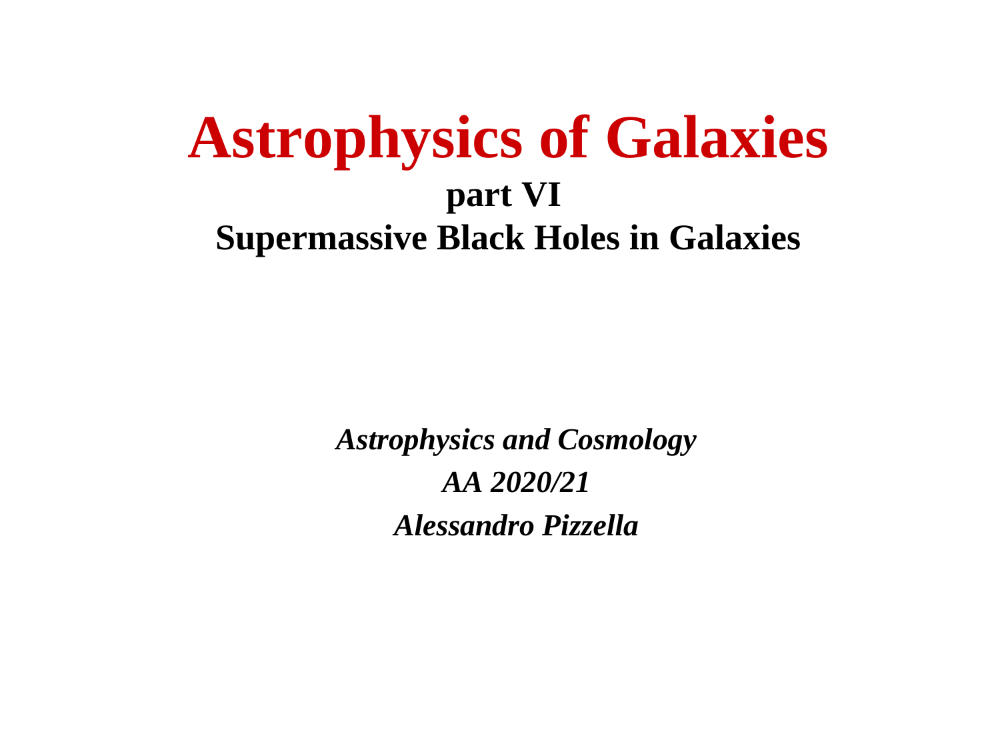


# Galactic Center, Sgr A* and the S-stars

the central region of the Milky Way at sub-mas resolution. the supermassive black hole **Sgr A*** (4.3 × 10⁶ M⊙) and the cluster of bright stars (S-stars) orbiting it within 1 milliparsec. studied at unprecedented detail by VLTI/GRAVITY since 2016. **Nobel Prize 2020** for these observations.

## the players

### Sgr A* (the SMBH)

a $4.3 \times 10^6 M_\odot$ supermassive black hole at the dynamical center of the Milky Way. distance: 8.0 kpc. mass measured from S-star orbits to <1% precision.

at radio: a compact synchrotron source, $T_b \sim 10^{10}$ K. EHT 2022 image showed the photon-sphere ring at ~50 μas.

at IR: faint, variable. flares lasting ~1 hour, peak ~50 mJy.

at X-ray: similar variable flares, with high-energy electron acceleration episodes.

### the S-stars

a cluster of $\sim 30$ bright young massive stars in close orbit around Sgr A*:
- **S2** (S0-2): the brightest, K = 14, periapse $\sim 17$ light-hours from Sgr A*
- **S0-102** (S55): innermost known star, period 12 years
- many others with periods 16-100 years

these are *short-lived* (10⁸ year lifetimes) but *deep* in the BH potential. their orbits trace Sgr A* directly.

## what GRAVITY does

GRAVITY at VLTI tracks the S-stars at $\sim 50$ μas astrometric precision. each year of observations:

- **mid-2016**: first detection of S2's orbital motion at this precision
- **mid-2018**: detected the gravitational redshift of S2 at periapse passage (the predicted shift due to GR's time dilation in the deep BH potential)
- **2020**: detected the **Schwarzschild precession** of S2's orbit (predicted by GR but not detected before in any non-test-mass)

these are the two bedrock GR predictions for S2's orbit:
- gravitational redshift: $\Delta\nu/\nu = GM/(rc^2)$
- Schwarzschild precession: $\Delta\phi$ per orbit $= 6\pi GM/(c^2 a (1-e^2))$

both confirmed at $\sim 1\sigma$ precision — the first confirmation of these GR effects in non-laboratory-mass settings.

## the complete picture

GRAVITY+ measurements of S2 over $> 30$ years (combining old data with new) give:
- $M_{\rm Sgr A*} = 4.297 \pm 0.012 \times 10^6 M_\odot$
- $D_{\rm GC} = 8.277 \pm 0.033$ kpc
- orbital precession matches GR to within experimental precision
- redshift matches GR

**GRAVITY effectively does GR tests in the strong-field regime that no other instrument can.**

## the connection to EHT

EHT (2022) imaged Sgr A* directly at 1.3 mm, revealing the photon-sphere ring of size 50 μas. combined with GRAVITY's S-star astrometry:
- ring diameter independently consistent with $4.3 \times 10^6 M_\odot$
- photon-sphere radius matches GR prediction to within a few percent

so GRAVITY gives the *mass* via dynamical orbits; EHT gives the *physical scale* via the photon ring. both confirm GR.

## the next steps

ongoing science:
- **higher precision** on S-star orbits as more data accumulates
- **detection of Lense-Thirring precession** (frame-dragging due to BH spin, predicted but tiny)
- **monitoring of S2 close to periapse** (next 2026, 2042)
- **JWST follow-up** of the ionized/molecular gas environment
- **microlensing** of background stars by S-cluster stars

each would constrain BH physics and stellar dynamics in extreme regimes.

## the broader stellar dynamical context

beyond just Sgr A*:
- **the cusp of stars** around Sgr A* with cusp-density profile $n \propto r^{-1.5}$ — predicted by Bahcall-Wolf 1976
- **the young stellar cluster** at $r \sim 0.1$ pc — paradoxical because young stars shouldn't form here
- **mass segregation**: heavier stars sink to smaller radii via dynamical friction
- **interaction with SMBH**: tidal disruptions, periastron passages, mergers

GRAVITY observations of these populations will refine our understanding of stellar dynamics in the most extreme galactic environment.

## see also

- [VLTI Very Large Telescope Interferometer](./VLTI%20Very%20Large%20Telescope%20Interferometer.html)
- [Event Horizon Telescope EHT](./Event%20Horizon%20Telescope%20EHT.html)
- [AGN and supermassive black holes](./AGN%20and%20supermassive%20black%20holes.html)
- [Stellar diameters and limb darkening](./Stellar%20diameters%20and%20limb%20darkening.html)
- [Astronomical_Interferometry_MOC](../../../04_Atlas/Astronomical_Interferometry_MOC.html)

---

## astrophysics of galaxies figures and slides (Prof. Alessandro Pizzella)

*Orbit of the S2 star around Sgr A* from Gillessen et al. (2009) monitored over 16 years.*

*Central stellar orbits of S-stars within the inner 0.05 pc of the Galactic Center (Gillessen et al. 2009).*

*Enclosed mass vs radius profile proving central point mass of 4.15 x 10^6 M_Sun (Gillessen et al. 2009).*

*S2 pericenter passage: r_peri ~ 120 AU ~ 1400 R_Schwarzschild, orbital velocity v ~ 7700 km/s (~2.6% c).*

*Relativistic gravitational redshift and Schwarzschild precession measured in S2 orbit.*

---

## lecture slides and reference figures (Prof. Alessandro Pizzella)



  <h4 class="backlinks-title">Linked References (16)</h4>
  <ul class="backlinks-list">
    <li class="backlink-item-wrap"><a href="../AGN%20and%20supermassive%20black%20holes.html" class="backlink-item">AGN and supermassive black holes</a></li>
    <li class="backlink-item-wrap"><a href="./AGN%20and%20supermassive%20black%20holes.html" class="backlink-item">AGN and supermassive black holes</a></li>
    <li class="backlink-item-wrap"><a href="../../../04_Atlas/Astronomical_Interferometry_MOC.html" class="backlink-item">Astronomical_Interferometry_MOC</a></li>
    <li class="backlink-item-wrap"><a href="../../../04_Atlas/Astrophysics_of_Galaxies_MOC.html" class="backlink-item">Astrophysics_of_Galaxies_MOC</a></li>
    <li class="backlink-item-wrap"><a href="./Components%20of%20a%20modern%20interferometer%20continued.html" class="backlink-item">Components of a modern interferometer continued</a></li>
    <li class="backlink-item-wrap"><a href="../Components%20of%20a%20modern%20interferometer%20continued.html" class="backlink-item">Components of a modern interferometer continued</a></li>
    <li class="backlink-item-wrap"><a href="../Event%20Horizon%20Telescope%20EHT.html" class="backlink-item">Event Horizon Telescope EHT</a></li>
    <li class="backlink-item-wrap"><a href="./Event%20Horizon%20Telescope%20EHT.html" class="backlink-item">Event Horizon Telescope EHT</a></li>
    <li class="backlink-item-wrap"><a href="../Ionized%20gas%20SMBH%20masses.html" class="backlink-item">Ionized gas SMBH masses</a></li>
    <li class="backlink-item-wrap"><a href="../Local%20Group%20galaxies.html" class="backlink-item">Local Group galaxies</a></li>
    <li class="backlink-item-wrap"><a href="../M%20sigma%20relation.html" class="backlink-item">M sigma relation</a></li>
    <li class="backlink-item-wrap"><a href="../Reverberation%20mapping.html" class="backlink-item">Reverberation mapping</a></li>
    <li class="backlink-item-wrap"><a href="../Stellar%20dynamics%20SMBH%20masses.html" class="backlink-item">Stellar dynamics SMBH masses</a></li>
    <li class="backlink-item-wrap"><a href="./VLTI%20Very%20Large%20Telescope%20Interferometer.html" class="backlink-item">VLTI Very Large Telescope Interferometer</a></li>
    <li class="backlink-item-wrap"><a href="../VLTI%20Very%20Large%20Telescope%20Interferometer.html" class="backlink-item">VLTI Very Large Telescope Interferometer</a></li>
    <li class="backlink-item-wrap"><a href="../Water%20maser%20BH%20masses.html" class="backlink-item">Water maser BH masses</a></li>
  </ul>

